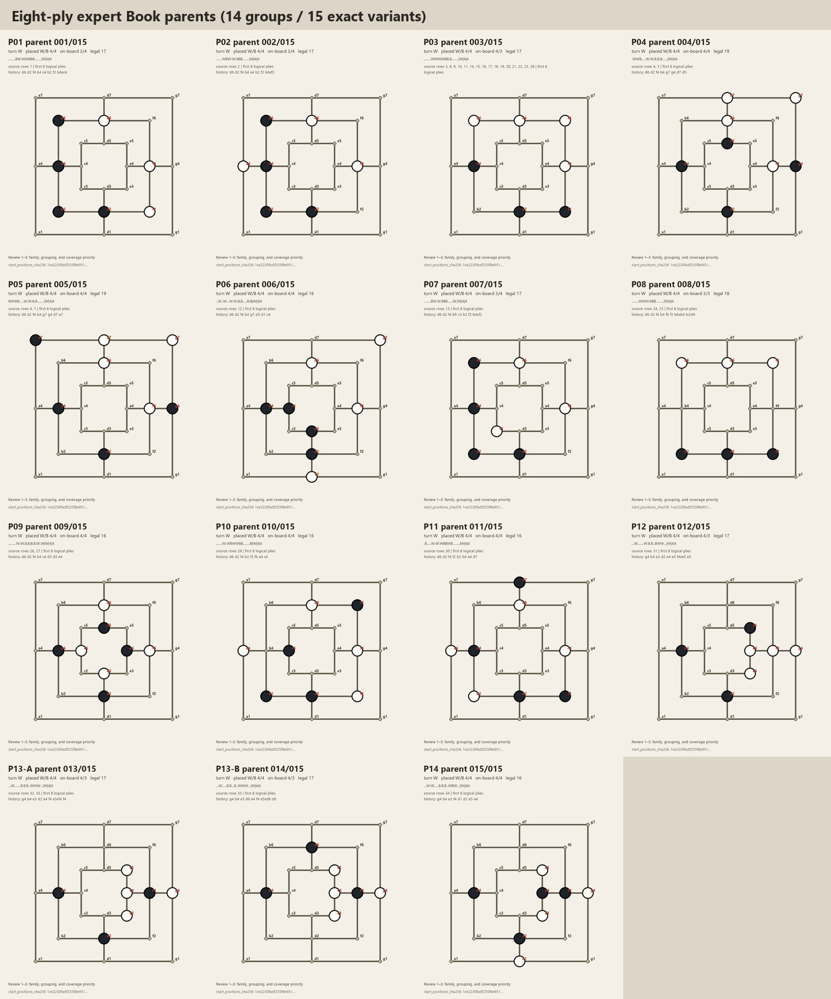
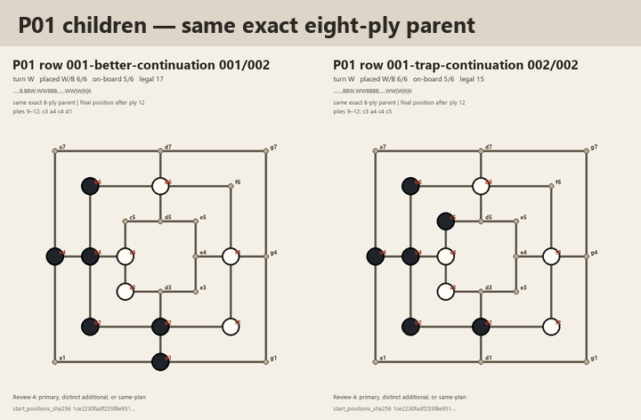
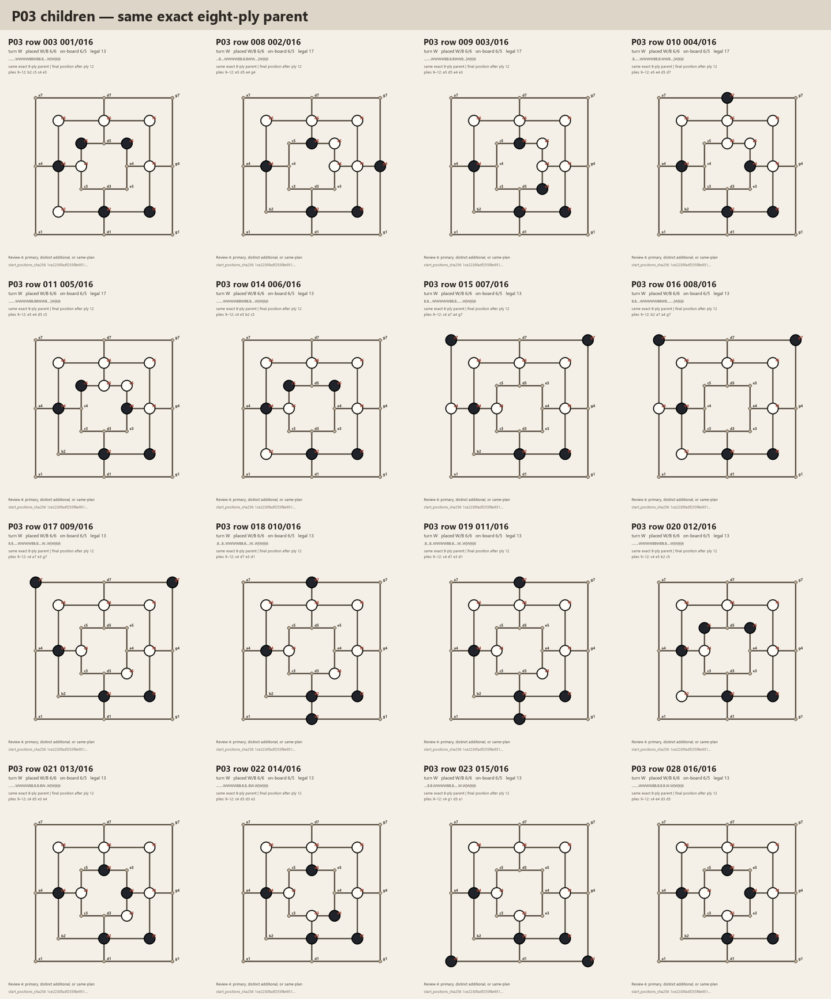
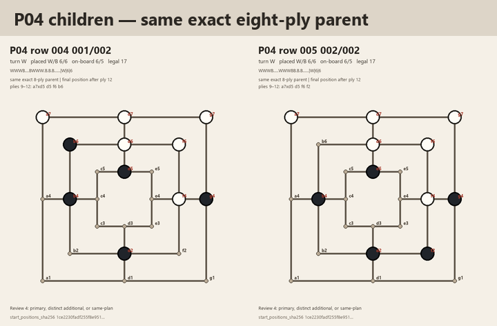
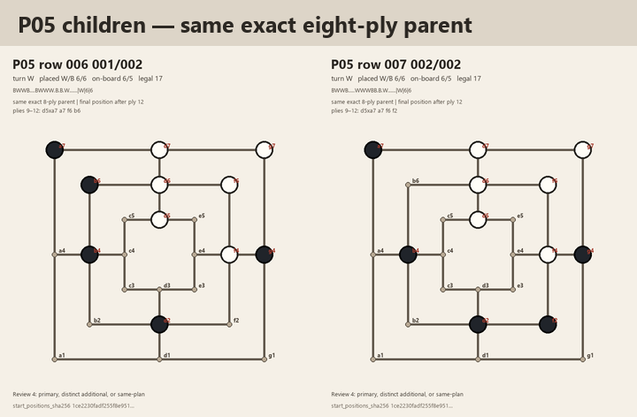
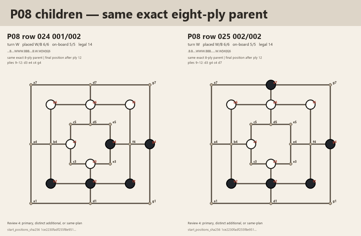
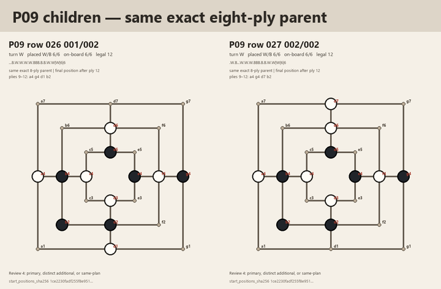
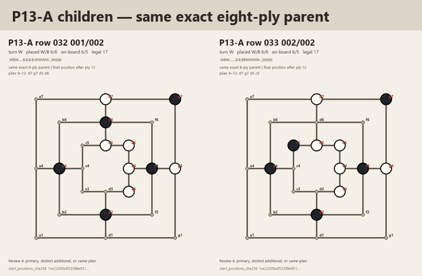

# Expert review guide for twelve-ply Book parents and children

Status: historical review request; partial expert response recorded

Corpus status: `needs_decision`

Date: 2026-07-26

The expert has now supplied a review supplement and follow-up messages. This
file preserves the exact request and the original image package that he saw.
Its row-19 panel predates the confirmed `d7` to `d5` correction and must not be
used for current selection. See the
[semantic disposition](../evidence/maintainer-book-opening-plays-semantic-review-2026-07-26.md)
and the
[reviewed-source follow-up](sanmill-layered-expert-book-review-follow-up.md)
for current evidence and corrected images. The later
[breadth-first shortlist](sanmill-layered-expert-book-shortlist-proposal-2026-07-31.md)
turned the remaining abstract questions into concrete choices. The expert's
1 August clarification is applied by the superseding
[unique-pattern coverage decision](sanmill-layered-expert-book-coverage-decision-2026-08-01.md).

This guide asks for a narrow Mill-domain review of the expert-curated
`Book Opening Plays.docx` delivery. The source has already been transcribed,
legally replayed, and audited. The review is not a request to repeat those
technical checks or to approve the final 64-prefix corpus.

The underlying evidence is recorded in the
[expert Book source audit](../evidence/sanmill-layered-expert-book-source-audit-2026-07-26.md).
The proposed overall corpus composition is recorded separately in the
[twelve-ply decision brief](sanmill-layered-opening-prefix-v2-decision-brief.md).
The rendered boards are bound to audit identity
`29293523ba211775827bfd903ef8dd0a0220bcd958a46974e37809a55dd51ff4`
by the
[review-asset manifest](assets/sanmill-layered-expert-book-parent-review-2026-07-26/manifest.json).
The manifest covers 14 structural groups, 15 exact parent variants, seven
same-exact-parent child comparisons, and 28 child panels. Its identity is
`434f69786830118570c317341d7867c81da41ed42692f93fa781c7bc1114b2a2`;
the ordered 43-FEN display set has SHA-256
`1ce2230fadf255f8e951cf411dd1803ac317c179a0f13655c5e6e64cbb951a62`.

## Why this review is needed

The 35 source rows contain 36 explicit twelve-ply candidates. Their first
eight logical plies reduce to 15 exact histories and 14 structural
`ring16` parent groups. One parent supplies 16 different twelve-ply
continuations. A diversity-oriented Book stratum should not automatically
spend most of its places on children of one parent, but structural grouping
alone cannot decide which human opening plans deserve representation.

The provisional 64-prefix design reserves 22 places for Book material,
alongside 21 HumanDB and 21 Perfect DB prefixes. The 22 Book places must cover
both the corrected Sanmill named lines and this expert-curated delivery.
Their internal allocation is not frozen. The expert review supplies the
human-strategy evidence needed before that allocation and the exact Book list
can be proposed.

## Terms used in this guide

- A **logical ply** is one complete turn by one player. Forming a Mill and
  performing its mandatory removal still count together as one logical ply.
- An **eight-ply parent** is the position and complete history after the first
  eight logical plies, when each side has made four turns.
- A **twelve-ply child** is a complete candidate produced by adding logical
  plies 9 through 12 to an exact eight-ply parent.
- A **`ring16` parent group** is a structural equivalence class that already
  normalises board rotations, reflections, and the inner/outer-ring swap. Two
  different group identifiers below are therefore not simple unnormalised
  rotations or mirror images of one another.
- A **human opening family** is a strategic or pedagogical concept recognised
  by players. It need not have a one-to-one relationship with a structural
  `ring16` group.

The identifiers `P01` through `P14` are review-only aliases ordered by the
first source row in each group. They do not modify the frozen JSON evidence or
become corpus identities.

## The four review points

### 1. Name or classify each human opening family

For each parent group, state which human opening play or family it represents.
An answer may use an established name, identify it as a subtype of another
family, describe the strategic plan in plain language, or say that it has no
recognised family name.

This question is about how a Mill player understands the plan, not merely the
shape of the eighth-ply board. If move order is part of the identity of the
opening, please say so.

Requested output for each group:

```text
Pxx: <family or plan name>; <optional note about move order or purpose>
```

### 2. Correct the relationship between structural groups and human families

The audit deliberately does not assume that one `ring16` group equals one
human opening family. Please identify either of these cases:

- two or more different `Pxx` groups should be combined conceptually because
  they express the same human plan despite having different structures; or
- one `Pxx` group should be split because the normalised structure or move
  order hides a distinction that matters to human opening theory.

Pure rotations and reflections are already collapsed by `ring16`; there is no
need to report those again. The useful information is a higher-level
strategic equivalence or distinction that the structural audit cannot infer.

`P13` especially needs this check. Rows 32 and 33 share one exact eight-ply
history, while row 35 reaches the same structural orbit through a different
exact history. It may be one human family or more than one; the evidence does
not decide that.

Requested output:

```text
Combine: Pxx + Pyy because ...
Split: Pxx rows ... and ... because ...
No changes: the 14 structural groups are also suitable human parent groups.
```

Only the applicable lines are needed.

### 3. Assign parent-coverage priority

Classify each resulting human parent or family using these review tiers:

- **core**: a representative should be present in a small Book evaluation
  corpus because this is a basic or widely useful opening plan;
- **useful**: worth including when space permits because it adds a meaningful
  plan or response not already covered; or
- **optional/niche**: interesting, uncommon, highly specialised, or adequately
  represented by another selected family.

This is a coverage judgment, not a claim that the opening is objectively
winning. A risky or difficult line may still be core if recognising it is
important human opening knowledge. Conversely, several sound lines with the
same plan do not all need separate parent slots.

Requested output:

```text
Core: P...
Useful: P...
Optional/niche: P...
Reason for any non-obvious classification: ...
```

### 4. Identify strategically distinct children of the same exact parent

For every exact parent with more than one continuation, identify:

1. one primary child that best represents the parent; and
2. any additional children whose plies 9–12 teach or test a genuinely
   different strategic decision.

An additional child is strategically distinct when, for example, it changes:

- the intended Mill, block, fork, chain, trap, or escape plan;
- which opponent threat must be answered;
- whether the line is a safe continuation or a deliberate practical trap;
- the side or region of the board on which the next plan develops; or
- a humanly meaningful choice that a player should recognise separately.

A child is not independently valuable merely because it uses different
coordinates, is a symmetry-equivalent rendering, transposes to the same
position, or makes a minor alternative while preserving the same plan.
Strength need not be proved, and the expert may mark a comparison
`uncertain`.

This point applies to children of the same **exact** parent, not merely to all
records in the same structural orbit. For `P13`, rows 32 and 33 are sibling
children; row 35 has a different exact eight-ply history and belongs first
under review point 2.

Requested output for each multi-child exact parent:

```text
Pxx primary: row ...
Pxx additional distinct children: row ... because ...
Pxx same-plan or redundant children: rows ...
```

The audit will automatically remove exact duplicates. The expert does not
need to choose between rows 14 and 20 or between rows 18 and 19 because each
pair contains the same complete action history.

## Parent-group index and boards

The histories below use the source coordinates. A token such as `b6xc4`
means that placement at `b6` formed a Mill and the mandatory removal at `c4`
completed the same logical ply. In every rendered board, Black pieces are
filled and White pieces are unfilled. The overview and every comparison sheet
can be selected to open the full-resolution PNG.

| Group | Source rows | Records | Exact parents | Representative eight-ply history | Full board |
| --- | --- | ---: | ---: | --- | --- |
| `P01` | 1, two explicit endings | 2 | 1 | `d6 d2 f4 b4 c4 b2 f2 b6xc4` | [P01](assets/sanmill-layered-expert-book-parent-review-2026-07-26/parents/P01.png) |
| `P02` | 2 | 1 | 1 | `d6 d2 f4 b4 a4 b2 f2 b6xf2` | [P02](assets/sanmill-layered-expert-book-parent-review-2026-07-26/parents/P02.png) |
| `P03` | 3, 8–11, 14–23, 28 | 16 | 1 | `d6 d2 f4 b4 f6 f2 b6xf2 f2` | [P03](assets/sanmill-layered-expert-book-parent-review-2026-07-26/parents/P03.png) |
| `P04` | 4–5 | 2 | 1 | `d6 d2 f4 b4 g7 g4 d7 d5` | [P04](assets/sanmill-layered-expert-book-parent-review-2026-07-26/parents/P04.png) |
| `P05` | 6–7 | 2 | 1 | `d6 d2 f4 b4 g7 g4 d7 a7` | [P05](assets/sanmill-layered-expert-book-parent-review-2026-07-26/parents/P05.png) |
| `P06` | 12 | 1 | 1 | `d6 d2 f4 b4 g7 d3 d1 c4` | [P06](assets/sanmill-layered-expert-book-parent-review-2026-07-26/parents/P06.png) |
| `P07` | 13 | 1 | 1 | `d6 d2 f4 b6 c3 b2 f2 b4xf2` | [P07](assets/sanmill-layered-expert-book-parent-review-2026-07-26/parents/P07.png) |
| `P08` | 24–25 | 2 | 1 | `d6 d2 f4 b4 f6 f2 b6xb4 b2xf4` | [P08](assets/sanmill-layered-expert-book-parent-review-2026-07-26/parents/P08.png) |
| `P09` | 26–27 | 2 | 1 | `d6 d2 f4 b4 c4 d5 d3 e4` | [P09](assets/sanmill-layered-expert-book-parent-review-2026-07-26/parents/P09.png) |
| `P10` | 29 | 1 | 1 | `d6 d2 f4 b2 f2 f6 a4 c4` | [P10](assets/sanmill-layered-expert-book-parent-review-2026-07-26/parents/P10.png) |
| `P11` | 30 | 1 | 1 | `d6 d2 f4 f2 b2 b4 a4 d7` | [P11](assets/sanmill-layered-expert-book-parent-review-2026-07-26/parents/P11.png) |
| `P12` | 31 | 1 | 1 | `g4 b4 e3 d2 e4 e5 f4xe5 e5` | [P12](assets/sanmill-layered-expert-book-parent-review-2026-07-26/parents/P12.png) |
| `P13` | 32–33, 35 | 3 | 2 | rows 32–33: `g4 b4 e3 d2 e4 f4 e5xf4 f4`; row 35: `g4 b4 e3 d6 e4 f4 e5xd6 d6` | [P13-A](assets/sanmill-layered-expert-book-parent-review-2026-07-26/parents/P13-A.png), [P13-B](assets/sanmill-layered-expert-book-parent-review-2026-07-26/parents/P13-B.png) |
| `P14` | 34 | 1 | 1 | `g4 b4 e3 f4 d1 d2 e5 e4` | [P14](assets/sanmill-layered-expert-book-parent-review-2026-07-26/parents/P14.png) |

The overview deliberately shows both `P13-A` and `P13-B`: there are 14
structural groups but 15 exact parent variants.

[](assets/sanmill-layered-expert-book-parent-review-2026-07-26/parent-overview.png)

## Continuation index for multi-record structural groups

Only structural groups with more than one candidate record appear here.
“Continuation” means logical plies 9–12 after the parent history shown above.
The comparison images following the table include only true sibling children
of the same exact parent. `P13` row 35 is retained in the table for point 2,
but it is `P13-B`, not a sibling of the `P13-A` rows 32 and 33.

| Group | Source row | Continuation | Technical note |
| --- | ---: | --- | --- |
| `P01` | 1, better continuation | `c3 a4 c4 d1` | Explicitly labelled better in the source |
| `P01` | 1, trap continuation | `c3 a4 c4 c5` | Explicitly labelled trap in the source |
| `P03` | 3 | `b2 c5 c4 e5` |  |
| `P03` | 8 | `e5 d5 e4 g4` |  |
| `P03` | 9 | `e5 d5 e4 e3` |  |
| `P03` | 10 | `e5 e4 d5 d7` |  |
| `P03` | 11 | `e5 e4 d5 c5` | Final `c5` verified from the source image |
| `P03` | 14 | `c4 e5 b2 c5` | Exact duplicate of row 20 |
| `P03` | 15 | `c4 a7 a4 g7` |  |
| `P03` | 16 | `b2 a7 a4 g7` |  |
| `P03` | 17 | `c4 a7 e3 g7` |  |
| `P03` | 18 | `c4 d7 e3 d1` | Exact duplicate of row 19 |
| `P03` | 19 | `c4 d7 e3 d1` | Exact duplicate of row 18 |
| `P03` | 20 | `c4 e5 b2 c5` | Exact duplicate of row 14 |
| `P03` | 21 | `c4 d5 e3 e4` |  |
| `P03` | 22 | `c4 d5 d3 e3` |  |
| `P03` | 23 | `c4 g1 d3 a1` |  |
| `P03` | 28 | `c4 e4 d3 d5` |  |
| `P04` | 4 | `a7xd5 d5 f6 b6` |  |
| `P04` | 5 | `a7xd5 d5 f6 f2` |  |
| `P05` | 6 | `d5xa7 a7 f6 b6` |  |
| `P05` | 7 | `d5xa7 a7 f6 f2` |  |
| `P08` | 24 | `d3 e4 c4 g4` |  |
| `P08` | 25 | `d3 g4 c4 d7` |  |
| `P09` | 26 | `a4 g4 d1 b2` |  |
| `P09` | 27 | `a4 g4 d7 b2` |  |
| `P13` | 32 | `d7 g7 d5 d6` | Same exact parent as row 33 |
| `P13` | 33 | `d7 g7 d5 c5` | Same exact parent as row 32 |
| `P13` | 35 | `d1 b6 b2 f6xb2` | Different exact parent in the same `ring16` group |

## Same-exact-parent child comparison boards

These seven sheets are the visual input to review point 4. Each sheet fixes
one exact eight-ply parent and changes only the recorded plies 9–12. Black
pieces are filled; White pieces are unfilled. Each panel links its source row
to its continuation and final board.

### P01

[](assets/sanmill-layered-expert-book-parent-review-2026-07-26/child-overviews/P01.png)

### P03

[](assets/sanmill-layered-expert-book-parent-review-2026-07-26/child-overviews/P03.png)

### P04

[](assets/sanmill-layered-expert-book-parent-review-2026-07-26/child-overviews/P04.png)

### P05

[](assets/sanmill-layered-expert-book-parent-review-2026-07-26/child-overviews/P05.png)

### P08

[](assets/sanmill-layered-expert-book-parent-review-2026-07-26/child-overviews/P08.png)

### P09

[](assets/sanmill-layered-expert-book-parent-review-2026-07-26/child-overviews/P09.png)

### P13-A

[](assets/sanmill-layered-expert-book-parent-review-2026-07-26/child-overviews/P13-A.png)

## What is already established and need not be reviewed

The expert is not being asked to recheck:

- legal move or mandatory-removal replay;
- twelve-ply length or final `[6, 6]` placed-piece counts;
- Sanmill process agreement, hashes, or source transcription identity;
- HumanDB occurrence counts or Perfect DB overlap;
- row 11's visually transcribed final `c5`;
- whether any candidate is objectively winning; or
- the final 22 Book identities or the final 64-prefix list.

Additional corrections or tactical observations are welcome, but they are not
required to clear this semantic review gate.

## How the answers will be used

After the review:

1. the expert response will be recorded as provenance rather than rewritten
   into the source audit;
2. the product owner can decide how the 22 Book places are divided between
   Sanmill named lines and expert-curated plays;
3. a deterministic selection rule can cover accepted parent families before
   adding strategically distinct children;
4. exact-history, final-FEN, and `ring16` duplicates will still be removed by
   code; and
5. only then will the exact immutable 64-prefix list and its review images be
   generated for final approval.

Until those steps are complete, the corpus remains `needs_decision` and no
candidate-versus-baseline evaluation is authorised.
