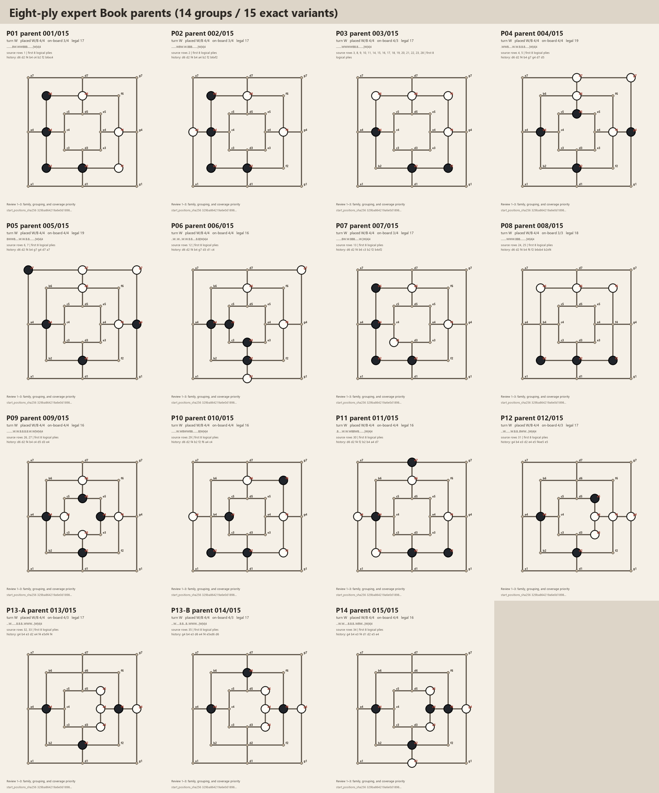
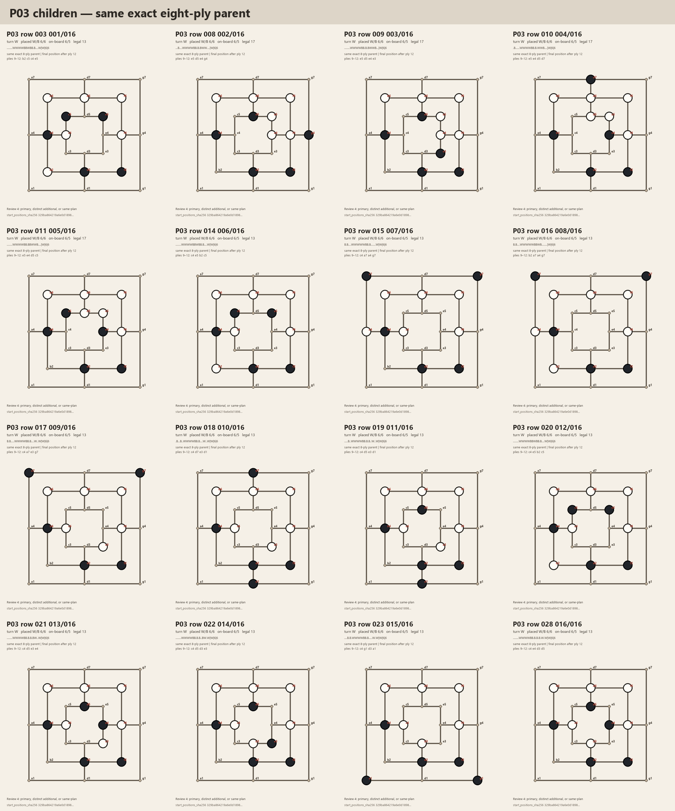

# Expert Book breadth-first shortlist proposal

Status: `proposal_for_expert_correction_not_frozen`

Date: 2026-07-31

Machine-readable proposal:
[`sanmill-layered-expert-book-shortlist-proposal-2026-07-31.json`](sanmill-layered-expert-book-shortlist-proposal-2026-07-31.json)

This document turns the Mill expert's family descriptions into concrete
choices that can be corrected quickly. It is not a record that the expert has
approved these choices. It does not freeze the 22 Book members, the internal
allocation between Book subtypes, the final 64 prefixes, or an evaluation.

The proposal is bound to reviewed expert-source audit identity
`1f6f9ceb8df36150ea401145e16c88cc25550622c1ad85a1b54a067183b9978d`.
All candidates are twelve complete logical plies, replay legally from
`startpos`, and finish with per-side logical-ply counts `[6, 6]`.

## Evidence and tie-break boundary

The proposal applies these rules in order:

1. preserve one representative for each expert structural parent before
   spending a second slot on one parent;
2. use an explicit expert primary choice when one exists;
3. use exact HumanDB occurrence support only as evidence that a history was
   observed, never as a strength label;
4. when expert evidence does not distinguish siblings, prefer the candidate
   that avoids current final-FEN and `ring16` overlap; and
5. retain every source history as provenance while withholding a diversity
   slot from an exact duplicate or same-plan endpoint transposition.

The last three rules are technical proposal rules, not Mill-expert judgments.
Rows selected only by those rules are marked as unconfirmed.

## Proposed must-keep breadth layer

This layer proposes one structurally unique representative for every P01-P14
parent group. `Must keep` is conditional: it means “retain if the
expert-curated subtype receives enough places to cover all fourteen parents.”
It is not final corpus membership.

| Parent | Proposed primary | Basis | Expert confirmed? |
| --- | --- | --- | --- |
| P01 | row 1, better `d1` continuation | Source explicitly prefers it over the sibling trap | Yes, source document |
| P02 | row 2 | Only child | Not needed |
| P03 | child 001, row 3 | Expert explicitly calls it the primary Black response | Yes |
| P04 | row 5 | Four-game exact HumanDB support versus none for row 4 | No; technical proposal |
| P05 | row 7 | Two-game exact HumanDB support versus none for row 6 | No; technical proposal |
| P06 | row 12 | Only child | Not needed |
| P07 | row 13 | Only child | Not needed |
| P08 | row 25 | Avoids row 24's current HumanDB endpoint-orbit overlap | No; trap wording is unresolved |
| P09 | row 27 | Avoids row 26's Sanmill Book endpoint-orbit overlap | No |
| P10 | row 29 | Only child | Not needed |
| P11 | row 30 | Only child | Not needed |
| P12 | row 31 | Only child | Not needed |
| P13 | P13-A row 32 | Source-order tie-break within the Knight Attack family | No |
| P14 | row 34 | Only child of the expert-named Interrupted Knight parent | Not needed |

The fourteen proposed records have fourteen distinct exact histories, final
FENs, and `ring16` endpoints. That within-list diversity is verified from the
frozen audit; it does not remove later cross-subtype or cross-stratum checks.

## Proposed P03 extended families

The expert's latest labels support the following correction sheet. Shared
words are used to propose groups, not to claim that the expert already approved
the grouping.

| Proposed family | Primary | Keep if space | Optional or redundant | Reason |
| --- | --- | --- | --- | --- |
| Closed Z / inner wrap | child 001, row 3 | none | child 006 row 14 is a same-endpoint transposition; child 012 row 20 exactly duplicates 006 | Expert selected 001; endpoint identity is objective |
| Perpendicular Mill Rush | child 002, row 8 | child 005, row 11 | none | Row 8 has nine-game exact HumanDB support; row 11 is a distinct source continuation |
| Parallel Mill Rush | child 003, row 9, outer | child 004, row 10, inner | none | Expert explicitly supplied the outer/inner distinction |
| Open Z / outer wrap | child 007, row 15 | children 008 row 16 and 009 row 17 | row 16 duplicates primary P03's final `ring16`; row 17 overlaps Sanmill Book | Row 15 minimises exact endpoint overlap, but the older/newer inner/outer wording needs correction if retained |
| Open Z with `c4/e3` | child 010, row 18 | child 011 row 19 and child 013 row 21 | rows 19 and 21 overlap another source structurally | Row 18 is the current non-overlapping outer-cardinal representative |
| Open Z with `c4/d3` Black forcing plan | child 015, row 23, Black double Mill | child 014 row 22 and child 016 row 28 | rows 22 and 28 have current cross-source orbit overlap | Row 23 is a non-overlapping, explicitly named tactical plan |

The order proposed for additional P03 family representatives is:

1. row 8, Perpendicular Mill Rush;
2. row 18, Open Z `c4/e3` outer cardinal;
3. row 23, Open Z `c4/d3` Black double Mill;
4. row 9, Parallel Mill Rush outer variant; and
5. row 15, Open Z outer-wrap candidate.

This order favours the strongest observed exact-history support first, then
distinct non-overlapping endpoints. It is not an ordering by playing strength.

## Other multi-child proposals

| Parent | Proposed primary | Additional child | Why this remains provisional |
| --- | --- | --- | --- |
| P01 | row 1 better `d1` ending | row 1 trap `c5` ending | Primary and trap labels are source-explicit; the trap still needs a product reason to consume a slot |
| P04 | row 5 | row 4 | Human occurrence breaks the tie, but the expert did not select a primary |
| P05 | row 7 | row 6 | Human occurrence breaks the tie, but the expert did not select a primary |
| P08 | row 25 | row 24 | Endpoint diversity breaks the tie; the expert's trap/better-response wording does not map cleanly to these rows |
| P09 | row 27 | row 26 | Row 27 avoids a Sanmill Book endpoint overlap; the expert did not select a primary |
| P13-A | row 32 | row 33 | Source order is only a deterministic tie-break |
| P13-B | row 35 if a second exact parent is desired | none | It is a different exact history in the same D4 structural family and is optional for breadth |

Full-resolution comparison sheets:

- [P04](assets/sanmill-layered-expert-book-parent-review-reviewed-source-2026-07-26/child-overviews/P04.png)
- [P05](assets/sanmill-layered-expert-book-parent-review-reviewed-source-2026-07-26/child-overviews/P05.png)
- [P08](assets/sanmill-layered-expert-book-parent-review-reviewed-source-2026-07-26/child-overviews/P08.png)
- [P09](assets/sanmill-layered-expert-book-parent-review-reviewed-source-2026-07-26/child-overviews/P09.png)
- [P13-A](assets/sanmill-layered-expert-book-parent-review-reviewed-source-2026-07-26/child-overviews/P13-A.png)

## Capacity consequence

The provisional corpus gives Book 22 places shared by two subtypes. Covering
all fourteen expert P01-P14 parents and one representative from each of the
seven Sanmill declared families consumes 21 places before cross-source
deduplication. Only one place remains, while the proposal identifies five P03
extended-family representatives beyond primary child 001.

The quota therefore cannot simultaneously guarantee:

- every expert parent;
- every Sanmill declared family; and
- every proposed P03 extended family.

This is the reason expert priority correction still matters. If several P03
plans are essential, some other parent or Sanmill family must be marked
`keep if space`, the subtype allocation must change, or the Book quota must be
revisited by the product owner. None of those choices is made here.

Under the breadth-first policy, the single initial extra place is proposed for
P03 row 8 because it has the strongest exact HumanDB support among the
additional expert histories. If later cross-source selection creates an
endpoint conflict, rows 18 and 23 are the next non-overlapping alternatives.

## Minimal expert correction requested

The expert can review this proposal by answering only the lines that are
wrong:

1. Which, if any, P01-P14 parent should move from `must keep` to
   `keep if space` or `optional`?
2. Are the six proposed P03 families grouped correctly, and which additional
   P03 family is most important after child 001?
3. Are the proposed primary rows correct for P04 (`5`), P05 (`7`), P08 (`25`),
   P09 (`27`), and P13-A (`32`)?
4. If P08 remains eligible, which audited row is the trap and which is the
   better representative?
5. If P03 rows 15 or 16 remain eligible, should their latest open/outer wording
   replace the older inner/closed wording?

Silence or general approval must not be converted into a formal corpus freeze.
After expert correction, the product owner must still approve the overall
`22 Book / 21 HumanDB / 21 Perfect DB` composition and the internal split of
the 22 Book places. Only then may an immutable 64-prefix proposal and final
review images be generated.

No candidate model was loaded, no game was played, and no evaluation or
training launch is authorised by this shortlist.
