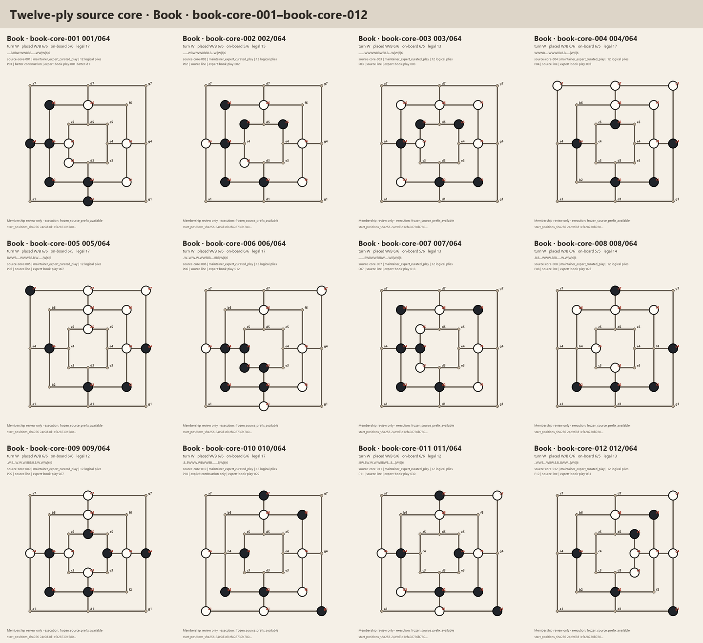
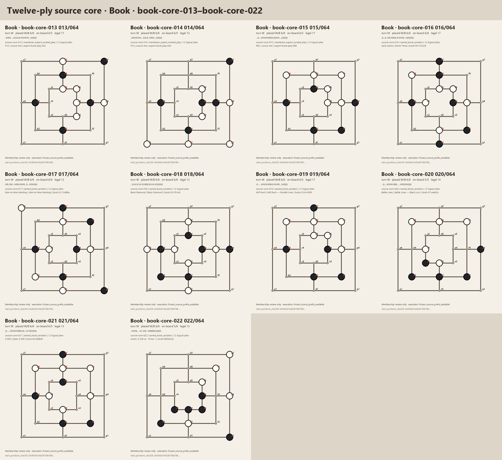
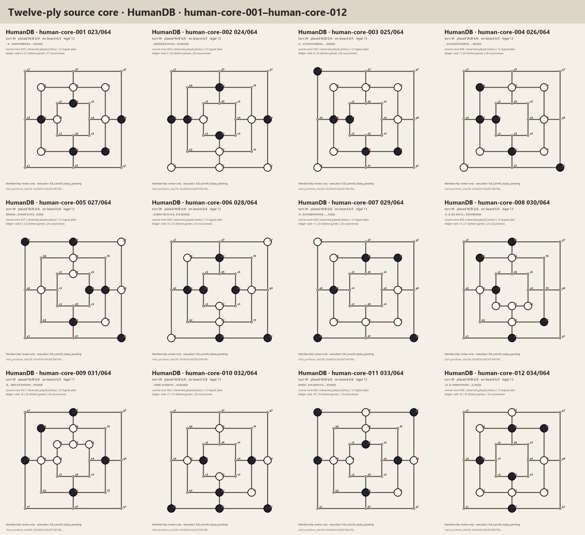
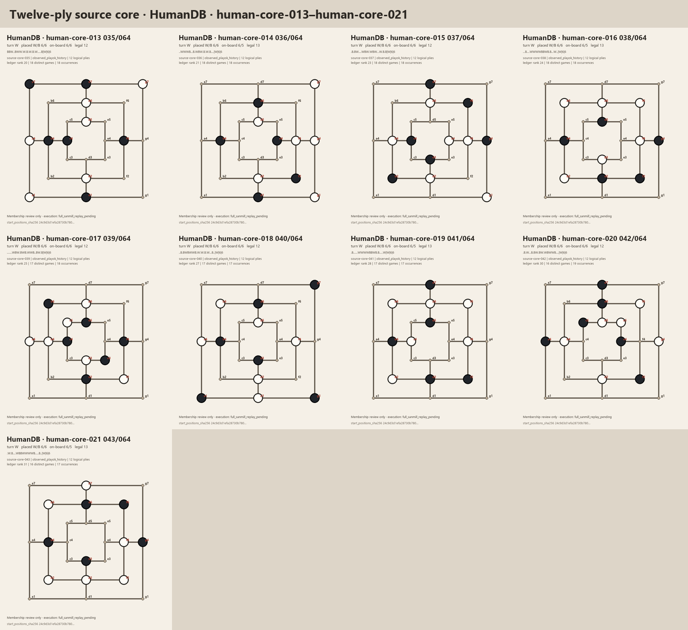
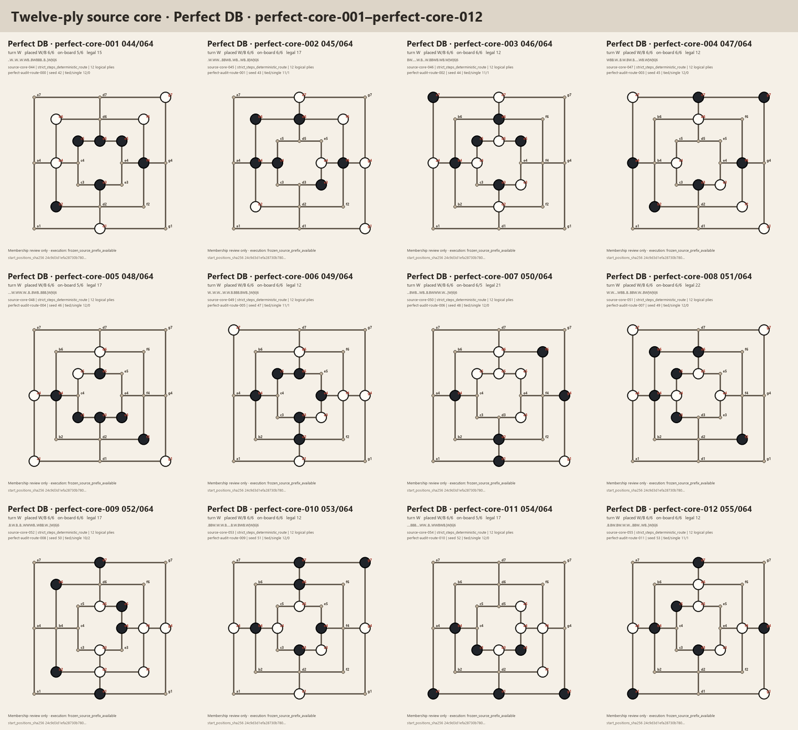
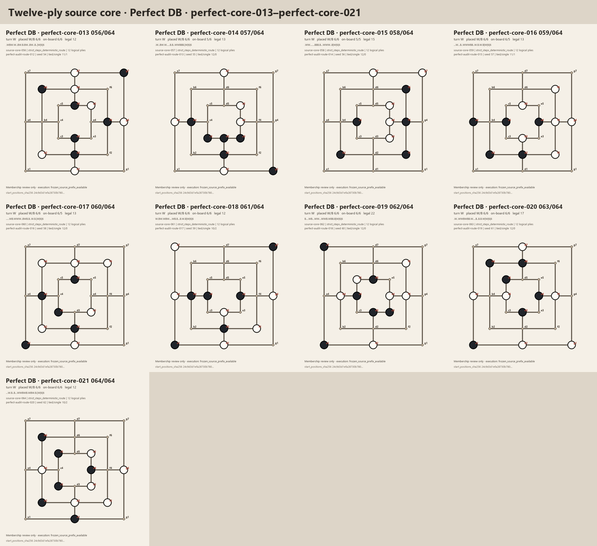

# Twelve-ply layered-prefix source-core review package

Status: `source_membership_review_only_not_execution_authority`

Review-package date: 2026-08-01

This package renders the 64 frozen source members selected for the twelve-ply
layered opening-prefix core. It contains 22 Book, 21 HumanDB, and 21 Perfect DB
positions, in that order. The source-membership identity is
`ed09e3952fa790b3cb044bd7a8fc06c9429d6675ece726abeef29d1c0ddf1608`.

The package contains 64 individual 720 x 840 PNG panels and six contact sheets.
Their paths, dimensions, SHA-256 digests, source identities, and sheet coverage
are frozen in
[the asset manifest](assets/sanmill-layered-opening-prefix-v2-source-core-2026-08-01/manifest.json),
whose identity is
`db37224db6e400a32df9275e5e0665647541c4aa589b327b4317235e2eb27fba`.

## Review scope

Reviewers should consider four separate questions:

1. **Rendering and attribution:** does each diagram agree with its displayed
   final FEN, side to move, placement/on-board counts, source stratum, and
   source-specific label?
2. **Book coverage:** do the 22 Book positions provide useful breadth across
   the selected expert plans and Sanmill named families, and is any position
   clearly unsuitable or misleading as a representative of its labelled plan?
3. **HumanDB plausibility:** do the 21 positions look like plausible human
   opening developments? Their counts mean only that the complete history was
   frequent in the frozen PlayOK sample; they do not establish universal human
   preference or theoretical quality.
4. **Perfect DB diversity:** do the 21 deterministic StrictSteps routes add
   useful theoretical and structural variety? They are theory-controlled
   routes, not claims about common human play.

Flags should identify the source-core number and the concrete concern. A
visual resemblance is not automatically a duplicate: the frozen source core
is already distinct by exact history, final FEN, and D4/`ring16` structure.

## Evidence boundary

The diagrams show final states only. They do not themselves prove that the
displayed state was reached by a complete legal replay. The Book and Perfect
DB members already referenced frozen source-prefix records when this package
was created. The subsequent
[HumanDB execution overlay](sanmill-layered-opening-prefix-v2-human-execution-2026-08-01.md)
now freezes complete replay evidence for the other 21 members and confirms
their displayed final FENs. The HumanDB panel footer
`full_sanmill_replay_pending` records package-time state; this frozen image
package is not regenerated or relabelled by the later evidence.

The later
[executable corpus](sanmill-layered-opening-prefix-v2-executable-corpus-2026-08-01.md)
binds all 64 complete prefix records to this unchanged source membership. It
does not convert the images themselves into execution evidence.

This package does not load a candidate model, play games, measure strength,
replace the separate movement/flying phase corpus, or authorise evaluation or
training. Reviewer comments can identify a membership problem, but cannot
silently change the accepted 22/21/21 allocation or substitute another source.

## Book (source-core 001-022)

## HumanDB (source-core 023-043)

## Perfect DB (source-core 044-064)

