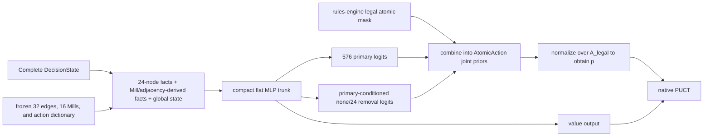

# Strict AlphaZero Training Design for Nine Men's Morris

Status: **strict AlphaZero research-design proposal; not authorization for
training, evaluation, or release**

Route ID: **NMM-AZ**

Positioning: **the policy-value network, native PUCT, and self-play are the
non-optional backbone and the object under study; the Perfect DB is a
measurement instrument that stays outside the pure-baseline training lineage,
provides absolute truth within a calibrated support domain, and may serve as a
curriculum, constraint, or auxiliary teacher in separate experiments**

Last updated: 2026-07-29

## 1. Document Purpose and Authority Boundaries

### 1.1 Route Positioning

This document defines a strict AlphaZero training route for Nine Men's Morris
(Mill). Here, "strict" does not mean reproducing a Go or Chess implementation
line by line. It means that every part of the following algorithmic loop is
present in the formal baseline, and that none may be replaced by Oracle
distillation, shallow alpha-beta, or hand-authored strategy rules:

```text
policy-value network fθ(s) → native PUCT → self-play search policy π
          ↑                                  ↓
          └──────── update θ with (s, π, z) ─┘
```

Specifically:

- $f_\theta(s)=(p_\theta(s),v_\theta(s))$ outputs both legal-action priors and
  a value from the perspective of the side to move;
- every self-play decision uses native PUCT with this network to produce a
  visit distribution $\pi$;
- $z\in\{-1,0,+1\}$ comes from an actual terminal result in the authoritative
  rules engine, and a draw is 0 in the strict baseline;
- each new network generates subsequent self-play data, completing the policy
  improvement loop.

"Strict" constrains two independent dimensions at the same time:

1. **Algorithmic-loop completeness:** the network, native PUCT, self-play, and
   $(s,\pi,z)$ updates must not be replaced by an external teacher.
2. **Purity of training-information sources:** the targets, start-state
   selection, and checkpoints of `NMM-AZ-BASE` come only from an accepted rule
   environment and information generated by this route itself. They do not
   read Perfect DB labels, human frequencies, Sanmill actions, or checkpoints
   from other routes.

These dimensions must not be misread as requiring every engineering choice in
the 2017 paper to be reproduced literally. W/D/L outputs, self-generated
auxiliary targets, search-value bootstrapping, or modern variants such as
Gumbel AlphaZero may still be information-pure AlphaZero-family ablations if
they use only the rules and the route's own search information. They require
separate configurations and experiment IDs, however, and must not
retroactively rewrite the first native-PUCT baseline defined here.
`NMM-AZ-BASE` remains the common anchor, and any gain from a modern variant
must be measured against it.

Consequently, none of the following systems, however strong, is by itself the
strict AlphaZero baseline defined here:

- a bare student distilled from all-candidate Perfect DB labels;
- a student plus fixed-depth minimax/alpha-beta;
- ordinary MCTS using rollouts with a hand-authored value function;
- imitation learning that trains only a policy and has neither a value nor a
  search-improvement target;
- a route that first completes an Oracle student and treats PUCT/self-play as
  an optional final upgrade.

The existence of a Perfect DB does not change this definition. It can improve
sample efficiency, discover theoretical errors, construct endgame curricula,
provide auxiliary labels, or authorize moves at runtime, but those uses must
remain separate from the pure-self-play lineage of `NMM-AZ-BASE`.
Oracle-assisted versions must be named accurately as `NMM-AZ-ORACLE-*`;
benefits from Oracle distillation must not be attributed to AlphaZero
self-play.

The unique scientific opportunity in this project is not to prove once again
that "AlphaZero can play a small-board game." It is to use NMM's solved assets
to measure the residual errors of self-play reinforcement learning against
absolute truth within a verified support domain: how far the system remains
from theoretical truth, where its errors concentrate, and how much
representation, visitation distribution, credit assignment, and search each
contribute. AlphaZero remains both the research backbone and the object under
study; the Perfect DB is the measurement instrument, not the pure baseline's
move generator.

### 1.2 Shared Authorities

This document does not replace:

1. `AGENTS.md` at the repository root;
2. the [Windows training handover](handoff/windows-training-2026-07-20.md);
3. the [local training-data layout](local-training-layout.md);
4. the rules, state, action, and Oracle semantics shared by the repository in
   the [v5 Oracle and rules specification](v5/oracle-and-rules-spec.md);
5. the risk classification, experiment source of truth, and semantic
   versioning rules in [v5 engineering
   governance](v5/engineering-governance.md).

The repository's authoritative rules and independent tests take precedence
over Sanmill, strategy books, historical screenshots, old database fields, and
recommendations in this document. Sanmill is an important differential
reference and candidate runtime environment, but it is not a reason to bypass
acceptance of this repository's semantics.

This document alone must not be used to:

- launch a smoke run, long training run, or resumed training run;
- generate formal Oracle labels;
- activate an old checkpoint or historical SpecialistDB;
- claim "perfect," "never loses," "theory preserving," or a particular
  Sanmill level;
- modify shared rules, history, Oracle, or node-index schemas.

Every actual run requires a separate frozen experiment contract, must pass
training-readiness verification, and must receive explicit launch
authorization.

### 1.3 Relationship to v5 and Existing Routes

`NMM-AZ` and v5 may share accepted rules engines, history adjudicators, state
serialization, the Sanmill bridge, Oracle query code, verifiers, and evaluation
tools, but they answer different questions:

| Route | Core question |
| --- | --- |
| `NMM-AZ-BASE` | How strong can a network + native PUCT + pure self-play become, and where does it fail? |
| `NMM-AZ-ORACLE-*` | What is the marginal gain from introducing the Perfect DB relative to pure AlphaZero? |
| v5 / Oracle-distill | Can reference-policy distillation, shallow search, and a compact runtime directly satisfy the product objective? |

A field-equivalent v5 T0 can serve as a strong external control, and its
infrastructure can be reused; it cannot replace the PUCT self-play experiment
of `NMM-AZ-BASE`. Conversely, making AlphaZero work does not establish that it
is a better product choice than v5. Section 16 explicitly separates the
product decision from the research question.

The corrected-v4 author further explained that the intent behind the flawed
opponents formed from the nets and Sentinel was to expose Gen 2b to varied
players and, in Gen 3, to mix human preferences and common human blunders with
a stronger heuristic player so that the learner exploits "the mistakes people
actually make" rather than uniformly random blunders. This explanation is
valuable **design intent and an experimental hypothesis**; it is not evidence
that Gen 2b or Gen 3 has been implemented, trained, or independently evaluated.
The HumanDB, GapNet, Sentinel, and heuristic mechanisms currently recorded in
`v4-specialist-plan.md` must still be accepted against their actual code, label
provenance, checkpoint lineage, and frozen configuration.

In this document, that intent enters only the `NMM-AZ-TARGET-*` external
opponent league in Section 17. It must not enter `NMM-AZ-BASE` input features,
reward shaping, policy/value targets, start-state sampling, or checkpoints.
This preserves the strict AlphaZero baseline while allowing the marginal
effects of varied opponents, human preferences, and human-like blunders to be
tested separately and attributed honestly.

## 2. Executive Summary

The first complete research deliverable of this route is neither an Oracle
student nor a shallow-search gain. It is a reproducible strict AlphaZero loop:

1. an NMM environment with rules- and history-sufficient state;
2. a policy-value network that outputs legal-action priors and a value;
3. native PUCT using the network's prior and value;
4. self-play from the standard initial position;
5. $\pi$ generated from search visit counts;
6. $z$ generated by actual terminal results;
7. network updates using $(s,\pi,z)$ followed by generation of new games;
8. exact resume, frozen external opponents, and independent evaluation
   evidence.

The recommended evidence order has two parallel prerequisites followed by a
single converged evidence chain:

```text
NMM-AZ-E0  accept core rules, history, atomic actions, and Sanmill mappings
    ↓
NMM-AZ-0   network + native PUCT + replay + training-loop smoke
    ↓
NMM-AZ-1   standard-start pure-self-play baseline from random initialization ─┐
                                                                            ├─ scientific completion:
NMM-AZ-M0  calibrate comparator, coverage, and positional/full-history bias ──┘  theoretical residuals + H1
                                                                                 ↓
NMM-AZ-CTRL-0  same-architecture error decomposition: full-domain/stratified
               Oracle supervision, AZ-visitation Oracle supervision, pure AlphaZero
                                                                                 ↓
NMM-AZ-2   scale, phase, and architecture ablations selected by H1 and error decomposition
    ├─ NMM-AZ-PHASE-*    phase-stratified sampling or state-archive ablations
    ├─ NMM-AZ-LONG-*     pure-self-play long-conversion and reverse-curriculum ablations
    ├─ NMM-AZ-ORACLE-*   Perfect DB curricula, auxiliary labels, and hard-case feedback
    └─ NMM-AZ-TARGET-*   asymmetric AlphaZero under theory-safety constraints
                                                                                 ↓
NMM-AZ-VERIFY-0  offline full-history reachable-subgraph verification of a frozen deterministic policy
```

PUCT and self-play are the backbone from `NMM-AZ-0`, not optional later
additions. Without them, the environment, an Oracle student, or a product
baseline may still be delivered, but this route has not been completed.

Prerequisites are divided into two tracks and must not be collapsed into one
global blocker:

- **Core AlphaZero prerequisite:** the rules profile, complete-history state,
  legal atomic actions, settled successors, terminal semantics, and
  repetition/no-progress semantics must be accepted. Before acceptance, only
  disposable smoke work is permitted.
- **Oracle-measurement prerequisite:** a full-field, perspective-preserving
  ultra-strong comparator, support coverage, and positional/full-history bias
  must be accepted before theoretical-downgrade evaluation or Oracle-assisted
  training. This does not block pure AlphaZero data generation that depends
  only on rules-terminal $z$, but it does block scientific completion of
  `NMM-AZ-1`, the H1 test, error decomposition, and every
  theoretical-reliability claim.

`NMM-AZ-E0` and `NMM-AZ-M0` should therefore proceed in parallel. If M0 is
delayed, AZ-0 smoke and pure-self-play actor engineering may continue, but
results containing only external matches and phase coverage must not be
described as having answered "where the residual theoretical errors are."

The strict baseline does not penalize draws. Changing a draw from $z=0$ to a
negative value makes the objective different from AlphaZero's actual terminal
return and may encourage deliberate entry into a theoretical loss. Error
induction within draws, complexity, and win rate against a target opponent
must be separate experiments compared under theory-safety constraints.

The Perfect DB's preferred roles are:

1. after calibration, act as an absolute-truth measurement instrument within
   the declared support domain and produce theoretical-residual curves and
   first-error structure;
2. provide supervised controls for decomposing representation, coverage, and
   reinforcement-learning errors;
3. support offline theoretical evaluation and error localization;
4. supply phase/endgame curricula and hard negatives;
5. optionally provide supervised warm starts, auxiliary losses, or reanalysis;
6. optionally provide theory-safe action masks and trap/conversion
   environments;
7. provide offline universal verification, runtime exact fallback, compact
   tables, or certificates.

The Perfect DB does not automatically become "an opponent that is good at
setting traps." W/D/L or distance fields supply only theoretical constraints
and conversion evidence; a frozen opponent model is still required to
construct safe traps against the current AlphaZero. The primary method trains
asymmetric AlphaZero against real terminal outcomes while masking the learner
to $A_{\mathrm{allow}}$; an adaptive trap teacher remains only an
external-environment control. Both belong to
`NMM-AZ-TARGET-*`/`ORACLE-*`, not the pure baseline.

Any Oracle intervention that **changes training data, search, the opponent, or
runtime behavior** must have a matched-budget comparison against pure
`NMM-AZ-BASE`, with self-play compute, Oracle queries, training updates, and
runtime costs accounted for separately. Read-only measurement does not change
baseline lineage, but its query/enumeration cost must still be reported
separately rather than mixed into training compute.

The first decisive hypothesis on this route is:

> **H1 (conversion signal dies first):** self-play draw rate crosses a
> preregistered saturation threshold before the Oracle theoretical-downgrade
> rate crosses a preregistered reliability threshold.

`95%` and `1%` may be candidate pre-pilot thresholds, but they must be frozen
before the formal curves are inspected and must not be written as known NMM
constants. If H1 holds, ordinary symmetric self-play has lost enough decisive
return while theoretical errors still remain. Subsequent LONG, league, or
Oracle constraints are then not synonyms for "train longer"; they are repair
mechanisms that require independent validation.

## 3. Research Questions, Goals, and Non-Goals

### 3.1 Primary Research Questions

This route answers, in order:

1. What is strict AlphaZero's **absolute theoretical residual** after random
   initialization, and where does it concentrate across phases, history
   boundaries, unique-response states, and long conversions?
2. Does the decisive-outcome signal in symmetric self-play disappear before
   the residual theoretical errors do; that is, does H1 hold?
3. Under the same architecture and evaluation domain, how much of the
   residual can operationally be attributed to representation/optimization
   capacity, visitation-distribution coverage, and self-play credit
   assignment/finite search?
4. Can strict AlphaZero learn legal tactics, phase transitions, blockade,
   flying, and long-range value, and attain meaningful external strength at
   fixed compute?
5. Can phase-stratified replay, a state archive, network architecture, or
   purely self-generated algorithmic variants improve the localized gaps?
6. How much sample efficiency and theoretical reliability do Perfect DB
   curricula, auxiliary supervision, action constraints, or hard-state
   feedback add over equal-compute pure self-play?
7. Can a frozen, deterministic neural policy be verified over the full-history
   reachable subgraph to obtain a universally quantified safety claim backed
   by a certificate?
8. Within theory-safe actions, can asymmetric AlphaZero learn ultra-strong
   error induction and actual conversion against a specified opponent?
9. What are the network-size, PUCT-node, latency, and strength tradeoffs on the
   target device?

### 3.2 Goals

- Build a complete, resumable, and testable native AlphaZero loop.
- Preserve correct rules, history, atomic-action, perspective, and terminal
  semantics.
- Produce a pure-self-play baseline and learning curve from random
  initialization.
- Seal independent measurement snapshots starting with the first checkpoint;
  after M0 passes, use the calibrated Perfect DB read-only to measure absolute
  theoretical error without writing measurement labels back into the pure
  baseline.
- Decompose representation, visitation coverage, and RL/search residuals with
  same-architecture supervised controls.
- Test H1 and, when its signal-depletion condition is met, stop the baseline
  according to preregistered rules and open separate repair experiments rather
  than silently changing the objective inside the same run.
- Cover placing, moving, flying, combined capture actions, and phase
  boundaries.
- Quantify the gain from PUCT relative to the bare network and frozen external
  engines.
- After Oracle acceptance, quantify theoretical-downgrade rate on the
  naturally reached distribution.
- Measure the independent contributions of phase curricula, Oracle use, and
  target-opponent training through controlled comparisons.
- Produce a compact network + PUCT candidate deployable in Sanmill or a
  compatible runtime.
- Distinguish measured playing strength, low theoretical error rate, and
  provable theory safety.

### 3.3 Non-Goals

- Do not treat NMM as a miniature version of Go or assume that a small board
  makes perfection easy.
- Do not treat self-play Elo, training loss, or win rate against an old
  checkpoint as evidence of theoretical reliability.
- Do not present an Oracle student + alpha-beta as strict AlphaZero.
- Do not ask the network to guess legality, terminal conditions, or removal
  rules.
- Do not treat pending removal as an independent turn for the other player.
- Do not penalize draws in the strict baseline.
- Do not write human maxims, node-terrain scores, or mobility constants into
  the value or PUCT.
- Do not assume in advance that a GNN, Transformer, shared trunk, or
  phase-specific head must be better.
- Do not assume in advance that Perfect DB assistance must outperform spending
  the same compute on more self-play.
- Do not claim perfection merely because PUCT has been implemented.
- Do not extrapolate a result from one NMM ruleset into a cross-game algorithm
  conclusion.
- Do not let a research branch block a simpler product deliverable that
  already satisfies its requirements.

### 3.4 Expected Difficulties and Falsifiable Predictions

NMM has only 24 nodes, and its legal branching factor and state space are far
smaller than Go's. Strict AlphaZero is therefore likely to learn Mill
formation, blocking, opening and reclosing Mills, double threats, and basic
blockades relatively quickly. This is only a prediction to be tested; it does
not imply that Sanmill Level 9 is inevitable, much less that near-perfect play
is.

Progressing from "can play" to "theoretically reliable" may encounter:

- **draw saturation:** at high strength, many games have $z=0$, and ordinary
  outcomes cannot distinguish a simple safe draw from a unique-reply draw or a
  complex error-inducing draw;
- **conversion-signal depletion:** when the empirical variance of $z$ in
  replay, the number of decisive games, and PUCT's improvement over the prior
  all decline together, value may approach a constant and the search policy
  may approach the prior even while residual theoretical errors remain;
- **uneven phase coverage:** standard-start self-play may allow placing and
  moving samples to overwhelm flying, 4→3 transitions, and history boundaries;
- **long-range credit assignment:** a rare error may take many logical plies
  before it becomes a terminal loss;
- **long-conversion bootstrapping:** AlphaZero's terminal $z$ is not discounted
  by distance, but a weak self-play opponent may fail to convert an early
  theoretical blunder, causing a prefix that should be L to receive an actual
  draw label;
- **search/network co-adaptation:** the same network generates the training
  distribution and evaluates leaves, potentially creating mutually reinforced
  blind spots;
- **the error-induction gap in symmetric self-play:** a comparable strong
  searcher does not make the characteristic errors of a target population, so
  a complex drawing line receives no additional reward;
- **objective/evaluation mismatch:** the factual W/D/L objective only requires
  preserving the theoretical tier, while match score against a frozen weak
  opponent also requires selecting, among many draw lines, those most likely
  to induce and convert an error. External match score therefore mixes in
  ultra-strong quality and cannot serve as a proxy for pure theory safety;
- **a disproportionate last mile:** aggregate win rate or Elo can rise quickly,
  while eliminating a small number of theoretical blunders demands much
  greater coverage, evaluation, and search cost.

The corresponding falsifiable predictions must be frozen in formal experiment
contracts:

1. **P1 (quick competence, concentrated residuals):** basic tactics and loss
   rate against a frozen weak opponent improve quickly, but residuals are more
   likely to concentrate in flying, low-piece endgames,
   repetition/no-progress boundaries, and long-distance states. "≤6 pieces"
   is only a candidate stratum, not a result that may be written in
   advance.
2. **P2/H1 (conversion signal dies first):** the self-play draw-saturation
   event precedes achievement of the reliable theoretical-downgrade threshold.
   If it does not, continued scaling of pure self-play has stronger support
   than introducing complex branches.
3. **P3 (coverage/credit gap exceeds representation gap):** the same small
   network attains materially better theoretical action quality under
   full-domain or stratified Oracle supervision than under pure AlphaZero. If
   it does not, resources should go first to representational capacity and
   optimization, not curricula or leagues.
4. **P4 (ultra-strong behavior does not emerge automatically):** across many
   theoretically tied draw actions, symmetric self-play does not reliably
   produce an ordering targeted at a frozen weak opponent. If it emerges
   naturally, within-tier reference fidelity and conversion against unseen
   opponents should directly falsify this prediction.
5. Phase/archive methods, modern self-generated variants, or Oracle assistance
   may improve the gaps, but their gains must exceed those from more
   equal-compute native-PUCT self-play.

P1–P4 are hypotheses to falsify, not tautological reasons for authorizing the
route. In particular, neither P2 nor P3 may be treated as "plausible enough" to
skip the pure baseline, error controls, or sealed measurement.

## 4. Game Semantics and Training-Sample Unit

### 4.1 Action Modes

NMM is not four fully independent agents arranged in a strict sequence. The
formal state must describe the capabilities of the side to move:

- `placing`: that side still has pieces in hand;
- `moving`: that side has placed all pieces and has more than three pieces on
  the board, so it may move only along rules edges;
- `flying`: that side has exactly three pieces on the board and may move to any
  empty node;
- `capture/removal`: the conditional substep that must be completed after the
  primary action forms a Mill.

One player may already be flying while the other is still moving. The network
and search must not use a single coarse phase flag shared by both players.

### 4.2 Logical Plies and Atomic Actions

One logical ply for training and search is one complete decision by the
current player:

```text
placement / movement / flying
+ legal removal, if a Mill is formed
```

The Sanmill protocol may represent the primary action and removal with two
tokens, but the training policy, PUCT edges, and visit counts must operate on a
complete `AtomicAction`:

```text
AtomicAction {
  primary_kind
  from_node?       # absent for placement
  to_node
  capture_node?    # absent for a quiet action
}
```

If the same primary action permits removal of several different pieces, each
choice is a distinct legal atomic action. The rules engine must first produce
the settled successor; MCTS must not switch sides or back up a value between
the primary action and removal.

### 4.3 Complete `DecisionState`

A training root state must contain at least:

```text
board_occupancy
side_to_move
in_hand_count_self / opponent
on_board_count_self / opponent
current_mode_self / opponent
rules_profile_id
repetition_state
no_progress_state
history_sufficient_state
claim_state
terminal_state / outcome_reason
node_index_schema_id
```

If legality, terminal status, or theoretical value depends on additional
history, that history must be represented explicitly or through a provably
sufficient summary. States with the same board but different histories must
not be merged incorrectly.

Storing only the current repetition/no-progress counters or a board FEN may be
insufficient to update repetition-equivalence classes for every successor. The
preferred engineering candidate is a versioned sequence of position keys,
repetition counts, no-progress count, and claim state covering the interval
since the most recent history reset or irreversible action as defined by the
frozen rules, implemented as a bounded ring buffer. Its upper bound and the
actions that reset history must be derived from the final rules profile; the
design must not assume, before the rules are frozen, that placement, capture,
or any other action necessarily resets history in a particular way.

This does not require inventing new game theory. It is a bounded state-
representation and acceptance task:

1. first use the conservative complete relevant history as the reference;
2. prove that the candidate summary is equivalent for every legal successor,
   repetition/no-progress adjudication, and claim;
3. run differential/property tests at threshold boundaries, capture/reset
   cases, cycles, and serialization round trips;
4. only after proof may the rules tree, PUCT key, and verifier use the
   compressed summary.

As of the code audit at repository commit `65607ae`, the Rust `Board` contains
only both bitboards, cumulative placement counts, and the side to move; it has
no repetition, no-progress, or history fields. The Python `GameEngine`'s
specific oscillation detection and post-placement counter have likewise not
become the general history adjudicator required by the shared authoritative
specification. A clearly defined implementation candidate therefore does not
mean that this gap has already been closed.

The rules tree and PUCT key must carry a provably sufficient history summary,
or, conservatively, the complete relevant history. The network may experiment
with a compressed history encoder, but if that compression has not been proved
to preserve the Markov property, it is only an approximate evaluator and
cannot support a global theoretical guarantee.

Network inputs may be normalized to the perspective of the side to move, but
the rules engine, search backup, Oracle query, and evaluation must record each
perspective transformation. Every $v$, $z$, and W/D/L field must identify
whether it uses the side-to-move, root-player, or fixed-color perspective.

## 5. Core Environment and Rules Acceptance

### 5.1 Authoritative Path

Before formal training, freeze and accept:

- the standard rules profile and allowed variants;
- legality for placing, moving, flying, and removal;
- the exception governing which pieces may be removed after a Mill is formed;
- terminal conditions for fewer than three pieces, no legal primary action,
  repetition, and no progress;
- terminal status and `outcome_reason` for a complete logical ply;
- state serialization, deserialization, and replay;
- fail-closed behavior for every required component.

External `NMM_Std/standards` should be one input to standard-semantic
alignment, with its machine path resolved through a dedicated key in
`data/training_paths.local.json`; the final authority remains the repository's
frozen profile and independent tests. A formal long run must not train under
approximate rules with the intention of changing them later. A change to
rules, history, or terminal semantics changes legal actions, $z$, the search
tree, and checkpoint semantics, and normally requires a new schema, a new
experiment ID, and training from scratch.

If the external `NMM_Std/MIF` working draft and its conformance corpus are
used, their commit or content hash must also be frozen. MFEN, MPK, MSTATE, MRS,
and fixtures for stalemate, claims, delayed removal, multiple Mills, and
similar cases may be used for schema alignment and differential testing, but
that community draft does not automatically outrank the repository profile as
the rules authority. Formal training remains No-Go while differences affecting
legal actions, history, or terminal results remain unresolved.

If the repository's current simplified `GameEngine` has not passed formal
history-adjudicator acceptance, it may be used only for restricted smoke work.
It must not generate durable $z$ values, theoretical labels, or safety claims.

Before rules acceptance, a disposable smoke that does not retain checkpoints
may be run to verify tensor shapes, device throughput, or process
communication; it must not be promoted into a formal lineage.

### 5.2 Two Execution and Measurement Pacing Tracks

Prerequisites must be separated as follows:

| Prerequisite | Scope blocked |
| --- | --- |
| `core_rules_acceptance_id`: rules, history, atomic actions, terminal semantics, and perspective | all formal `NMM-AZ-*` training |
| `oracle_comparator_acceptance_id`: full-field, perspective-preserving ultra-strong comparator | all formal Oracle queries, all-candidate labels, and theoretical action comparisons |
| `oracle_instrument_calibration_id`: support-domain completeness, missing-table/unknown behavior, and positional/full-history bias | scientific completion of `NMM-AZ-1`, H1, CTRL-0, theoretical endpoints, Oracle-assisted training, and exact claims |

This distinction prevents two errors:

- starting self-play blindly while the rules environment is still incorrect;
- incorrectly blocking a pure AlphaZero baseline that never reads the Oracle
  merely because the comparator has not yet been accepted;
- claiming, from external matches alone and without a calibrated measurement
  instrument, to have measured AlphaZero's residual distance from theoretical
  truth.

`core_rules_acceptance_id` and Oracle comparator/instrument calibration should
be parallel project-level pacing items. The former controls whether formal
training data may be generated. The latter does not block engineering progress
on the pure loop, but it controls whether `NMM-AZ-1` can complete its primary
scientific conclusion. The design enters a feature freeze until the
`NMM-AZ-0` smoke produces evidence: apart from closing those acceptance items,
correcting discovered semantic defects, or completing contracts needed to
launch, do not add network branches, auxiliary heads, or sampling schemes.

Oracle instrument calibration must include at least:

- a frozen expected file/sector inventory, content hashes, and queryable
  support domain;
- fail-closed behavior for every state claimed to be supported: a missing
  table, corruption, unexpected entry, perspective contradiction, or
  `unknown` must not be converted to draw/0/None and allowed to continue;
- measurement, on both the natural-visitation population and a
  history-boundary stress population, of the disagreement rate and strata
  between positional $V^*_{\mathrm{pos}}$ and the full-history rules
  adjudicator/proof result;
- separate reporting of `A_pos`, `A_allow`, and states for which the history
  proof is `unknown`; a positional safe set must not substitute for a
  full-rules safe set;
- independent-verifier review of sampled and boundary cases.

As of commit `65607ae`, `EndgameSolvedDbHandle::open` silently skips a missing
`endgame_W_B.wdl` and lets the corresponding probe return `None`. That
behavior may support explicitly labeled best-effort exploration, but it does
not satisfy the fail-closed contract for formal Oracle measurement. Before M0,
the implementation must require an exact match to the expected inventory, or
load an explicitly versioned partial-support manifest and abstain for states
outside that support without including them in endpoint denominators.

### 5.3 Required Deterministic Tests

- The same state produces the same legal atomic-action set in independent
  implementations.
- Every atomic action replays to the same settled successor.
- A pending-removal state never becomes a training root.
- If the side to move has no legal action, terminate exactly without calling
  the network.
- Repetition/no-progress transitions and terminal outcomes agree.
- Both sides' on-board/in-hand counts, claim state, outcome reason, and history
  hash agree.
- Swapping perspective twice returns the original state.
- A serialization round trip loses no history.
- Sanmill/NMM_LLM mappings are invertible and preserve the action set.
- A missing, unknown, or failed required component stops execution rather than
  returning a neutral value.

Failure of any item blocks formal training. A green result must not be
obtained by deleting tests, skipping rare rules, or turning errors into draws.

## 6. Node Numbering, Topology, and Symmetry

### 6.1 Separate Semantic Nodes from Model Indices

Sanmill's node numbering serves its code and protocol; it need not be the best
memory layout for the network. Renumbering by itself does not improve playing
strength. It can provide an engineering benefit only if it improves action
encoding, locality, batching, or implementation clarity.

Keep distinct:

- `semantic_node_id`: a board-semantic coordinate stable across
  implementations;
- `sanmill_node_id`: the numbering used by the Sanmill bridge;
- `model_node_index`: the tensor layout used by the current network;
- `node_index_schema_id`: the versioned identity of those mappings.

The mapping must cover:

- single-node placement and capture;
- `{from,to}` for moving and flying;
- complete `{from,to,capture}` atomic actions;
- boards, history keys, policy vectors, and successors;
- every symmetry transform and its inverse.

Checkpoints, replay, search trees, datasets, and bridges must carry
`node_index_schema_id`. A schema change must never silently load an old
checkpoint.

The first version may use an auditable 3-ring × 8-position semantic layout,
but its mapping to Sanmill/NMM_LLM must be derived and verified from the
authoritative topology. The use of `[0..7]/[8..15]/[16..23]` in some example
must not be taken as evidence that the repository uses the same numbering.

At least three bijective orders are currently known, and the formal schema
must adapt them through semantic coordinates:

| Source | Ring order and starting point within each ring |
| --- | --- |
| NMM_LLM `POSITIONS` | outer → middle → inner; clockwise from the north-west corner of each ring |
| Sanmill Rust dense node | inner → middle → outer; clockwise from the north midpoint of each ring |
| Malom bit order | outer → middle → inner; clockwise from the west midpoint of each ring |

The recommended candidate `ring-major-sector8-v1` explicitly defines:

```text
ring   = [outer, middle, inner]
sector = [NW, N, NE, E, SE, S, SW, W]
index  = ring * 8 + sector
```

This makes it convenient to reuse one sector8 D4 permutation and makes the
outer/inner-ring swap act only on rings 0 and 2. It is only a proposed model
protocol pending the shared specification freeze; it must not inherit
semantics implicitly merely because it happens to match an existing list.
"Swap `[0:8]` with `[16:24]`" is valid only under this schema and is not a
cross-implementation algorithm. The formal mapping record contains at least:

```text
semantic_node_id
model_node_index
sanmill_dense_node
malom_bit_index
node_index_schema_id
forward_inverse_map_sha256
ring16_permutation_sha256
```

Here, 3×8 defines only serialization order, not a neural-network neighborhood.
Adjacent indices do not imply a rules edge, and nearby drawing coordinates do
not imply an edge either. The model must not infer topology from `i±1`, 7×7
pixel distance, or the position of a conventional convolution kernel. True
adjacency and Mill incidence must be independent, versioned structural inputs.

### 6.2 Standard Topology Facts

The standard board must be verified automatically from authoritative tables,
not transcribed by hand:

- 24 playable nodes;
- 32 undirected rules edges: eight on each of the three rings, for 24, plus
  eight midpoint connections between adjacent rings;
- 16 Mills: four on each of the three rings, for 12, plus four cross-ring
  Mills;
- a node-degree distribution of twelve degree-2, eight degree-3, and four
  degree-4 nodes;
- graph diameter/radius of 6/5;
- exactly two Mill memberships for every node.

These are objective topology facts and may enter graph structure, positional
encoding, or deterministic derived features. "Degree 4 is always better" and
"corners are always worse" are subjective strategy judgments and must not
enter fixed evaluation weights.

Differential evidence in this repository includes:

- nodes, edges, and Mills in [game/board.py](../game/board.py);
- ring16 permutations in [ai/malom_db.py](../ai/malom_db.py);
- ring16 canonicalization in
  [learned_ai/evaluation/oracle_corpus.py](../learned_ai/evaluation/oracle_corpus.py);
- generic D4 in [ai/board_symmetry.py](../ai/board_symmetry.py).

Sanmill's `topology.rs`, `opening_book_symmetry.rs`, and perfect-db symmetry
implementation may provide independent differential evidence, but a formal
report must freeze their commit, working-tree state, and file hashes. Rules
variants outside the standard no-diagonal profile must recompute edges, Mills,
and automorphisms; the same visual board is not a reason to keep using ring16.

### 6.3 ring16 Automorphisms

The standard NMM topology should verify 16 automorphisms, comprising D4
geometric symmetries combined with the outer/inner-ring swap. Data must not be
augmented merely because the drawing appears symmetric. Every transform must
pass:

- uniqueness and invertibility of its 24-node permutation;
- group closure and inverse tests;
- preservation of adjacency and every Mill;
- legal-atomic-action mapping;
- $T(g(s),g(a))=g(T(s,a))$;
- preservation of terminal status, outcome, complete history, and draw
  trackers;
- corresponding permutation of policy visit vector $\pi$, with value $z$
  unchanged.

Like the original board-game implementations, strict AlphaZero may use
rule-preserving symmetry augmentation. The first version should select one
accepted transform randomly for each training sample rather than materializing
all 16 copies in replay by default. The benefits of `none`, D4, ring16, and
inference ensembling must be ablated separately.

Color exchange or side-to-move perspective exchange is not a seventeenth board
automorphism: it must also transform the side to move, both sides' counts,
reserve, modes, history metadata, and the sign of the value. Samples in one
ring16 orbit are strongly correlated augmentations, not 16 independent
statistical observations. A 16-way inference ensemble pays for 16 forward
passes; even if batching reduces wall-clock time, it must be compared with a
control that spends the same compute on more PUCT nodes.

If full-history canonicalization has not been proved safe, an MCTS
transposition key must not canonicalize only the board under ring16.

### 6.4 Graph/Hypergraph Topology Contract

The strict baseline uses a rules-native graph/hypergraph representation, not a
dense two-dimensional Chess-like board. This contract may be consumed by the
feature builder of a topology-explicit MLP or directly by a GNN/attention
model:

$$
G=(V,E),\qquad |V|=24,\quad |E|=32
$$

$$
\mathcal{H}_{mill}=\{M_1,\ldots,M_{16}\},
\qquad |M_k|=3
$$

Freeze at least the following tensors and their content hashes:

| Object | Shape | Meaning |
| --- | --- | --- |
| `edge_index` / $A_{\mathrm{edge}}$ | `2×64` or `24×24` | bidirectional representation of 32 undirected rules edges |
| `mill_incidence` / $B_{\mathrm{mill}}$ | `24×16` | whether a node belongs to a Mill hyperedge |
| `graph_distance` / $D_{\mathrm{graph}}$ | `24×24` | static shortest rules-edge distance |
| `automorphism_perm` | `16×24` | ring16 node permutations |
| `action_incidence` | `{from?,to,capture?}` for each legal action | association between policy actions and node representations |

`A_edge` describes the physical links used by ordinary moving;
`B_mill` describes three-node Mill relationships. They cannot replace one
another: an adjacent path does not tell the network which three nodes form a
Mill, and shared membership in a Mill does not permit arbitrary movement
outside flying.

Flying must not be represented by permanently replacing
$A_{\mathrm{edge}}$ with a complete 24-node graph. In a flying state, the
rules engine directly generates every legal `{from,to}` action; the network
expresses long-range choice through its global-state path and
action-conditioned scoring, while the static board graph remains the same 32
rules edges.

These objects form the topology sub-artifact of
`environment_contract_hash`. They must all come from, or be generated
deterministically from, one authoritative topology definition and be
cross-checked against the Sanmill mapping, the 16 Mills, and the ring16
permutations. Whether the model uses message passing is an architecture choice;
whether the topology content is correct is not.

## 7. Policy-Value Network

### 7.1 Strict Baseline Interface

The network interface is:

$$
f_\theta(S)=\left(p_\theta(\cdot\mid S),v_\theta(S)\right)
$$

where:

- $p_\theta$ is normalized only over $A_{\mathrm{legal}}(S)$;
- $v_\theta(S)\in[-1,1]$ is the expected final result from the perspective of
  the side to move;
- the legal mask is supplied by the rules engine and is not predicted by the
  network;
- terminal nodes do not invoke the network.

The first version uses a "topology-explicit flat MLP + fixed primary-action
dictionary + conditional removal head" to minimize time to the first credible
evidence. This does not treat NMM as a one-dimensional sequence or a Chess
grid: node order, the 32 rules edges, the 16 Mill hyperedges, and action
mappings are defined by the frozen topology contract, and the MLP input
explicitly includes node/Mill/action facts determined by those relations.



The fixed primary-action dictionary contains:

- 24 placement destinations;
- $24\times23=552$ ordered `(from,to)` relocation pairs, of which directed
  rules edges in moving and global pairs in flying are legal subsets;
- 576 primary IDs in total, with placement and relocation types kept
  unambiguous;
- a conditional removal domain of `none` plus 24 nodes, with only
  rules-permitted combinations retained.

For complete atomic action $a=(m,c)$:

$$
P_\theta(a\mid S)
=
P_\theta(m\mid S)\,
P_\theta(c\mid S,m)
$$

A quiet move's conditional removal can only be `none`; a Mill-forming primary
action is rules-masked to all legal captures. Let
$\ell_\theta(S,a)=\log P_\theta(m\mid S)+\log P_\theta(c\mid S,m)$ and
renormalize over $A_{\mathrm{legal}}(S)$:

$$
p_\theta(a\mid S)
=
\frac{\exp \ell_\theta(S,a)}
{\sum_{b\in A_{\mathrm{legal}}(S)}\exp \ell_\theta(S,b)}
$$

Approximately 576 primary actions do not constitute an unmanageable "huge
permanently illegal space." The real risks are an incorrect mask, incorrectly
making conditional removal independent, or rerunning the trunk for every
candidate. One batched forward in the first version must produce all legal
atomic priors and prove that:

- fixed IDs map bijectively to `{type,from,to}`;
- `none/capture` conditional probabilities reconstruct the complete
  `{from,to,capture}` joint probabilities;
- illegal entries are masked before root noise, softmax, loss, and visit
  counting;
- every action is invertible under node-index and ring16 transforms;
- policy-head throughput is materially higher than a trunk rerun per
  candidate, with no regression in policy quality.

A variable-$k$ scorer over legal actions remains an architecture control. It
expresses variable candidate counts and atomic actions more directly, but must
not be presumed faster than the fixed dictionary without measurement.

### 7.2 Input Facts and Ablatable Derived Features

The environment contract must include:

- current-player and opponent occupancy;
- the side to move;
- both sides' reserve and on-board piece counts;
- both sides' current modes;
- repetition/no-progress and other history-sufficient information;
- the rules profile;
- true topology relations such as `A_edge`, `B_mill`, and action incidence.

The first-version flat MLP need not store fixed matrices redundantly in every
sample, but its feature builder must generate and hash the following
deterministically from that contract:

- self/opponent/empty occupancy on all 24 nodes;
- per-node counts of adjacent self, opponent, and empty occupancy aggregated
  through true adjacency;
- the exact occupancy state of the two Mills containing each node;
- both sides' reserve, on-board count, mode, side to move, and
  provably sufficient history fields;
- from/to/capture incidence for every fixed primary/removal ID.

This is a "topology-explicit MLP," not a hand-authored node-value function. An
MLP that deletes those relational facts and receives only 24 flattened indices
must be named separately as a topology-blind negative control.

Candidate deterministic derived features include:

- current Mill membership and nodes that complete a Mill in one move;
- phase-aware legal-primary-action counts;
- adjacent-empty counts per node;
- `blockade_win_in_one`;
- node degree, graph distance, and same-Mill relations;
- each Mill's current occupancy pattern, movable members, and number of legal
  one-step closing actions;
- from/to/capture Mill incidence touched by each action;
- one-step rules deltas determined by $S$ and settled successor $T(S,a)$.

These features may improve efficiency, but each must be compared with an
equal-parameter control using only the raw sufficient state. They must not
carry a future Oracle value or receive a fixed hand-authored score.

State-level facts and action-conditioned facts must be modeled separately.
Define the Mills containing node $x$ as:

$$
\mathcal{M}(x)=\{k:B_{\mathrm{mill}}[x,k]=1\}
$$

For legal atomic action $a=(from?,to,capture?)$, an ablatable rules delta
$r_{\mathrm{rule}}(S,a)$ may include:

- Mill tokens touched respectively by from, to, and capture, preserving those
  three roles;
- the exact three-node occupancy or state bits of each Mill before and after
  the action;
- the sets of newly closed, opened, or capture-broken Mills;
- both sides' phase-aware primary-action counts and movable-piece masks in the
  settled successor;
- whether the successor is rules-terminal and its `outcome_reason`.

These quantities may be produced only deterministically by the accepted rules
engine. Strategy names without unambiguous machine definitions, such as
"feeder," "spring," "dead placement," and "initiative," must not enter the
schema directly. Per-action successor features also consume rules CPU; that
work must be included in matched-total-work comparisons. A superficial network
gain obtained by reducing the number of available PUCT nodes must not be
presented as a free improvement.

Rules-history sufficiency must also be separated from the network's
approximate history encoding. The rules tree always carries complete, or
provably sufficient, history. In the global token, the network may ablate the
most recent $K$ settled atomic-action tokens:

$$
H_K=\{(\mathrm{side},\mathrm{type},from?,to,capture?)_{t-i}\}_{i=1}^{K}
$$

The first candidates may preregister $K\in\{0,4,8\}$ while retaining exact
repetition/no-progress summaries. A short history may help identify opening
and reclosing Mills, waiting, pursuit, and local cycles; it must not be
replaced by opening names or the author's strategy labels.

"Liberty" is only an intuition. The formal schema distinguishes:

$$
\operatorname{adjacent\_empty}(S,x)
=
|\{y:(x,y)\in E,\ y\text{ is empty}\}|
$$

$$
\operatorname{primary\_move\_count}(S,p)
=
|A_{\mathrm{primary}}(S,p)|
$$

$$
\operatorname{atomic\_action\_count}(S,p)
=
|A_{\mathrm{legal}}(S,p)|
$$

`adjacent_empty` is a local node fact; `primary_move_count` counts primary
actions under the current placing, moving, or flying rules;
`atomic_action_count` is further inflated when one Mill-forming primary action
allows several removals. The three must not be conflated as "total liberties"
or compared directly across modes.

A one-move blockade win uses a rules-verifiable definition:

$$
\operatorname{blockade\_win\_in\_one}(S)
=
\mathbb{1}\left[
\exists a\in A_{\mathrm{legal}}(S):
T(S,a)\text{ is a win for the current player because the opponent has no legal primary action}
\right]
$$

If no legal primary action is terminal under the frozen profile, the rules
engine must return a loss directly. An approximate threshold such as "total
liberties ≤ 2" must not be handed to the value network. A flying player's legal
destinations are not constrained by local adjacency, so a node's
`adjacent_empty` cannot replace that player's legal-action count.

### 7.3 Topology-Explicit Flat-MLP Baseline and Architecture Order

The strict first version does not use an ordinary Chess-like 7×7/8×8 Conv2D
and does not treat the 24 flattened indices as a sequence with natural
one-dimensional locality. But "the board is a graph" does not imply that the
first executable baseline must be a GNN. On 24 fixed nodes, a flat MLP that
consumes complete objective topology facts has sufficient expressive power,
easy-to-measure throughput, and a small implementation surface. It is the
appropriate baseline for minimizing time to the first evidence.

The baseline state representation is:

$$
h_\theta(S)
=
\operatorname{MLP}_\theta\left(
\operatorname{flatten}
[X_{\mathrm{node}},X_{\mathrm{mill}},g_{\mathrm{history/mode}}]
\right)
$$

where:

- $X_{\mathrm{node}}$ contains occupancy on all 24 nodes, true-adjacency
  aggregates, and static degree/relation facts;
- $X_{\mathrm{mill}}$ contains the exact occupancy state of all 16 three-node
  Mills and no hand-authored quality score;
- $g_{\mathrm{history/mode}}$ contains side, reserve, mode, and
  history-sufficient fields;
- the policy uses the fixed primary dictionary and conditional removal head
  from Section 7.1;
- value is emitted from the shared trunk.

A flat MLP is sensitive to the frozen model-node index; this is not a hidden
fact. `NMM-AZ-E0` must first choose an auditable `model_node_index`, freeze
bidirectional Sanmill/Malom/model permutations, and use accepted ring16
transforms randomly from the start of training. Evaluation reports equivariance
error and per-orbit performance. Nodes must not be renumbered by visual
coordinates, and symmetry augmentation must not be claimed to make the model
mathematically equivariant by construction.

Most difficult cases in the strategy material compare not a static board
maxim but what one legal action changes in Mills, mobility, and forced replies.
After the strict smoke, therefore, test representations of action consequences
before deciding to enlarge the trunk:

1. fixed primary + conditional removal baseline;
2. add role-aware from/to/capture-to-Mill incidence;
3. then add one-step successor rules deltas;
4. then compare short-history encoding and mode-conditioned FiLM;
5. compare the topology-explicit MLP with a per-candidate atomic scorer at
   equal compute;
6. only then enlarge the trunk or add auxiliary losses.

GNN/hypergraph and attention models remain the primary architecture ablations;
they are not excluded:

1. a 24-node adjacency-only GNN;
2. relational message passing over 24 nodes and 16 Mill hyperedges;
3. 24-token graph attention using $D_{\mathrm{graph}}$, adjacency, and
   same-Mill as relation biases while retaining a global token;
4. topology-explicit and topology-blind flat-MLP controls;
5. a 7×7 masked ResNet only as a compatibility/negative control.

The abstract graph/hypergraph block remains:

$$
h_i'
=
\Phi_\theta\left(
h_i,\;
\operatorname{Agg}_{j:A_{ij}=1}\phi_E(h_i,h_j),\;
\operatorname{Agg}_{k:B_{ik}=1}\phi_M(h_i,u_k),\;
g
\right)
$$

where $u_k$ is a Mill-hyperedge representation and $g$ is the global-state
representation. The network does not receive hand-authored weights such as
"add value to midpoints"; edges and Mills communicate only objective
relations.

The standard graph diameter is 6, and the shortest graph distance between the
endpoints of any Mill is 2. If error decomposition identifies representation
as the main bottleneck, message-passing depth may preregister a `{2,4,6}`
ablation: two layers suffice to aggregate a single Mill's local combination,
and six cover the whole graph topologically. This does not prove that six
layers are best; oversmoothing, residuals, the global token, and throughput
must still be monitored. Graph-attention distance buckets may cover `0..6`,
with same-Mill as an independent relation rather than a prespecified positive
or negative value.

The hard constraint on the formal baseline is therefore "consume the true
24-node/32-edge/16-Mill topology and do not copy Chess's two-dimensional
locality," not "use a particular graph-network family." This removes the
contradiction between Section 3.3's refusal to assume that a GNN wins and the
older design's mandatory first-version GNN.

### 7.4 Phase Conditioning

Increase complexity in this order:

1. mode fields in the complete state;
2. mode embeddings;
3. FiLM or a small phase adapter;
4. a shared trunk with a small phase-specific policy head;
5. fully independent agents only as a diagnostic control.

The value of placing depends on later moving and flying, so fully independent
agents sever cross-phase credit assignment. Multiple heads also do not change
the requirement that the final policy operate on one unified legal
atomic-action set.

### 7.5 Value Head

The minimum `NMM-AZ-0` smoke may regress one scalar $v$ to the actual $z$.
Before the expensive `NMM-AZ-1`, a small-scale, multi-seed, equal-compute pilot
must compare:

1. a 2017-style scalar-only control;
2. a three-class W/D/L head with one-hot targets derived from the same factual
   terminal result.

Both use only self-generated outcomes and therefore preserve the same
information lineage. The W/D/L head still supplies PUCT with:

$$
v(S)=p(W\mid S)-p(L\mid S)
$$

A W/D/L head may preserve independent gradients for rare W/L tails and
calibrate better in a draw-heavy population. A preregistered selection metric
may therefore choose it for the long-run primary configuration; scalar-only
must remain as the historical-form control. They must not share an experiment
ID.

W/D/L classification does not create decisive examples from nothing. If
replay is already almost entirely draw, the three-class head also suffers
signal starvation. It is a representation/optimization choice, not a solution
to H1.

Optional auxiliary heads include phase-aware mobility, history slack,
blockade, DTW/DTL, or uncertainty. Every auxiliary label must define its
source, unit, mask, and version and prove that it does not leak Oracle final
data.

### 7.6 Strategy Material Generates Hypotheses Only

The machine path and content hash of external `NMM_Strategy/en.md` should be
frozen through the local path contract. It can suggest relationships the model
may need to express:

| Phenomenon in the strategy material | Falsifiable network/data hypothesis |
| --- | --- |
| open/dual/entwined/separate Mills, feeders | whether dynamic Mill tokens, same-Mill relations, or role-aware action-to-Mill incidence help |
| springs, herding, blockades | whether deeper message passing, a global token, or a mobility auxiliary helps |
| flying and cross-ring redeployment | whether a global action scorer/attention outperforms purely local propagation |
| end of placing and 4→3 | mode embeddings, phase replay, or transition strata |
| dead placements, capture, sacrificed/abandoned Mills, removal choice | successor-delta action head versus the complete atomic scorer |
| unique replies, zugzwang, waiting, and cycles | a short-history encoder, long-range first-error analysis, and defensive precision |

The correct process is "form a hypothesis → replay under the rules → optionally
relabel with the Oracle → run an independent ablation." It is forbidden to:

- use moves recommended in the book directly as $\pi$;
- write judgments such as "cardinal points are stronger" or "corners are
  worse" into fixed weights;
- treat the author's retelling of Perfect DB results as independent Oracle
  evidence;
- let the same game, puzzle, or strategy family cross train/final leakage
  components.

This material supports the conclusion that the current topology-explicit
baseline must express action consequences. It does not support returning to a
two-dimensional Chess encoding or assuming, before baseline evidence, that a
GNN, larger trunk, or more auxiliary heads must be stronger.

### 7.7 Conditional Action-Decomposition Baseline and Joint-Scorer Control

The first-version fixed action head uses:

$$
P(a\mid S)=P(m\mid S)P(c\mid S,m)
$$

Here $m$ is the placing/moving/flying primary action and $c$ is the removal
after that primary action forms a Mill; a quiet move uses a dedicated `none`.
The prior passed to PUCT must still be reconstructed as the joint probability
of every complete `{from,to,capture}` atomic action.

Two unconditionally independent softmax distributions must not simply be
multiplied, and removal must not become the opponent's turn. The implementation
must produce conditional removal logits for all legal primary actions in a
batch and must not rerun the trunk for every candidate.

A joint scorer over complete legal atomic actions remains the quality control.
It may express from/to/capture interactions more directly, but it may also
increase MCTS hot-path cost. Compare the two at matched parameter scale, search
nodes, network forwards, rules CPU, and wall-clock for policy quality,
calibration, and throughput; network FLOPs alone are insufficient.

## 8. Native PUCT

### 8.1 PUCT Is the Backbone, Not an Upgrade

Starting with `NMM-AZ-0`, native PUCT produces every formal self-play policy
target. The searcher must invoke this route's policy-value network directly,
rather than:

- replacing $v_\theta$ with Sanmill's built-in static evaluation;
- replacing visit distribution $\pi$ with an alpha-beta principal variation;
- replacing the network leaf value with the mean result of random rollouts;
- adding MCTS only at deployment while some other teacher generated the
  training data.

Shallow alpha-beta, the Oracle reference, and fixed-node Sanmill engines are
external controls only.

### 8.2 Selection Formula

For search state $S$ and legal atomic action $a$:

$$
a^*
=
\arg\max_a
\left[
Q(S,a)
+
c_{\mathrm{puct}}
P(S,a)
\frac{\sqrt{\sum_b N(S,b)}}{1+N(S,a)}
\right]
$$

Freeze and record:

- the definitions and initialization of $Q,N,P$;
- **first-play urgency (FPU):** whether an unvisited edge uses the parent value,
  a fixed value, or a parent-value reduction, together with the reduction
  formula and parameters;
- side-to-move perspective and the backup sign;
- root-prior noise;
- terminal values;
- expand/evaluate/backup order;
- virtual loss or an equivalent mechanism for parallel search;
- tie-breaking and RNG;
- node, time, memory, and batch boundaries.

### 8.3 Leaf Nodes and Backup

- At a terminal node, the rules engine returns $-1,0,+1$ and the network is not
  called.
- At a new nonterminal leaf, call $f_\theta$, expand with legal priors, and
  return $v$ from the perspective of the side to move.
- The side to move changes after one complete atomic action, so the value sign
  is flipped when backing up to the parent.
- Removal is already part of the atomic action and causes no additional sign
  flip.
- Repetition/no-progress must be adjudicated from complete history.

Use hand-provable small trees and property tests to verify:

- a win in one is selected;
- a loss in one is avoided;
- draws, color exchange, and perspective inversion are correct;
- backup agrees for quiet successors and Mill-plus-capture successors;
- an empty legal-action set is an immediate loss;
- batched and per-node inference agree within tolerance.

### 8.4 Root Exploration and Decision Temperature

The self-play root uses:

$$
P'(S,\cdot)
=(1-\varepsilon)P(S,\cdot)+\varepsilon\eta,
\qquad
\eta\sim\operatorname{Dir}(\alpha)
$$

The first baseline freezes one interpretable set of
$\varepsilon,\alpha_0,\tau$ values and a temperature-switch rule. Because the
number of legal atomic actions varies greatly across placing, moving, flying,
and multi-removal states, the default keeps the Dirichlet **total
concentration** approximately stable rather than assigning the same fixed
$\alpha$ to every legal action:

$$
\alpha(S)
=
\operatorname{clip}\left(
\frac{\alpha_0}{|A_{\mathrm{legal}}(S)|},
\alpha_{\min},
\alpha_{\max}
\right)
$$

Then $\eta\sim\operatorname{Dir}(\alpha(S)\mathbf{1})$. The value of
$\alpha_0$, its lower and upper bounds, and whether the branch count is atomic
or primary must be frozen after the pilot and before formal results are
inspected. Fixed per-action $\alpha$ is only a diagnostic control; a
configuration known to vary total concentration with branching factor must
not be presented as the neutral default.

The training target is:

$$
\pi(a\mid S)
=
\frac{N(S,a)^{1/\tau}}
{\sum_b N(S,b)^{1/\tau}}
$$

Root noise is disabled by default during evaluation, which uses a frozen
low-temperature or argmax rule. Self-play and evaluation parameters must be
versioned separately.

The standard-start baseline still begins from the empty board, but root noise
and a frozen high-temperature opening window must provide opening diversity
from the first game, with ring16-orbit coverage over the first several plies
reported. If an experiment adds "several random opening moves," those moves
must also be generated legally by this route's current PUCT and record their
full $\pi$ values. Arbitrary random placements or an external opening book do
not belong to the same baseline. Reusing self-generated prefixes as start
states is a separate self-generated-archive ablation and must not be mixed in
without an explicit label.

### 8.5 Transpositions and Tree Reuse

The first version may avoid tree reuse across roots to reduce the risk of
incorrect history merging. If transpositions or cross-move tree reuse are
enabled, the key must include the complete Markov state, side to move, rules
profile, draw tracker, and schema. Board occupancy alone is insufficient.

PUCT statistics belong to a tree. If multiple parents are merged into a DAG,
the sharing semantics for visit counts and priors must be defined and tested
separately. Until they are proved, fewer optimizations are preferable to
incorrectly sharing states with different histories.

### 8.6 Native Hot Path and Leaf Batching

The formal throughput architecture should be:

1. native rules state and PUCT tree;
2. collection of leaves awaiting network evaluation;
3. one GPU/accelerator batch forward pass;
4. native backup;
5. periodic durable persistence of resumable self-play samples.

The Sanmill process protocol is suitable for differential verification,
benchmarks, and controlled matches. It should not synchronously invoke
Python↔Sanmill IPC at every tree node. If the rules tree cannot yet be made
native, `NMM-AZ-0` must first measure IPC p95/p99, batch utilization, and
nodes/second. Unscalable throughput is a No-Go; it must not be hidden by
reducing PUCT to a nonrepresentative budget.

### 8.7 Modern Search Variants Using Only Self-Generated Information

Native PUCT is the first common anchor and must not be replaced by another
searcher before the smoke. After the baseline closes, the following may be
tested as separate ablations whose information sources remain purely
self-generated:

- Gumbel AlphaZero / sequential-halving root selection;
- playout-cap randomization;
- policy-target pruning using only the route's own search statistics;
- a bootstrap mixture of $z$ and frozen root $Q$;
- regeneration of $\pi$ by the current network when old replay is reanalyzed.

These methods may be more efficient at low simulation budgets, but they change
the search or target operator. They must not retain the same
`mcts_config_id`, and their gains must not be described as "a little more
native-PUCT training." Every variant retains a native-PUCT control with the
same parent and matched nodes, network forwards, total work, and latency.

Gumbel AlphaZero's theoretical policy-improvement condition depends on its
specific sampling and sequential-halving algorithm; adding Gumbel noise alone
does not inherit that conclusion. Search-value bootstrapping must likewise
report bias, calibration, and the H1 timeline so that search and network do
not silently confirm the same error.

## 9. Strict Self-Play Loop

### 9.1 Baseline Data Generation

`NMM-AZ-BASE` starts from a randomly initialized network, and every game
starts from the standard initial state. At each logical ply:

1. run fixed-budget PUCT at the current state;
2. save state $S_t$ and root visit distribution $\pi_t$;
3. select a complete atomic action from $\pi_t$ under the frozen temperature;
4. use the rules engine to execute through the settled successor;
5. continue until an authoritative terminal result $z$;
6. write $z_t$ for every historical state from that state's side-to-move
   perspective.

The core training record is:

```text
run_id
game_id
ply_index
state_schema_id
rules_profile_id
node_index_schema_id
network_checkpoint_id
mcts_config_id
state
legal_atomic_actions
visit_counts
policy_target_pi
side_to_move
terminal_result_z
outcome_reason
source=standard_start_self_play
symmetry_id
```

The strict baseline must not mix in:

- Oracle policy/value labels;
- human-game frequencies;
- actions selected by Sanmill;
- state-archive starts;
- hand-authored phase weights;
- negative draw rewards;
- old v5/corrected-v4 checkpoints.

Each may become a later, explicitly named experiment arm, but none may
contaminate the pure baseline.

### 9.2 Iteration and Checkpoint Protocol

At minimum, every training cycle records:

- the network used to generate data;
- actor count, per-game search budget, and actual nodes;
- new games/states and their result and length distributions;
- replay window and sampling policy;
- optimizer steps;
- the new checkpoint;
- results against frozen external evaluators;
- the decision to continue, scale, or stop.

The generator may continuously use the latest network, or a candidate may be
promoted after passing an arena, but the first experiment must preregister one
protocol. With an arena, promotion cannot depend only on a candidate's
self-play win rate against its parent; it must also pass external-anchor,
rules, and stability gates. Without an arena, retain rollback checkpoints and
monitoring that detects catastrophic regression.

### 9.3 Resignation, Truncation, and Long Games

Resignation is disabled in the strict first version. An incorrect early
resignation writes network bias back into $z$. It may be enabled only after an
independent evaluation proves that its false-resignation rate is below a
frozen limit, and it must remain continuously audited.

Maximum game length must not be handled by declaring an arbitrary draw. Use
the repetition/no-progress rules of the rules profile. If an engineering hard
cutoff is still necessary, mark the sample `truncated_unknown` and exclude it
from value loss, or handle it through a preregistered method; it must not
masquerade as an actual draw.

### 9.4 Self-Play Stability

Monitor at least:

- W/D/L, terminal reasons, and game lengths;
- $\operatorname{Var}(z)$ in the replay window, the count/rate of decisive
  games, and their effective sample size by generating checkpoint;
- state proportions and action branching by mode;
- root-policy entropy, largest visit share, and value distribution;
- prior-to-visit KL/ranking improvement and whether additional PUCT budget
  still changes the action;
- repeated states, cycles, and truncation rate;
- network inference latency, PUCT nodes/second, and batch utilization;
- policy KL, value drift, and external evaluation between checkpoints;
- nonfinite losses/gradients, actor crashes, and data gaps.

A high draw rate is not itself a playing-strength failure, but it may be the
mechanism by which the **learning signal dies before theoretical errors do**.
To test H1, define the two first-crossing times on frozen smoothed windows:

$$
t_{\mathrm{draw}}(q)
=
\inf\{t:\widehat{\Pr}_t(z=0)\ge q\}
$$

$$
t_{\mathrm{theory}}(r)
=
\inf\{t:
\widehat{\operatorname{theory\_downgrade}}_t\le r\}
$$

The primary test is
$t_{\mathrm{draw}}(q)<t_{\mathrm{theory}}(r)$. Values $q=0.95$ and $r=0.01$
are candidate starting points, not known constants. Window size, required
duration, confidence interval, censoring when a threshold is never crossed,
and aggregation across seeds must all be preregistered. A frozen
`H1-monitor` selection set drives the training-time trigger; the one-use final
set only confirms the result and must not be inspected repeatedly by that
trigger.

Also freeze a `signal_starvation` trigger that jointly considers at least:

- rolling $\operatorname{Var}(z)$ and the effective number of decisive
  examples;
- W/L value-tail quality and calibration;
- prior-to-visit improvement;
- whether the Oracle theoretical-downgrade rate remains above target;
- whether a larger PUCT budget can still repair the errors.

The trigger must not automatically change the loss, mix in the Oracle, or
change the opponent inside the same run while retaining `NMM-AZ-BASE`
lineage. The correct response is to save and stop, or continue to the
preregistered cap, then open `LONG`, league, W/D/L, Gumbel, or Oracle
experiments from the same parent. Draws must not be changed to losses merely
to create more decisive samples.

### 9.5 Early Theoretical Blunders and Long-Conversion Bootstrapping

If the full comparator proves that state $S$ could preserve D but an early
action $a$ has a settled successor that puts the current player in L, the
theoretical downgrade occurs when that action is played. It does not become
"nearly a draw" merely because the visible disadvantage appears only after 40
turns or 80 logical plies. Under a profile in which a settled successor
normally changes the side to move:

$$
Q^*(S,a)=-V^*(T(S,a))
$$

The formal implementation must still use the accepted perspective conversion
and comparator; this simplified expression alone must not handle special
terminals or history rules.

Standard AlphaZero writes the actual terminal result back through the whole
history from each state's side-to-move perspective, with no ply-dependent
discount:

$$
z_t\in\{-1,0,+1\}
$$

Distance therefore does not shrink the loss gradient at move six into
$-1/80$. The real difficulty is the **conversion gap**: the early self-play
opponent does not know the later forced win, so a theoretically L prefix may
actually be played into a draw and receive $z=0$. At the same time,
finite-budget PUCT cannot directly expand dozens of branching plies to correct
the prior/value. Policy, value, and search are each waiting for the others to
bootstrap.

The pure AlphaZero route first preserves standard-start `NMM-AZ-BASE`, then
compares independent `NMM-AZ-LONG-*` ablations:

1. retain undiscounted actual $z$ for every prefix of a genuinely decisive
   self-play game, clustering by complete game;
2. use stratified prioritized replay for prefixes far from the actual
   terminal, without changing their target;
3. from the route's own legal decisive archive, move starting positions
   backward from near-terminal states to earlier prefixes, continuing to use
   current PUCT for $\pi$ and to play to a real terminal, creating a reverse
   curriculum;
4. use a league of frozen historical checkpoints or endgame-conversion
   checkpoints to raise the actual conversion rate;
5. reanalyze early roots with higher-budget PUCT and compare against a control
   that spends the same compute on more ordinary self-play.

Distance buckets must be preregistered from actual game-length or Oracle
distance distributions. `8/16/32/64` or `40/80` are only pilot candidates,
not rules facts. If archive selection and priorities depend only on this
route's actual terminals and ply distances, the experiment may remain a pure
`LONG` branch. As soon as the Perfect DB is used to find the first theoretical
error, select a losing conversion line, or set start-state difficulty, it must
be recorded as `NMM-AZ-ORACLE-*`.

These methods improve the probability of learning; they do not provide a
global proof. Even if a finite network and finite PUCT repair long-range
blunders in sampled positions, they may claim only the theoretical-downgrade
rate measured on an independent Oracle final test.

## 10. Replay, Phase Coverage, and Curricula

### 10.1 Self-Play Replay Is the Primary Data Source

Strict-baseline replay contains only $(S,\pi,z)$ generated by this route's PUCT
self-play. Treat complete games as leakage and recovery units, and record the
generating checkpoint, sampling probability, and symmetry.

A replay window that is too short forgets early strategy; one that is too long
lets old weak policies dominate. Freeze the window size, recent-data fraction,
and number of reuses per state before the experiment, and report effective
sample size.

### 10.2 Measure the Phase Distribution Before Intervening

Report:

- natural access rates for placing, moving, and flying;
- current-player/opponent mode combinations;
- positions before and after the last placement;
- 4→3 flying transitions;
- quiet versus Mill-plus-capture;
- `|A_legal|` and phase-aware `primary_move_count=0/1/2/3+`;
- current Mill count, one-move Mill completions, reopenable Mills, and
  one-move double threats;
- captures with non-Mill opponent pieces available and the exception in which
  all opponent pieces are in Mills;
- a unique legal action and a unique action that preserves the best
  theoretical tier;
- `blockade_win_in_one` and positions with many pieces but low mobility;
- piece-count matchups such as 7v4, 6v4, 4v4, 4v3, and 3v3, without presuming
  their theoretical values;
- history slack and proximity to repetition/no-progress thresholds;
- lengths of consecutive exact defense and quantiles of decisive-conversion
  distance;
- network confidence, search/network disagreement, and Oracle disagreement
  when available;
- source, rules, generating checkpoint, and logical-ply length.

The placing→moving transition may not be rare in complete games; flying,
unique replies, and history boundaries may be. Phase weights must not be fixed
from intuition before measuring them.

### 10.3 `NMM-AZ-PHASE-*` Experiments

If `NMM-AZ-1` shows that rare phases are learned poorly, compare:

1. a natural-replay control;
2. phase-balanced replay;
3. oversampling of rare transitions;
4. PUCT self-play starting from a versioned state archive;
5. hard-state prioritized replay.

These may use the same AlphaZero loss, but they alter the training or
visitation distribution and therefore require distinct experiment IDs. Every
archive start must:

- be a legal complete-history state;
- have `removal_pending=false` and replay from a complete legal history;
- record its source and sampling probability;
- stay in its preassigned split and not cross a final-test leakage component;
- use the same PUCT/network to continue producing $\pi,z$;
- be compared with an equal amount of standard-start self-play under
  matched compute.

An arbitrarily assembled board satisfying only piece-count constraints must
not be described as naturally reachable.

Every nonnatural sample must record, or permit recovery of, its sampling
probability. Compare an unweighted curriculum with preregistered importance
weighting/clipping. Whatever balancing is used during training, the product
endpoint remains weighted by the frozen natural population. Repeated moving
cycles must not swamp other modes merely because they create many samples.

If archive states come from Perfect DB disagreements, strategy books, or human
games, the source determines sampling only; it must not directly determine $z$
or the policy target.

### 10.4 Hard-State Feedback

Candidate hard cases may be discovered from:

- the first error made by pure AlphaZero;
- disagreements with frozen Sanmill or shallow search;
- Oracle theoretical downgrades;
- replayable human games;
- strategy families and puzzles from `NMM_Strategy/en.md`;
- phase/history/symmetry metamorphic tests.

After entering AlphaZero replay, the current network's PUCT must still search
the state to produce $\pi$, and actual terminal play must produce $z$, unless
the sample explicitly belongs to a supervised `NMM-AZ-ORACLE-*` arm.

Long-range hard cases must distinguish three kinds of positions rather than
calling all of them a "first error":

- `realized_decisive_prefix`: located only from this game's final result and
  ply distance; it cannot identify which action was the first theoretical
  error;
- `first_theory_downgrade`: the first W→D, W→L, or D→L transition proved by
  per-action Oracle checks;
- `conversion_prefix`: winning-conversion states after the theoretical
  downgrade and before the rules terminal.

One early error may generate dozens of descendant losing states. Replay should
deduplicate or cap them by complete game and first-theory-downgrade cluster,
prioritizing the state before the error, the erroneous action, all safe
alternatives at that point, and distance-stratified conversion prefixes. A
large tail of L states must not drown out the actual decision point.

A reverse curriculum must first show that the current runtime can actually
convert near-terminal states before moving to earlier prefixes. If actual
conversion rate collapses beyond some distance, record that boundary; an
Oracle terminal value must not masquerade as evidence that current PUCT has
learned to convert.

### 10.5 Deduplication, Leakage Components, and Sealed Evaluation

Pure standard-start self-play replay may roll forward under the online training
protocol. However, every state set used for architecture, curricula, Oracle
work, strategy material, confirmation, or final testing must be grouped into
leakage components before splitting. Identify at least:

- an exactly identical state and history;
- a complete game;
- a ring16 orbit, and the color orbit when color-exchange augmentation is used;
- a parent position and neighboring variations;
- an opening/strategy/puzzle family;
- a human player or session;
- an Oracle enumeration cluster.

One component may enter only one split. Retain at least:

- train/replay;
- selection/validation;
- one-time confirmation;
- an independent natural-visitation final test;
- an independent rare-strata stress test.

Confirmation and both final tests must not select network architecture, PUCT
parameters, phase weights, Oracle curricula, or thresholds. Samples produced
by ring16 augmentation remain one component and must not count as 16
independent samples for confidence intervals or effective sample size.

## 11. Loss Function and Optimization

### 11.1 Strict Baseline Loss

For self-play sample $(S,\pi,z)$:

$$
\mathcal{L}_{AZ}
=
(z-v_\theta(S))^2
-\sum_{a\in A_{\mathrm{legal}}(S)}
\pi(a\mid S)\log p_\theta(a\mid S)
$$

where:

- $z=+1$: the side to move in that state ultimately wins;
- $z=0$: an actual draw;
- $z=-1$: the side to move in that state ultimately loses;
- $\pi$: the current network's PUCT-improved visit distribution;
- policy loss is computed only over legal complete atomic actions.

An Oracle-best action, Sanmill action, or human action must not silently
replace $\pi$.

If the Section 7.5 pilot selects a W/D/L head, replace the value term with
cross-entropy against the factual terminal one-hot target:

$$
\mathcal{L}_{\mathrm{WDL}}
=
-\sum_{o\in\{W,D,L\}}y_o\log p_\theta(o\mid S)
-\sum_{a\in A_{\mathrm{legal}}(S)}
\pi(a\mid S)\log p_\theta(a\mid S)
$$

This still uses only the factual terminal outcome of self-play and introduces
no Oracle information. Scalar and W/D/L configurations are recorded
separately and must not switch without an explicit marker on the same curve.

If the optimizer belongs to the Adam family, weight decay is decoupled from
the gradient loss by default in the AdamW/SGDW sense and frozen separately in
the optimizer configuration. Do not put
$\lambda\|\theta\|_2^2$ into the objective and then call it weight decay. If
SGD or explicit L2 regularization is selected, name and record it accurately.

### 11.2 Draw Handling

A draw must be 0 in the strict baseline. The following do not belong to that
baseline:

- labeling every draw as negative;
- penalizing draws by game length;
- rewarding complexity, branching factor, or reduction of opponent mobility;
- assigning hand-authored scores to safe and dangerous draws.

If the objective is to raise win rate against an imperfect opponent, use the
constrained ordering in Section 17:

$$
\max_a U_{\mathrm{target}}(S,a)
\quad
\text{s.t.}\quad
V^*(S,a)\ge V^*(S)
$$

Do not make the core value misreport the actual result.

A separate `NMM-AZ-DRAW-ABLATION-*` may compare modest draw shaping, but it
must:

- retain factual $z$ and store the shaped target separately;
- use the same compute as a `z=0` control;
- use the Oracle to check whether D→L increases;
- not call the result strict AlphaZero;
- not permit shaped value to support a theory-safety claim.

### 11.3 Self-Generated and Oracle-Assisted Losses

If the W/D/L head in Section 7.5 is selected as the primary value head, it is
part of the core outcome loss and is not added again below. Mobility, blockade,
history slack, and quantities such as the route's own policy several steps in
the future may be self-generated auxiliary heads when derived from the rules
or this route's trajectories. Distance, theory tier, or defensive precision
derived from the Perfect DB may enter only `NMM-AZ-ORACLE-*`. The total loss
is:

$$
\mathcal{L}
=
\mathcal{L}_{AZ}
+\sum_k \beta_k\mathcal{L}_{aux,k}
$$

Each $\beta_k$ must be preregistered and compared with an equal-parameter,
equal-training-compute control with no auxiliary. For each head, report loss,
gradient norm, effective sample count, and gradient interference with the
policy/value main task. Auxiliary heads must not alter legal actions, terminal
semantics, or core $z$.

### 11.4 Optimization and Stability

The experiment contract must freeze:

- optimizer, learning rate, scheduler, and weight decay;
- batch size, gradient accumulation, and mixed precision;
- replay sampling and sample-reuse count;
- gradient clipping;
- network initialization and every RNG;
- checkpoint interval;
- fail-closed behavior for nonfinite losses/gradients.

A falling training loss is not promotion evidence. Also observe the
post-search policy, external games, phase coverage, and, when available,
Oracle theoretical metrics.

## 12. Correct Role of the Perfect DB / Oracle

### 12.1 The Oracle Is Not Part of the Training Environment but Is an Absolute Measurement Instrument Within Its Support Domain

Pure `NMM-AZ-BASE` requires only:

- a complete Markov state;
- legal atomic actions and state transitions;
- terminal semantics and actual $z$;
- a policy-value network, PUCT, and self-play.

Pure AlphaZero can therefore train after core-rules acceptance even if the
ultra-strong comparator has not yet been accepted. It cannot at that point
generate formal Oracle labels, calculate theoretical-downgrade rates, or claim
proximity to the Perfect DB. Nor can `NMM-AZ-1` close as a scientific
milestone that has measured the structure of residual errors.

For the pure baseline, the Oracle is a read-only instrument. It may measure
per-action theoretical relations starting with the first checkpoint, but its
query results must not enter baseline start-state sampling, PUCT, replay
targets, the optimizer, or promotion decisions. The Oracle changes training
only inside an explicitly named `NMM-AZ-ORACLE-*`/`TARGET-*` experiment.

### 12.2 Seven Uses of the Oracle

| Use | Changes strict-baseline lineage? | Acceptance required |
| --- | --- | --- |
| absolute theoretical-residual curves, H1, first-error, and strata diagnostics | no; read-only measurement | comparator + instrument calibration + independent verifier |
| same-architecture full-domain/visitation-distribution supervised controls and error decomposition | does not change the baseline; the control itself is not pure AZ | all-candidate labels, population, and matched-training contracts |
| state discovery, curricula, or archive sampling | yes; forms an `NMM-AZ-PHASE-*` or `NMM-AZ-ORACLE-*` experiment | state legality; comparator as well if filtered by theoretical value |
| policy/value auxiliary supervision or warm start | yes; forms an `NMM-AZ-ORACLE-*` experiment | all-candidate fields, perspective, tie-group, and split acceptance |
| asymmetric AlphaZero/conversion training under an `A_allow` mask | yes; forms an `NMM-AZ-TARGET-*` experiment | full-history allow set, opponent model, mask, and conversion contracts |
| offline reachable-subgraph verification of a frozen policy | does not change the verified checkpoint; produces a separate certificate | full-history verifier, deterministic-policy semantics, and closure proof |
| exact runtime fallback/authorization | changes the runtime guarantee class | exact component, support-domain, and failure-semantic acceptance |

The Oracle knowing the truth does not mean the network will learn it
naturally. The network learning it does not mean the runtime has a proof. An
approximate distilled network may report only measured error rates.

### 12.3 All-Candidate Label Red Line

Every formal Oracle policy teacher must store all legal atomic actions for each
state, not only the final best move or an approximate `top-k`:

```text
state_id
history_id
side_to_move
legal_atomic_actions
settled_successor_ids
oracle_value_before
oracle_fields_after_each_action
theory_tier_groups
within_tier_reference_groups
distance_metric_id
distance_fields_after_each_action
unknown/equivalence flags
source_provenance
sampling_probability
```

If the budget is insufficient, reduce the number of states, optimize batching,
or stop the experiment. Do not silently drop non-top-k candidates; otherwise
theoretical downgrade, unique replies, tie groups, and hard negatives cannot
be measured.

### 12.4 Theoretical Tiers and Within-Tier Reference

For state $S$, let $A_{\mathrm{legal}}(S)$ be all legal actions. Under
complete-history rules, the theory-safe set is:

$$
A_{\mathrm{allow}}(S)
=
\{a\in A_{\mathrm{legal}}(S):
V^*(S,a)=V^*(S)\}
$$

with W > D > L. Any practical reference within a tier may rank only inside
$A_{\mathrm{allow}}$:

$$
\text{first maximize }V^*
\;\rightarrow\;
\text{then compare verified ultra-strong/reference fields}
\;\rightarrow\;
\text{only then compare target-opponent utility}
$$

Position-level `A_pos` and complete-history `A_allow` must remain distinct.
Cycles, repetitions, or no-progress rules can give the same board different
allowed sets.

Within-tier comparator meaning must also be frozen by theoretical tier:

- W: first preserve winning liveness under complete history, then compare
  verifiable conversion fields;
- D: first preserve draw viability, then compare history slack, cycle/claim
  risk, and accepted ultra-strong fields;
- L: first meet the claimed bounded-survival lower bound, then compare chances
  of saving a draw or reversing the result, and only last compare pure delay.

"Survives a few more moves" must not automatically be interpreted as stronger.
Every distance field must state its exact semantics, such as DTW, DTL, or
logical plies.

### 12.5 Comparator Discriminability

A correct comparator does not necessarily provide a fine-grained order among
all draws. Before formal use, generate a versioned
`reference_discriminability_profile_id` reporting:

- the proportion of states in the natural population and key strata in which
  same-tier actions can be distinguished;
- the number of tie groups per state, the best-group size, and its fraction of
  legal actions;
- proportions of strictly comparable pairs, unknowns, equivalences, and
  abstentions;
- learnable headroom for within-tier ordering.

When support is low, a within-tier ordering gate must be
`unsupported/inconclusive`; it must not pass easily merely because almost no
states are distinguishable. If support is sufficient but the network miss rate
is high, only then does the evidence point toward data, capacity,
optimization, or representation.

### 12.6 Oracle-Assisted Experiment Arms

After freezing the pure baseline, compare:

1. `ORACLE-EVAL`: use the Oracle only for evaluation; training is unchanged.
2. `ORACLE-WARM`: all-candidate supervised warm start followed by the same PUCT
   self-play.
3. `ORACLE-AUX`: retain the $(\pi,z)$ main loss and add an Oracle W/D/L or
   tie-group auxiliary loss.
4. `ORACLE-HARD`: use the Oracle to find first-error/unique-reply states, then
   reanalyze them with current PUCT or continue self-play.
5. `ORACLE-REANALYSE`: search old replay again with the current stronger
   network to produce $\pi$; the Oracle only selects or checks states.
6. `ORACLE-DIRECT`: Oracle policy/value as a direct supervised control, not an
   AlphaZero baseline.

Every experiment must be compared with a pure-self-play control from the same
parent, and at minimum match or report:

- wall-clock time and training updates;
- network forward passes and PUCT nodes;
- new states and replay reuse;
- attempted/successful Oracle queries, cache hits, and candidate-action counts;
- CPU/GPU time, memory, and storage.

If an Oracle arm is stronger only because it received more labels or compute,
the conclusion must be limited to that resource difference.

### 12.7 Oracle-Assisted Policy Targets

Within `NMM-AZ-ORACLE-*`, auxiliary targets may progress with evidence:

1. multi-label classification of the best tie group;
2. a neutral uniform distribution within a tie group;
3. a temperature distribution from the complete comparator;
4. pairwise/listwise ranking when the evidence is sufficiently
   discriminative;
5. opponent-conditioned policies with a supported domain only in an
   independent target branch.

"No statistically detected difference" does not imply theoretical
equivalence. Use a preregistered equivalence band or retain unknown. These
targets may enter only an explicitly named auxiliary loss/independent
checkpoint; they must not silently replace strict AlphaZero's PUCT visit
target $\pi$.

### 12.8 Long-Range W/D/L and Distance Auxiliary Targets

Oracle assistance must represent theoretical tier and conversion distance as
two different fields. If a state is D and action $a$ makes the current player
L, the policy-safety target must immediately classify it as a theoretical
blunder even when the database reports a long conversion distance:

$$
\operatorname{tier}(S,a)=L,\qquad
\operatorname{distance}(S,a)=d
$$

It is forbidden to label it as:

$$
V(S,a)=-\frac{1}{d}
$$

That expression makes a distant forced loss appear close to a draw on the
scalar axis and destroys the hard W > D > L hierarchy. The order is always:

$$
\text{first preserve W/D/L}
\;\rightarrow\;
\text{then compare verified distance/conversion fields within the tier}
$$

A distance auxiliary head may be enabled only after its field semantics and
support domain have been accepted, explicitly stating:

- whether it is DTW, DTL, DTM, logical plies, atomic substeps, or something
  else;
- who minimizes or maximizes within a tier, and how cycles are handled;
- the W, D, and L tiers for which it is defined, and how unknown is masked;
- whether it depends on the repetition/no-progress profile;
- how buckets, truncation, and normalization are determined from the actual
  distribution.

`ORACLE-LONG` data should be stratified by early ply, phase, theoretical
downgrade type, distance quantile, unique safe reply, and conversion result.
Training may compare:

1. a pure control using only strict $(\pi,z)$;
2. an Oracle W/D/L value auxiliary;
3. a policy auxiliary for the best safe group;
4. a joint version in which W/D/L has priority and distance is only secondary;
5. a matched control spending the same Oracle-query budget on IID states
   rather than specially selected long-range hard cases.

Oracle labels can tell the network "this is already L," but they do not prove
that the current runtime can reliably convert an opponent's L into an actual
win. Theoretical-tier accuracy and actual conversion rate must therefore be
reported separately.

### 12.9 Absolute Generalization Curves and Three-Arm Error Decomposition

On the same frozen evaluation domain $\mathcal{D}$, define:

$$
E(\theta;\mathcal{D})
=
\Pr_{S\sim\mathcal{D}}
\left[
\arg\max_{a\in A_{\mathrm{legal}}(S)}
p_\theta(a\mid S)
\notin A_{\mathrm{allow}}(S)
\right]
$$

If the runtime is PUCT, also report the version that replaces policy argmax
with the deterministic runtime action. `A_allow` may be used only when
full-history semantics are supported; otherwise name the quantity accurately
as `A_pos` error.

`NMM-AZ-CTRL-0` constructs three arms with the same architecture, parameter
count, optimizer family, and evaluation domain:

| Arm | Training information | Primary interpretation |
| --- | --- | --- |
| `SUP-FULL` | all-candidate Oracle labels over an enumerable full support domain or a preregistered stratified population | attainable error of this architecture and optimization under sufficient truth data |
| `SUP-VISIT` | all-candidate Oracle labels on states actually visited by pure AZ | error after adding the visitation-distribution coverage restriction |
| `AZ` | native-PUCT self-play $(S,\pi,z)$ | total error after also adding outcome credit assignment, search, and co-adaptation |

Report on the same endpoint:

$$
E_{\mathrm{full}},\qquad
\Delta_{\mathrm{coverage}}
=
E_{\mathrm{visit}}-E_{\mathrm{full}},\qquad
\Delta_{\mathrm{rl/search}}
=
E_{\mathrm{AZ}}-E_{\mathrm{visit}}
$$

These are **operational decompositions**, not automatically valid causal
identities. Differences in training distributions, label noise, optimization
difficulty, and budgets can interact; a signed gap may be negative and must
not be clipped to zero. Use matched architecture, multiple seeds, learning
curves, and budget sensitivity, and limit interpretation to the frozen domain.

The phrase "exact full-domain curve" is permitted only if the declared support
domain's complete states, all legal actions, and full-history equivalence
classes have genuinely been enumerated. Stratified-uniform or natural-
population samples still require the sampling weights, clustering, and
confidence intervals in Section 15. A large database does not turn a sample
estimate into full-domain truth.

### 12.10 Offline Universal Verification of a Frozen Neural Policy

NMM's solved structure permits a separate goal stronger than "a low measured
error rate":

> For a frozen deterministic policy $\pi_{\mathrm{det}}$, starting from the
> declared initial state under full-history rules, the policy never reaches a
> rules-defined losing terminal against any legal opponent action.

`NMM-AZ-VERIFY-0` does not train the network; it verifies a frozen artifact:

1. freeze bare-network argmax or a deterministic PUCT runtime, floating-point/
   quantization semantics, tie-break, legal mask, hardware/software
   implementation, and fallback;
2. at an AI node expand only the action selected by
   $\pi_{\mathrm{det}}(S)$, while at an opponent node quantify over and expand
   every legal atomic action;
3. include complete Markov history, the rules profile, and claim state in the
   node key;
4. run recursive viability/attractor analysis over the reachable AND/OR
   subgraph, handling SCCs, repetition, and no progress;
5. output the root, policy hash, covered nodes/edges, closure, rank/invariant,
   and a certificate reviewable by an independent verifier.

A positional Perfect DB alone cannot prove a full-history proposition, and
network confidence cannot fill unexpanded branches. If the subgraph does not
close, resources are exhausted, the policy is nondeterministic, or any state
is `unknown`, report only `bounded_survival`, `positional_exact`, or an
explicit `inconclusive`. The runtime enters the
`theory_preserving_verified` class only after an independent verifier accepts
a complete closure certificate.

## 13. Sanmill Integration Design

### 13.1 Integration Principles

Connecting an external Sanmill source tree through a versioned interface is
viable; its machine path is resolved through
`data/training_paths.local.json`. In this route, Sanmill is:

- a candidate authority-equivalent environment;
- a differential rules implementation;
- a fixed-node external opponent;
- the final deployment/bridge target.

It does not automatically become the repository's rules authority, and its
internal node numbering, search evaluation, or action tokens must not be used
directly as network semantics.

A formal experiment freezes:

- Sanmill source commit and working-tree state;
- compiler, binary hash, and build options;
- rules profile;
- state/action protocol version;
- `node_index_schema_id` mapping;
- the primary-action/removal composition rule for each logical ply;
- terminal status and outcome reason;
- definitions of search nodes, threads, and randomness.

### 13.2 Environment API

The AlphaZero environment provides at least:

```text
reset(rules_profile, seed) -> DecisionState
legal_atomic_actions(state) -> list[AtomicAction]
step_atomic(state, action) -> settled DecisionState
terminal_value(state, perspective) -> {-1, 0, +1} | nonterminal
serialize_full_state(state) -> bytes/json
deserialize_full_state(payload) -> DecisionState
transform(state, action, symmetry_id)
```

The training hot path should support batched state encoding and low-cost
successors. Calling Sanmill over a high-latency process protocol at every MCTS
node may be prohibitively slow. A repository-native rules tree may be
implemented, but it must pass differential tests against the frozen Sanmill
bridge and an independent verifier.

### 13.3 Node-Numbering and Network-Independence Tests

For a GNN/attention implementation claimed to be permutation equivariant, run
a synchronous-renumbering metamorphic test:

1. permute the state, adjacency, and actions;
2. run the network forward;
3. map the policy back to semantic actions;
4. compare with the original output.

If the model intentionally learns absolute position embeddings, train it
independently under at least two verified schemas and quantify differences in
strength, calibration, and convergence. A visually tidy numbering must not be
declared "more suitable for reinforcement learning" without evidence.

### 13.4 Sanmill-Level Evaluation

"Sanmill Level 9" is a product configuration, not a stable academic unit.
Direct results against that version of Level 9 may be reported only after
freezing:

- source/binary;
- rules;
- node/time/thread limits;
- opening seed and colors;
- game count and confidence interval;
- bridge overhead.

Reaching Level 9 does not imply theoretical reliability. Failing to reach it
also does not, by itself, locate the problem in the network, PUCT, or rules
interface. This result is a secondary external anchor/product evidence, not a
gate for H1, error decomposition, or scientific completion of AZ-1. No
resource commitment to "must reach Level 9" is preregistered before the pure
baseline and M0 curves exist.

## 14. Milestones and Controlled Experiments

### 14.1 `NMM-AZ-E0`: Core Environment Acceptance

Objective: close the core AlphaZero prerequisites in Section 5.

Deliverables:

- frozen rules profile and standards-conformance report;
- complete `DecisionState` with history-sufficiency proof/tests;
- `AtomicAction`, settled-successor, and replay tests;
- Sanmill/NMM_LLM differential results;
- a content-addressed `environment_contract_hash` covering node index,
  cross-implementation mappings, `A_edge`, `B_mill`, distance matrix, ring16,
  state/action serialization, and rules;
- terminal, perspective, and property-test reports;
- a performance baseline for legal actions, successors, and terminal checks
  at p50/p95/p99.

Go conditions:

- every required semantic test passes;
- missing components fail closed;
- disposable smoke data does not enter formal lineage;
- environment throughput supports the preregistered small-budget
  `NMM-AZ-0`.

E0 itself does not require completion of the ultra-strong comparator.

#### Parallel `NMM-AZ-M0`: Oracle Measurement-Instrument Acceptance

M0 runs in parallel with E0. It does not block the AZ-0 smoke, but it blocks
scientific completion of AZ-1. Deliverables:

- a full-field, perspective-preserving comparator and independent verifier;
- the expected DB/sector inventory, content hashes, support domain, and
  fail-closed probes;
- the comparator-discriminability profile;
- `positional_value_vs_full_history_disagreement` on both the natural
  population and a history-boundary stress population;
- separate reports for `A_pos`, `A_allow`, and unknown/abstain;
- the sealed measurement sets and power/enumeration plan required by H1 and
  CTRL-0.

If the full-history reference cannot yet close, M0 may accept an accurately
named `positional_measurement_only` instrument, but that instrument may not
produce `natural_theory_downgrade_rate` or `A_allow` conclusions.

### 14.2 `NMM-AZ-0`: Strict Closed-Loop Smoke

Objective: prove that the network, native PUCT, self-play, replay, training,
and resume actually form a closed loop.

The minimum smoke:

- starts from a randomly initialized network;
- uses the Section 7.3 topology-explicit flat MLP, fixed primary dictionary,
  and conditional removal head rather than a two-dimensional board
  convolution;
- generates complete games from the standard initial position;
- uses native PUCT at every move;
- saves $(S,\pi,z)$;
- completes several optimizer updates;
- uses a new checkpoint to continue generating data;
- under a frozen seed, exact resume reproduces key counts and hashes;
- passes PUCT/backup tests on hand-constructed small trees.

This is not a strength promotion. A very small network and node budget are
allowed, but the loop's components must not be replaced by the Oracle,
Sanmill-selected actions, alpha-beta, or an old checkpoint.

Stop conditions:

- rules, perspective, backup, or terminal errors;
- a policy target that is not a visit distribution;
- inconsistent $z$ perspective in replay;
- nonfinite loss/gradient;
- data or RNG lineage that cannot be explained after resume;
- an output directory conflicting with existing training.

### 14.3 `NMM-AZ-1`: Pure-Self-Play Baseline

Objective: measure the actual curve by which strict AlphaZero learns NMM from
a random network.

Freeze:

- one network architecture and parameter count;
- `environment_contract_hash`, the topology features actually consumed by the
  network, and the action-head schema;
- the scalar or W/D/L value selected by the Section 7.5 pilot, retaining the
  other configuration as a historical control;
- standard starts;
- replay window;
- PUCT nodes, FPU, branch-scaled root noise, temperature, and batch;
- actor/learner resources;
- maximum wall-clock/compute;
- checkpoint-evaluation schedule;
- fixed external anchors.

Primary scientific evidence:

- theoretical-downgrade, first-theoretical-error, and strata curves starting
  from the first checkpoint;
- the order of H1's $t_{\mathrm{draw}}$ and $t_{\mathrm{theory}}$, censoring,
  and stability across seeds;
- signal-starvation metrics and the repair capacity of a larger PUCT budget;
- an audit proving that read-only Oracle measurement never flows back into the
  pure training lineage.

External and engineering evidence:

- paired games against random, heuristic, and frozen Sanmill configurations;
- the learning curve of strength versus self-play compute;
- access rates and performance by mode;
- the gain from PUCT relative to the bare network at the same checkpoint;
- stability across seeds;
- training/inference throughput and exact resume;
- measured CPU rules-tree, GPU batch, network-forward, rules-successor, and
  wall-clock envelopes; unpiloted GPU-hour estimates must not be written as
  budget facts.

AZ-1 **engineering completion** does not require the comparator: a closed loop
that stably exceeds random and preregistered weak baselines and produces an
analyzable scaling curve is sufficient. AZ-1 **scientific completion**
requires M0 and must report absolute theoretical residuals, H1, and support
boundaries. Otherwise its status is
`engineering_complete_measurement_pending`.

Match score against a frozen external opponent is not a theory-safety
endpoint. If theoretical downgrade is already low but external win rate
remains low, the gap may be within-tier ultra-strong/conversion quality rather
than failure of the strict W/D/L objective.

#### `NMM-AZ-CTRL-0`: Same-Architecture Error Decomposition

After AZ-1 has produced a frozen visitation-distribution shard and M0 has
passed, run the Section 12.9 `SUP-FULL`, `SUP-VISIT`, and `AZ` arms. Before
large architecture expansion, this control must answer:

- whether P3 holds;
- whether the current dominant term looks more like
  representation/optimization, coverage, or RL/search;
- whether full-domain enumeration is feasible and, if not, which frozen
  stratified population is used;
- whether the conclusion is robust to training budget, seed, and
  policy-versus-runtime endpoints.

`ORACLE-DIRECT` is a critical scientific control here, but it is still not an
AlphaZero baseline.

### 14.4 `NMM-AZ-2`: Scale, Phase, and Architecture Ablations

Enter only after `NMM-AZ-1` has produced a stable baseline and H1/CTRL-0 has
provided direction. Compare one variable at a time:

- network width/depth;
- topology-explicit flat MLP, GNN, or attention;
- fixed conditional head, joint atomic scorer, and role-aware
  action-to-Mill incidence;
- no successor delta versus a one-step rules-delta action head;
- no short history versus a last-$K$-action history encoder;
- mode embedding, FiLM, or phase head;
- natural replay versus phase-balanced replay;
- standard starts versus state archives;
- natural replay versus `NMM-AZ-LONG-*` decisive-prefix/reverse curricula;
- D4/ring16 augmentation;
- scalar value versus a W/D/L outcome head;
- PUCT nodes, batch, and exploration parameters;
- native PUCT versus Gumbel AlphaZero or another self-generated search
  variant.

Every comparison uses the same parent or from-scratch contract, the same
maximum training compute, and frozen selection/final sets. Changing
architecture, data, search, and loss simultaneously and attributing the result
to being "more like AlphaZero" is forbidden.

The objective of `NMM-AZ-2` is the strongest pure-self-play candidate with
localized gaps, not waiting for an Oracle student or shallow search.

Evidence determines the priority:

- if H1 holds and `SUP-VISIT` is materially better than AZ, do
  LONG/league/targeted visitation before expanding the trunk;
- if `SUP-FULL` is also poor, so P3 does not hold, improve capacity,
  representation, and optimization first;
- if H1 does not hold and pure AZ continues to improve reliably with compute,
  prioritize further scaling;
- prioritize Gumbel/search variants only when a low simulation budget clearly
  limits search improvement.

### 14.5 `NMM-AZ-ORACLE-0`: Marginal Value of Oracle Assistance

Entry conditions:

- the pure `NMM-AZ-1` baseline, H1, and CTRL-0 conclusions are frozen; not all
  AZ-2 architecture ablations need to be complete first;
- the ultra-strong comparator and verifier are accepted;
- an all-candidate-label pilot shows acceptable query cost, storage, and
  failure rate;
- the baseline gap to be addressed is preregistered;
- minimum useful gain and maximum extra cost are preregistered.

Retain at least:

1. a pure-self-play control from the same parent;
2. one preregistered Oracle-assisted arm;
3. a query/compute-matched alternative control, such as spending the same
   compute on more pure self-play or deeper PUCT.

If several Oracle uses are compared, run them sequentially rather than as one
large contest. Formal labels remain all-candidate and must not degrade to
`top-k`.

If a baseline gap is "an early move is theoretically L but appears only much
later in self-play or is never converted," the first Oracle experiment should
explicitly select `ORACLE-LONG` and separately measure:

- first-theoretical-downgrade recognition;
- recall of safe alternative actions;
- value/policy calibration by distance quantile;
- actual conversion rate of the teacher or current runtime;
- sample-efficiency gain relative to a pure `NMM-AZ-LONG-*` reverse
  curriculum.

### 14.6 `NMM-AZ-RUNTIME-0`: Runtime Tradeoffs

On a frozen network, compare PUCT budgets, batching, tree reuse, and optional
exact components. The primary product view is normally matched latency; also
report:

- matched total work;
- matched nodes;
- peak memory;
- model size;
- energy, if product-relevant;
- natural theoretical downgrade and external match score.

`search_compute_ledger_id` records at least rules/successor CPU work,
transpositions, network samples and batches, GPU time, CPU process time/cycles,
threads, memory, and hardware identity. Neither network FLOPs nor search nodes
alone may masquerade as total compute.

### 14.7 `NMM-AZ-TARGET-*`: Target-Opponent Experiments

Run these only after both core AlphaZero and theoretical evaluation are stable.
Their checkpoints, data, losses, opponent models, and claims are isolated from
`NMM-AZ-BASE/ORACLE`; see Section 17.

The primary experiment ID is `NMM-AZ-TARGET-MASKED-*`. On learner turns it
uses the accepted `A_allow` as a hard action mask and retains at least:

1. a symmetric AlphaZero self-play control from the same parent;
2. an Oracle-opponent control that follows an ordinary Perfect DB
   best/conversion policy without targeting traps at the student;
3. masked asymmetric AlphaZero that maximizes factual terminal $z$ within the
   allow set against a frozen target opponent;
4. a theory-safe `safe_trap_setter + exact_converter` external-environment
   control that uses the frozen student model to choose lines;
5. matched ledgers for Oracle queries, training updates, network forwards,
   rules-successor work, and wall-clock.

To test the corrected-v4 author's stated Gen 2b/Gen 3 intent, run a further
opponent-league ablation with the same parent, same allow mask, and matched
total compute. Do not bundle several changes into one arm:

1. `TARGET-HEUR`: only a frozen strong-heuristic/fixed-search-budget anchor;
2. `TARGET-VARIED`: add frozen historical checkpoints and varied nonhuman
   players, measuring the effect of opponent diversity alone;
3. `TARGET-HUMAN-PREF`: then add a conditional human-action distribution
   estimated from the training split, measuring human preference itself;
4. `TARGET-HUMAN-BLUNDER`: then add a human-like blunder model stratified by
   the Oracle and calibrated independently, measuring blunder type rather
   than random error;
5. `TARGET-RANDOM-BLUNDER-CTRL`: a negative control that matches aggregate
   error rate and theoretical-downgrade severity but selects erroneous actions
   randomly, separating the quantity of errors from human error structure.

"Strong heuristic" here means a frozen best-effort anchor; the name does not
grant it perfect status. A perfect/Oracle opponent requires the corresponding
comparator, history, and support-domain acceptance. Prefer sampling and
freezing one opponent identity for a whole game. If action sources are mixed
within one game, record the actual source and probability at every ply rather
than presenting the result as one fixed policy.

`Trap_1` is diagnostic/stratification only, not reward. The experiment answers
separately whether long-range defense, active trap setting, and actual
conversion improve. Active capability requires role exchange and evaluation
against unseen target opponents. If external-teacher actions are distilled
into policy targets, open a separate `ORACLE-DISTILL` experiment; do not
attribute that gain to masked AlphaZero's terminal-outcome learning.

### 14.8 Minimum Useful-Gain Gate

Statistical significance does not imply that a change is worth deploying.
Before results are seen, every `PHASE`, `ORACLE`, search-configuration, and
target branch freezes:

- primary useful effect $\delta_{\min}$, such as an absolute reduction in
  natural theoretical-downgrade rate, an increase in match score on a frozen
  external population, or higher target-device throughput;
- noninferiority bounds for key safety metrics;
- maximum extra latency, total work, memory, and engineering complexity;
- target confidence interval and power;
- the stop decision when the effect or cost limit is not met.

Use a joint Go criterion:

$$
\Delta U\ge\delta_{\min},
\qquad
\Delta C\le C_{\max},
\qquad
\Delta R\text{ satisfies safety noninferiority}
$$

Below $\delta_{\min}$, even a significant $p$ value yields "detectable but not
worth deploying." Product or research budgets must set thresholds before
results are observed.

### 14.9 `NMM-AZ-VERIFY-0`: Offline Verification of a Frozen Policy

Entry conditions:

- the candidate network/runtime, full-history rules, and deterministic
  tie-break are frozen;
- the Section 12.10 verifier and independent checker have passed small-graph
  tests;
- Oracle/proof support, resource caps, and `unknown` semantics are frozen;
- the target proposition is explicitly one of standard start, a start set,
  non-loss, forced win, or another named property.

First run the minimum feasibility test on bare-network argmax, then decide
whether to verify a fixed-budget PUCT runtime. Go depends only on certificate
closure and independent review, not network confidence or zero sampled errors.
Failure to close within the resource cap is a legitimate `inconclusive`; a
local positional value must not be promoted into a universally quantified
theory-safety claim.

## 15. Evaluation System

### 15.1 Five Evaluation Layers

| Layer | Question answered |
| --- | --- |
| environment correctness | Are rules, actions, history, terminal results, and mappings correct? |
| truth-instrument calibration | Are Oracle coverage, perspective, missing tables, and positional/full-history bias controlled? |
| AlphaZero learning | Does network + PUCT become stronger through self-play? |
| external playing strength | How does it perform against frozen Sanmill/searchers/old models? |
| theoretical reliability | Does it downgrade theoretical W/D/L, and in which strata does it first err? |

No layer can replace another. Passing rules tests does not prove playing
strength; higher self-play win rate does not prove external generalization;
high win rate against Sanmill does not prove theoretical safety; and an
uncalibrated positional Oracle does not prove full-history theoretical value.

### 15.2 Frozen External Population

To prevent a candidate from defining its own evaluation distribution, freeze
`natural_population_spec_id` before training:

- rules, start set, and weights;
- a frozen policy mixture that generates states;
- at least one `external_anchor_policy_id` with no checkpoint/training lineage
  shared with any candidate;
- the anchor's minimum mixture weight, search budget, and binary identity;
- game/ply sampling, colors, seeds, clustering unit, and final hash;
- one or two preregistered sensitivity specifications.

Before results, classify each sensitivity specification as
`release_critical` or `diagnostic_only`. If a release-critical variant crosses
a safety limit or reverses the direction of the primary conclusion, the
candidate is No-Go; it must not be downgraded after the fact.

States actually reached by the candidate are reported separately as
`runtime_reached_*`; they do not replace the frozen exogenous population.

### 15.3 AlphaZero-Specific Diagnostics

Report at least:

- action differences and match score between the raw network and PUCT at the
  same checkpoint;
- root visit entropy, prior/visit KL, and value/search-result bias;
- rolling $\operatorname{Var}(z)$, the effective number of decisive outcomes,
  and `signal_starvation` events;
- H1's $t_{\mathrm{draw}}(q)$ and $t_{\mathrm{theory}}(r)$, including seeds
  and censoring;
- scalar-value MSE and binned reliability; for W/D/L variants, log loss,
  Brier score, and ECE;
- gain curves across node budgets;
- whether post-search performance improves monotonically with budget; if not,
  localize batch, exploration, or value errors;
- policy/value drift between self-play checkpoints;
- the depth at which PUCT first repairs or creates a theoretical error;
- `realized_conversion_matrix`, showing how theoretical L prefixes are
  actually played into W/D/L;
- distance from first theoretical downgrade to rules terminal and actual
  conversion rate of the current runtime;
- the earliest prefix boundary that a reverse curriculum can convert
  reliably;
- off-policy degree between replay age, generating checkpoint, and current
  network;
- `policy_equivariance_error`: L1/KL between the transformed policy and the
  inverse-mapped policy;
- `value_invariance_error`: maximum value gap within a ring16 orbit;
- stratification by phase, action count, and history complexity.

These metrics explain whether the loop works; they do not replace external or
theoretical endpoints.

### 15.4 Theoretical-Downgrade Rate

After acceptance of both the comparator and
`oracle_instrument_calibration_id`, the primary theoretical product endpoint
is:

$$
\operatorname{natural\_theory\_downgrade\_rate}
=
\Pr_{S\sim\mathcal{D}_{natural}}
\left[
V^*(S,a_{\mathrm{runtime}})<V^*(S)
\right]
$$

W > D > L, with action values normalized to the state's side-to-move
perspective. Report:

- D→L, W→D, and W→L;
- `first_theory_downgrade`;
- opening ply of the first downgrade and distance to theoretical/actual
  terminal;
- `natural_allow_violation_rate` and selection rate within `A_allow`;
- recall of the unique action that preserves the best tier;
- actual conversion from W states;
- the conversion gap between theoretical W/L and actual-game W/D/L;
- disagreement between position-level value and complete-history rules value;
- Oracle support-domain coverage, unknown/abstain, missing tables, and reasons
  for denominator exclusion;
- `P(certW)`, or accurately named weaker evidence; network confidence must not
  masquerade as a certificate;
- placing/moving/flying, 4→3, history-boundary, and long-conversion strata;
- state count, independent-game count, event count, sampling weights, and
  clustered confidence intervals;
- runtime policy, network, PUCT, and final-test hashes.

A resampled training set, self-play Elo, or matches only against the Perfect DB
cannot replace per-action Oracle checks.

If only a positional comparator is available, report
`natural_positional_tier_downgrade_rate`; do not retain the name of the
full-history endpoint.

In addition to the natural population, report full-domain or stratified
theoretical-action curves as defined in Section 12.9. Use an `exhaustive_*`
prefix only when the support domain has genuinely been enumerated completely;
sampled versions continue to report weights and confidence intervals. If the
final frozen policy enters `VERIFY-0`, zero sampled errors still do not replace
a universal reachable-subgraph certificate.

### 15.5 Within-Tier Reference Fidelity

On comparator-distinguishable state set $\mathcal{S}_{dist}$, define best
reference group $G_1(S)$:

$$
\operatorname{reference\_best\_group\_miss\_rate}
=
\Pr\left[
a_{\mathrm{runtime}}\notin G_1(S)
\mid S\in\mathcal{S}_{dist}
\right]
$$

Report it for the full population and the D tier, bound to the Section 12.5
discriminability profile. It measures only ultra-strong/reference fidelity
within a tier and is not equivalent to trap utility against humans.

### 15.6 Rare Strata and Statistical Power

Confirmatory evaluation preregisters:

- estimand, minimum useful effect/noninferiority bound, and target CI;
- planning event rate, cluster design effect, and effective sample size;
- maximum sample, sequential looks, and futility;
- multiplicity and zero/few-event handling;
- `underpowered_disposition` for every key stratum.

Permitted dispositions:

- `critical_stop`: the product must cover the stratum, so insufficient power
  prevents promotion;
- `scope_restriction`: permitted only if the runtime can identify the stratum
  and abstain/switch to exact fallback, or the product explicitly excludes
  that support domain;
- `sequential_expand`: expand by preregistered increments and, at the maximum,
  execute the prespecified stop or scope reduction.

Naturally reachable flying, phase-transition, and history-boundary states from
which the runtime cannot abstain must not be relabeled "out of scope" after an
inconclusive result.

### 15.7 Search-Budget Fairness

When comparing PUCT configurations, alpha-beta, Sanmill, or an Oracle-assisted
runtime, report all three:

1. matched latency: the primary product view on the target device;
2. matched total work: the CPU/GPU/rules/memory resource ledger;
3. matched nodes: a diagnostic of search behavior.

If their directions disagree, limit the conclusion to the corresponding
hardware and budget rather than selecting the most favorable view.

### 15.8 Formal Match Protocol

Formal match evaluation at minimum:

- swaps colors and pairs starts;
- freezes seeds, threads, node/time limits, and hardware;
- uses both the standard initial position and preregistered stress starts;
- covers blockade, phase transition, flying, unique replies, and
  strategy-inspired states validated through rules replay;
- compares multiple frozen Sanmill budgets or versioned external opponents;
- separately reports win/draw/loss, match score, game length, and performance
  by mode;
- reports confidence intervals and draws no conclusion from one game or only
  from games against an old parent.

Starts from the Oracle, strategy material, or historical failures must obey the
leakage-component and sealing rules in Section 10.5. Reaching a Sanmill level
still means only a direct result against that frozen configuration.

## 16. Product Route versus Research Route

### 16.1 Research Completion Criteria

The minimum complete deliverable for the strict AlphaZero research route is:

- `NMM-AZ-E0` environment acceptance;
- `NMM-AZ-M0` truth-instrument acceptance or an accurately named
  positional-only conclusion;
- `NMM-AZ-0` closed-loop smoke test;
- `NMM-AZ-1` random-initialized, pure-self-play baseline;
- H1, absolute theoretical residuals, and phase/history first-error structure;
- the operational error decomposition from `NMM-AZ-CTRL-0`;
- evidence for external playing strength, compute, and recovery.

Even if the result is weak or PUCT underperforms another searcher, a controlled
experiment that produces a clear negative conclusion remains a valid research
output. A weak result must not be used to retrospectively relabel an Oracle
student as the strict baseline. If M0 is incomplete, the route may deliver an
AlphaZero engineering baseline but may not claim completion of its most
distinctive scientific objective: absolute measurement in a solved game.

### 16.2 The Product May Choose Another Route Earlier

If the product objective is only a strong, compact NMM engine on the target
device, it may choose at any point:

- a v5 Oracle-distilled student plus shallow search;
- the `NMM-AZ` network plus PUCT;
- Oracle-assisted AlphaZero;
- neural candidate ranking plus an exact pack/prover;
- the existing Sanmill search.

The product need not wait for `NMM-AZ-ORACLE-*` or `NMM-AZ-TARGET-*`. Nor may
the research route change the definition of "strict AlphaZero" merely because
the product chooses v5. The two routes must record their costs, claims, and
checkpoint lineages separately.

### 16.3 PUCT and Self-Play Are Not on Other Product Critical Paths

Within this document's route, PUCT and self-play are the main line. Within the
project's overall product portfolio, they are parallel research options with
bounded budgets and legitimate stopping points. These two levels must not be
confused:

- "the product need not adopt AlphaZero" is an organizational choice;
- "an AlphaZero design may omit PUCT or self-play" is a definitional error.

### 16.4 Runtime Guarantee Classes

| Class | Runtime composition | Permitted claim |
| --- | --- | --- |
| `ordinary_best_effort` | network + PUCT/bounded search | measured strength and risk |
| `positional_exact` | network/search + exact positional pack | positional relation of the current actions |
| `bounded_survival` | network/search + bounded prover | properties within the declared horizon |
| `theory_preserving_verified` | frozen deterministic policy + full-history reachable-subgraph recursive certificate | global properties within the certificate's support domain and bound policy |
| `oracle_service` | complete Oracle service | properties within the Oracle's support domain |

The network, PUCT, and self-play do not by themselves authorize a "never
loses" claim. Network confidence cannot substitute for exact authorization.

## 17. Target-Opponent Error Induction under Theory Safety

### 17.1 Primary Form: Asymmetric AlphaZero under a Safe-Action Mask

Symmetric self-play optimizes results against a peer searcher; it does not
automatically learn cognitive traps for humans or a particular shallow engine.
Multiple drawing actions may also have the same value in the Perfect DB.

After fixing target-opponent policy $\pi_{\mathrm{opp}}$, the opponent becomes
part of the environment and the learner faces a well-defined MDP/stochastic
game. The primary experiment requires no hand-authored trap bonus. Instead, it
restricts the learner's action domain from $A_{\mathrm{legal}}$ to the
full-history-rules allow set $A_{\mathrm{allow}}$:

$$
\pi_{\theta}^{\mathrm{safe}}(a\mid S)
\propto
\pi_\theta(a\mid S)\,
\mathbb{1}[a\in A_{\mathrm{allow}}(S)]
$$

At learner nodes, PUCT expands only the allow set. At opponent nodes, the
frozen $\pi_{\mathrm{opp}}$ or its explicitly defined searcher supplies a
chance/opponent transition. The factual rules terminal still supplies $z$,
and the learner's PUCT visit distribution still supplies the policy target:

$$
\max_{\pi_\theta}
\mathbb{E}_{\pi_\theta,\pi_{\mathrm{opp}}}[z]
\quad
\text{s.t.}\quad
a_t\in A_{\mathrm{allow}}(S_t)
\text{ on learner turns}
$$

This preserves the AlphaZero shape of network → PUCT → games →
$(S,\pi,z)$ updates. But the Oracle action mask and asymmetric opponent change
the training information and environment, so the experiment is
`NMM-AZ-TARGET-MASKED-*`, not pure `NMM-AZ-BASE`.

If only positional `A_pos` is available, name the experiment a positional
constraint; do not claim full-history theory safety. Nor does the L tier have
an ordinary non-losing safe set. It must use the frozen
bounded-survival/rescue contract from Section 12.4 or be excluded from the
support domain.

### 17.2 Opponent Model

The following must be frozen:

- opponent version, search budget, and randomness;
- training and evaluation games;
- support domain and OOD definition;
- error definition;
- first exposure and repeat exposure;
- a candidate-independent, leakage-free final test.

Playing many games against one "trap AI" learns that version's weaknesses; it
does not establish general trap ability. Playing against an ordinary Perfect
DB optimal policy can train defense and theoretical safety, but a fixed
shortest/default optimal move is not necessarily good at setting traps and
does not by itself identify which drawing line will mislead the current
AlphaZero or a human. The primary experiment combines the Oracle theoretical
constraint with a frozen target-opponent model in a masked asymmetric
environment; it does not misrepresent teacher actions as student search
targets.

HumanPolicy must not be forced to be ring16- or color-equivariant by default.
UI orientation, piece color, device layout, and visual habits may be genuine
human signals. Symmetry augmentation may only be an ablation, with a separate,
unaugmented final test from the human distribution retained.

#### Human Preference, Human Blunder, and Exploitation Ability Must Remain Distinct

HumanDB action frequencies first define a conditional preference distribution,
not a blunder probability. Let $c$ denote available conditions such as skill
group, time control, phase, piece color, UI orientation, or data source, and
estimate on the training split:

$$
p_{\mathrm{H}}(a\mid S,c)
=
P(\text{human chooses }a\mid S,c)
$$

An accepted comparator then assigns every legal action, from the actor's
perspective, a theoretical tier
$\tau(S,a)\in\{0,1,2\}$ corresponding to L, D, and W, and defines tier loss
relative to the best legal action:

$$
\Delta_{\mathrm{tier}}(S,a)
=
\max_{b\in A_{\mathrm{legal}}(S)}\tau(S,b)-\tau(S,a)
$$

The empirical human theoretical-blunder probability mass at a state may then
be written:

$$
B_{\mathrm{H}}(S,c)
=
\sum_{a\in A_{\mathrm{legal}}(S)}
p_{\mathrm{H}}(a\mid S,c)\,
\mathbb{1}\!\left[\Delta_{\mathrm{tier}}(S,a)>0\right]
$$

W→D, W→L, D→L, within-tier comparator-rank loss, and distance fields must
still be reported separately rather than compressed into one scalar. A common
move may be theory-safe, and a rare move may be the only good move.
Consequently, "HumanDB's most-played move," maximum human frequency, and
`human_norm` are preference signals only. Even a field named `gap_norm`
opponent-blunder probability becomes a HumanBlunder model only after its label
source, perspective, calibration, and performance on unseen human data pass
acceptance.

A third quantity is whether the learner can actually **induce and convert**
those errors. A high human-blunder probability does not imply that the current
network can elicit it or win after it occurs. Formal reports include at least:

- `opponent_first_theory_downgrade_rate`;
- `learner_first_theory_downgrade_rate`;
- `conditional_conversion_rate`, the actual conversion rate after the
  opponent downgrades first;
- results on an unseen-human final split, unseen opponent checkpoints, and
  external engines;
- gain over a random-blunder control with matched error rate.

Every model claimed to represent human-like blunders must split at player or
complete-game level. Prefixes from the same player or game must not cross
train/final. Where sample size permits, calibrate by skill, phase, and time
control; where it does not, mark the condition unsupported rather than
presenting a global frequency as a conditional human model.

### 17.3 Candidate Metrics

Within $A_{\mathrm{allow}}$, candidate quantities include:

- the fraction of opponent actions that preserve its theoretical tier;
- whether there is a unique reply;
- the length of the required sequence of precise defenses;
- disagreement between the opponent's shallow search and deep search/Oracle;
- logical plies from the error to theoretical conversion;
- the current runtime's actual conversion rate after the error;
- empirical error probability for the real target population or engine.

These are candidate features or labels. They must not be turned into a fixed
trap bonus without validation.

A threshold of 40, 80, or any other number of plies must be derived from the
observed distance distribution and target-opponent data. Relaxing the distance
threshold is allowed only when looking for a safe trap whose consequence
appears far after the opponent's error; it must never permit the AI itself to
lose its theoretical tier first.

### 17.4 Trap Score Is Diagnostic; Terminal Utility Is the Objective

The old one-step score:

$$
\operatorname{Trap}_1(S,a)
=
1-
\sum_{b\in A_{\mathrm{allow}}^{\mathrm{opp}}(T(S,a))}
\pi_{\mathrm{opp}}(b\mid T(S,a))
$$

measures only the probability mass that the opponent assigns on its next move
to tier-preserving replies. It does not represent a multi-step trap, actual
conversion, or final utility. It may be used to:

- describe the difficulty of the training population;
- stratify candidate starts;
- provide optional search guidance in an ablation that does not enter the
  value target;
- calibrate against the actual probability of first theoretical downgrade and
  final win rate.

It must not become a fixed reward, value target, or safety proof. Primary
training directly maximizes factual terminal $z$, and the action mask
constructs safety.

`safe_trap_setter` and `exact_converter` remain as two external controls:

1. an ordinary Oracle optimal/conversion opponent;
2. an adaptive opponent that selects lines against the frozen learner model
   only within the allow set, then converts exactly after obtaining W.

They compare ordinary optimal play with opponent-conditioned visitation. They
no longer generate policy targets for the student. A long-range trap still
requires the trap setter to preserve its tier before the opponent's error,
localize the first downgrade, and actually convert the distant result. First
entering L and betting on a later opponent error remains gambling, not a trap.

### 17.5 Asymmetric-Game Data and Loss Boundaries

Every masked asymmetric game records at least:

```text
experiment_id
learner_checkpoint_id
learner_mcts_config_id
opponent_model_id
oracle_comparator_id
allow_set_artifact_id
constraint_class_per_ply
state_and_history_id
all_legal_actions_and_oracle_tiers
learner_root_pi
opponent_action_and_probability
opponent_source_class
opponent_mixture_weight
human_condition_bucket
human_preference_probability
human_blunder_class_and_severity
optional_trap1_diagnostic
first_theory_downgrade
safe_alternatives_at_first_downgrade
distance_metric_and_conversion_distance
actual_terminal_z_and_outcome_reason
oracle_query_and_compute_ledger
```

On learner turns, the learner's PUCT generates $\pi$, forming normal
$(S,\pi_{\mathrm{learner}},z)$ samples, but policy softmax and root noise apply
only to the state's allow set. Opponent turns come from frozen
$\pi_{\mathrm{opp}}$ or an external searcher, not from the learner's PUCT
visitation distribution:

- by default, mask out learner policy loss on opponent turns;
- if opponent-turn states enter value loss, include
  `actor_role/opponent_model_id`, record their mixed-policy origin, and compare
  with a control whose value loss uses learner turns only;
- if the network is to imitate an adaptive opponent's line selection, use a
  separately named Oracle policy-distillation/ranking loss;
- store the state before the first theoretical downgrade, the erroneous move,
  every safe alternative, and the conversion prefix as one cluster; do not
  split them in a way that leaks across datasets.

The allow mask is an environment constraint, not a $\pi$ label. If the safe
group becomes a separate classification target, create an independent
`ORACLE-AUX` arm; do not attribute distillation gains to masked AlphaZero's
terminal learning.

The corrected-v4 nets, Sentinel, HumanDB, GapNet, or heuristic may decide how a
frozen external opponent acts. In the primary `NMM-AZ-TARGET-*` experiment,
however:

- their scores must not become learner input features;
- they must not enter learner reward shaping or the value target;
- their selected opponent actions must not enter learner policy loss;
- the learner still updates only from its own PUCT root-visit target and
  factual terminal $z$.

Testing whether those signals help when supplied directly to the learner
requires a separately named non-pure feature/reward ablation. The result must
not be attributed to "playing against human-like opponents." This separates
learning to exploit opponent behavior from directly reading an old system's
hand-authored evaluation signals.

If the Oracle mask is removed at deployment and only network + PUCT remains,
the construction no longer guarantees theory safety. Allow-set violation and
conversion must be remeasured. Only a verified mask/certificate retained at
runtime can carry the corresponding exact claim.

### 17.6 Curriculum, League, and Direction of Capability

The trap curriculum follows distance quantiles from the database and actual
games, from short to long. It does not presuppose that 40 or 80 plies is a
factual threshold:

```text
short-distance, convertible losing moves
    ↓
unique replies and medium-range blockades
    ↓
placing-to-moving cross-phase traps
    ↓
long-distance early theoretical downgrades
```

The opponent league should contain at least:

- standard symmetric AlphaZero self-play;
- frozen historical checkpoints;
- frozen varied nonhuman players;
- a HumanPreference opponent;
- a HumanBlunder opponent stratified by the Oracle and calibrated on held-out
  data;
- a RandomBlunder control with matched error rate/severity;
- a frozen strong-heuristic/fixed-search-budget anchor;
- an ordinary Oracle optimal/conversion opponent;
- the adaptive `safe_trap_setter + exact_converter`;
- a frozen Sanmill external anchor.

Freeze one $\pi_{\mathrm{opp}}$ for each target-training block and update the
opponent league only after that block completes. If both sides change online,
the process is population self-play rather than a fixed MDP and must not be
combined with frozen-opponent results.

League weights, per-game versus per-action mixing, player-skill buckets, and
error rates must be frozen before candidate results are inspected. The strong
anchor prevents adaptation to only one weak opponent, but does not replace
theoretical evaluation. HumanPreference reproduces common human choices;
HumanBlunder reproduces those choices that have theoretical cost. They must
not share one ambiguous `human score`. Higher win rate only against the
training opponent mixture, coupled with regression on unseen humans/engines,
is opponent overfitting, not general error-induction ability.

Keeping AlphaZero permanently in the student role primarily teaches it to
recognize, defend against, and avoid allowing long-range traps. It does not
automatically learn to set such traps proactively. If the objective also
includes setting and converting traps, the learner should optimize factual
$z$ against a frozen weak opponent inside its own allow set and exchange
colors/roles, or a separate teacher-policy-distillation control should be
created. Active capability must be tested on unseen opponent checkpoints, a
human final test, or an external-engine mixture.

This training may be distilled for deployment into "network + native PUCT,"
without online access to the complete Perfect DB. Once the allow mask/exact
component is removed, however, only measured theoretical downgrade and actual
conversion may be reported; no global theoretical guarantee may be claimed.
If the mask remains at runtime, its query cost, latency, support domain, and
fail-closed behavior enter the product ledger.

## 18. Training Operations and Reproducibility

### 18.1 Experiment Source of Truth

Metadata is not implemented as more than a dozen mutually independent schema-
ID registries. A formal experiment requires only two top-level,
content-addressed objects:

1. `environment_contract_hash`: immutable contents for the rules profile,
   complete history, state/atomic-action serialization, node index and
   cross-implementation mappings, 32 edges, 16 Mills, ring16, terminal
   semantics, and the Oracle perspective interface;
2. `run_manifest`: references the environment hash and freezes the run's
   network, search, data, optimization, compute, evaluation, outputs, and
   parent lineage.

Names such as `node_index_schema_id`, `graph_topology_schema_id`,
`mcts_config_id`, and `opponent_model_id` may remain readable fields or
sub-artifact hashes inside the manifest. They do not require building a
general metadata platform that does not exist.

Every formal `run_manifest` freezes at least:

- `route_id=nmm-az`, experiment family, run ID, and parent checkpoint;
- Git commit, worktree state, and code hash;
- Windows, Python, PyTorch, CUDA, GPU/driver, and compiler identities;
- `environment_contract_hash` and `core_rules_acceptance_id`;
- comparator, instrument calibration, and support-domain hashes when read-only
  Oracle measurement or Oracle-assisted training is used;
- Sanmill source/binary/rules/protocol identities;
- topology features actually consumed by the network, fixed action dictionary,
  conditional removal, and optional rule-delta/history-$K$ hashes;
- network architecture, parameter count, and initialization;
- PUCT, FPU, branch-scaled root noise, temperature, batching, and parallelism
  parameters;
- self-play starts, actors, replay, sampling, and maximum budget;
- optimizer, loss, RNG, and exact-resume contract;
- dataset, checkpoint, replay, and report output roots;
- evaluation population, external anchor, effect threshold, and stopping
  conditions;
- H1 thresholds/windows, the signal-starvation trigger, and the CTRL-0
  three-arm contract;
- additional Oracle/phase/long/target-arm query and matched-compute ledgers;
- for a masked target environment, the allow-set artifact, opponent model,
  learner/opponent roles, conversion policy, and first-theoretical-downgrade
  schema;
- for VERIFY-0, the deterministic policy, floating-point/quantization
  semantics, tie-break, and certificate artifact.

### 18.2 Lineage Isolation

Recommended names:

```text
nmm-az-base-*
nmm-az-phase-*
nmm-az-long-*
nmm-az-oracle-*
nmm-az-oracle-trap-league-*
nmm-az-draw-ablation-*
nmm-az-target-masked-*
nmm-az-target-*
nmm-az-verify-*
```

`NMM-AZ-BASE` does not warm-start from corrected-v4, v5, SpecialistDB,
HumanDB, or an Oracle student. Sharing code does not change lineage; mixing
training samples or checkpoints does.

Historical SpecialistDB assets remain read-only and retain their original
provenance. Human frequencies and outcomes from HumanDB may enter the target
arm only within their evidence-supported domain; unversioned historical Malom
fields are not labels.

### 18.3 Outputs and Recovery

Machine-specific paths are written only to
`data/training_paths.local.json`. Before a formal run, resolve and verify:

- dataset/replay root;
- checkpoint root;
- report/log root;
- temporary directory;
- no collision with v5, corrected-v4, historical runs, or SpecialistDB.

Exact resume restores at least:

- network/optimizer/scheduler;
- replay cursor/window;
- actor/learner step;
- every RNG;
- the current self-play generation checkpoint;
- search/archive state where applicable;
- opponent-league schedule, constraint class, learner/opponent role, opponent
  model, and Oracle query/cache cursor where applicable;
- completed data shards and their content hashes.

### 18.4 Failure Semantics

Stop immediately, without falling back to defaults, upon any of the following:

- inconsistency in rules, history, perspective, legal actions, or terminal
  semantics;
- incomplete checkpoint or data lineage;
- a missing required component;
- non-finite loss or gradients;
- an actor producing an illegal action or unreplayable state;
- an incorrect $z$ perspective or PUCT backup;
- exact resume failing to reproduce;
- an output-directory collision;
- Oracle `unknown` being neutralized;
- a missing expected Oracle file/sector while measurement continues;
- a masked learner selecting outside the allow set, or an opponent/Oracle
  action being falsely recorded as a learner-PUCT policy target;
- final-test leakage;
- compute or storage exceeding a frozen cap;
- a critical safety metric or release-critical sensitivity result crossing
  its limit.

The repository's training-readiness check must be used before long training.
This design neither freezes nor authorizes any launch command.

## 19. Reusable Assets and Current Gaps

### 19.1 Reusable Infrastructure

- the PyO3 Rust `native/nmm_core` verified at commit `65607ae`: bitboards,
  24-node adjacency, 16 Mills, complete `Move` with `capture`, settled
  copy-make, D4, Zobrist/TT, native alpha-beta, and fullgame/endgame mmap
  probes;
- sector-corrected Malom decoding and provenance tests;
- atomic move-plus-removal query semantics;
- phase-covered corpus tooling;
- Sanmill strict-logical-turn, `statejson`, and fixed-node bridge;
- v5 rules, history, Oracle, verifier, and evaluation contracts;
- variable-$k$, per-legal-action policy-scoring implementation;
- training/evaluation manifests, isolated outputs, and exact-resume
  experience;
- corrected-v4, v5, and historical models as frozen external controls;
- the corrected-v4 author's Gen 2b/Gen 3 flawed-opponent,
  human-preference, and human-blunder mixture as a still-unverified
  opponent-league hypothesis for `NMM-AZ-TARGET-*`;
- `NMM_Strategy/en.md` as a source of falsifiable hypotheses and hard cases.

Reusing these assets does not permit inheriting erroneous labels, old
checkpoint semantics, or bypassing independent acceptance.
Author intent cannot substitute for implementation acceptance.
`human_norm`, the HumanDB most-played opponent, `gap_norm`, Sentinel, and the
heuristic in `v4-specialist-plan.md` may become formal opponent artifacts only
after their actual code, configuration, data split, label provenance, and
frozen checkpoints have been verified. Existing `ai/mcts.py` is UCT with
heuristic/value-net leaf values, not the native neural PUCT required here;
Rust alpha-beta/TT likewise does not count as completed PUCT. Current native
primitives materially reduce the environment hot-path work, but a percentage
"complete" must not replace actor-throughput and closed-loop-smoke evidence.

### 19.2 Current Core Gaps

- the final conformance between the formal rules profile,
  `NMM_Std/standards`, and the repository rules still needs to be frozen;
- the bounded relevant-history candidate in Section 4.3 has not been
  implemented or proved, and the formal history arbiter has not been accepted;
- the simplified `GameEngine` still cannot serve as the formal history
  arbiter;
- the `NMM_Std/MIF` working-draft version and conformance-corpus hash have not
  been frozen;
- complete logical-action, terminal, and history diffs between Sanmill and
  NMM_LLM still need to become a core acceptance artifact;
- the formal Sanmill source commit, worktree, and topology/symmetry-file hashes
  have not yet been frozen;
- `environment_contract_hash` has not been frozen; its node index and
  cross-implementation mappings, exact adjacency, Mill incidence, graph
  distance, and action incidence have not yet become one executable contract;
- ring16 is not yet a unified test covering DecisionState, action, successor,
  and history;
- the source of the D4 permutations in general
  `ai/board_symmetry.py` and the ring16 permutations used by Malom/Oracle has
  not yet been unified;
- the safety of full-history ring16 canonical transpositions has not been
  proved;
- the repository does not yet contain the native neural PUCT defined here;
- the complete self-play actor, replay, and learner loop does not yet have
  acceptance evidence;
- the topology-explicit flat MLP, fixed primary/conditional-removal head,
  value pilot, FPU, branch-scaled noise, and compute envelope have not yet
  been preregistered;
- exact resume has not yet been verified for the self-play loop;
- the fixed external anchor and naturally reached evaluation population have
  not yet been frozen.

### 19.3 Current Oracle-Arm Gaps

- a full-field, perspective-preserving ultra-strong comparator has not yet
  been accepted;
- `EndgameSolvedDbHandle` silently skipping a missing table does not satisfy
  formal measurement's fail-closed contract;
- natural-population bias between positional Oracle values and full-history
  rules values has not been calibrated;
- support coverage for `A_pos`, `A_allow`, and unknown has not yet become an M0
  artifact;
- the comparator-discriminability profile has not yet been generated;
- the throughput, storage, and failure-rate pilot for all-candidate labels has
  not yet run;
- the natural-theory-downgrade final test and power plan have not yet been
  frozen;
- matched-budget contracts for the Oracle warm/aux/hard experiments have not
  yet been defined;
- the `SUP-FULL`, `SUP-VISIT`, and `AZ` three-arm error-decomposition contract
  has not yet been defined;
- the full-history reachable-subgraph verifier/certificate for a frozen
  deterministic policy has not yet been implemented;
- the semantics and support domains of DTW/DTL/DTM/logical-ply long-distance
  fields have not yet been accepted;
- the allow set, chance/opponent nodes, frozen opponent model, and
  first-theoretical-downgrade recording of masked target AlphaZero have not
  yet become a versioned environment contract;
- learner-policy-loss masking, mixed-policy value data, and optional
  opponent-policy distillation for asymmetric games do not yet have an
  independent data schema;
- the Gen 2b/Gen 3 author explanation has not yet been mapped to a frozen
  experiment ID, opponent checkpoint, league weights, and reproducible
  configuration;
- HumanPreference and HumanBlunder have not yet been separated into
  independent player/game-split models with held-out calibration; the current
  GapNet artifact remains disabled pending label-provenance review;
- the human-like-blunder versus error-rate/severity-matched RandomBlunder
  control has not yet been built;
- the strong-heuristic anchor does not yet have a frozen version, node/time
  budget, and formal identity as "best effort, not perfect."

These gaps do not block pure `NMM-AZ-0` or AZ-1 data generation, but they block
scientific completion of AZ-1, H1, CTRL-0, every Oracle label or theory gate,
and every exact claim.

### 19.4 Design Freeze

Until `NMM-AZ-E0` and `NMM-AZ-0` are closed:

- do not add another network family;
- do not add another auxiliary loss;
- do not add another phase/Oracle/target arm;
- do not keep expanding gates unsupported by evidence;
- do not expand this document further; compress the executable AZ-0
  configuration into a separate short experiment contract;
- prioritize core-rules acceptance, M0 instrument calibration, native PUCT,
  the closed-loop smoke test, and recovery testing.

Change the design only when new evidence shows that the existing design cannot
represent or verify required behavior, and record the reason. This does not
stop work; it prevents a blocked route from accumulating paper complexity.

## 20. Open Empirical Questions

Do not flatten every idea into a list with equal priority. First answer the P0
questions capable of falsifying large blocks of later work, and enter P1/P2
only when evidence triggers them.

### 20.1 P0: Close Prerequisites and Choose the Research Direction

1. Under complete-history rules, what observable differences remain among
   `NMM_Std/standards`, the repository rules, and frozen Sanmill?
2. Is the bounded relevant-history candidate from Section 4.3 equivalent to
   conservative complete history for every successor, repetition/no-progress
   adjudication, and claim?
3. How many legal actions, successors, and terminals can the native
   environment generate per second, and is the measured bottleneck the CPU
   rules tree or GPU batching?
4. Are the model index, cross-implementation mapping, 32 edges, 16 Mills, and
   ring16 in `environment_contract_hash` all invertible and covered by
   complete-history metamorphic tests?
5. Does the Oracle pass M0 for its expected sector/file coverage, unknown
   handling, and fail-closed behavior?
6. How often do positional
   $V^*_{\mathrm{pos}}/A_{\mathrm{pos}}$ and full-history
   $V^*/A_{\mathrm{allow}}$ disagree, and in which strata?
7. Do native PUCT's perspective, FPU, removal, repetition backup, and
   branch-scaled root noise pass every small-tree/statistical test?
8. Does the topology-explicit flat MLP with fixed
   primary/conditional-removal heads produce correct priors in one batched
   forward and meet smoke throughput?
9. In an equal-compute pilot, which is more stable and better calibrated:
   scalar or W/D/L outcome value, and does each show signal starvation?
10. Does P2/H1 hold: does draw saturation precede attainment of the target
    theoretical-downgrade rate?
11. Does P3 hold: what are the operational gaps among `SUP-FULL`,
    `SUP-VISIT`, and `AZ`?
12. Can full-history reachable-subgraph verification of a frozen bare-network
    policy close within preregistered resources?

### 20.2 P1: Triggered by H1 and Error Decomposition

1. What are the scaling curves for playing strength and theoretical residuals
   against self-play games, network forwards, PUCT nodes, and wall-clock?
2. How much strength does native PUCT add, and how much theoretical error does
   it remove, relative to the same bare checkpoint?
3. What are visitation and first-error rates for placing, moving, flying,
   4→3, unique-response, and history-boundary states?
4. How many early theoretical-L prefixes are played as draws, and how does the
   conversion gap change with checkpoint and search budget?
5. Do phase-balanced replay, a self-generated archive, and the LONG reverse
   curriculum each outperform equal-compute natural replay?
6. If representation is the bottleneck, which performs best under matched
   parameters/total work: flat MLP, GNN, Mill hypergraph, or attention?
7. What are the independent gains from a fixed conditional head versus a
   joint atomic scorer, action-to-Mill incidence, successor deltas, and the
   last $K$ actions?
8. Under matched budgets, which is better: native PUCT, Gumbel AlphaZero,
   playout-cap randomization, or a purely self-generated bootstrap?
9. Does ring16 augmentation/ensembling outperform spending the same network
   compute on more PUCT nodes?
10. What are the independent gains from Oracle W/D/L safe groups, distance
    assistance, and hard-state feedback relative to matched-query/compute
    controls?
11. Do all-candidate p95/p99 query costs, compressed bytes/state, and
    comparator-discriminability headroom support the corresponding
    experiments?
12. Do strategy-inspired blockade, sacrifice, reopenable-Mill, and zugzwang
    strata actually enrich for pure AlphaZero's first errors?

### 20.3 P2: Target Opponents, Verification, and Product

1. Does masked asymmetric AlphaZero improve actual conversion against a frozen
   target opponent without violating $A_{\mathrm{allow}}$?
2. What is the stepwise gain from
   `TARGET-HEUR → TARGET-VARIED → TARGET-HUMAN-PREF →
   TARGET-HUMAN-BLUNDER`; relative to an error-rate/severity-matched
   RandomBlunder control, does the gain really come from human error
   structure?
3. Can HumanPreference and HumanBlunder be calibrated by skill, phase, time,
   color, and UI orientation, and do they generalize to unseen players and a
   complete-game final split?
4. Do an ordinary Oracle optimal opponent and the
   `safe_trap_setter + exact_converter` environment contribute differently to
   long-range defense?
5. Can role exchange/population leagues learn active, theory-safe,
   ultra-strong behavior against unseen opponents, rather than only trap
   defense?
6. How do Perfect DB, specified-engine, and real-human error distributions
   differ, and are HumanPolicy orientation/color signals real?
7. Does draw shaping raise target win rate while increasing D→L or
   calibration error?
8. Do matched-latency, matched-total-work, and matched-node search conclusions
   agree?
9. At product cost, which is preferable: network + PUCT, v5 student + shallow
   search, or an exact-assisted runtime; and what is the frozen direct-match
   result against Sanmill Level 9?
10. Which conclusions apply only to standard NMM, and which merit replication
    in other rule variants or solved games?

## 21. Related Research

- Ralph Gasser,
  [Solving Nine Men's Morris](https://www.cambridge.org/core/books/abs/games-of-no-chance/solving-nine-mens-morris/855C0BC5C53321E41B6E7991F919B70D):
  proves that the standard initial position is a draw using a large endgame
  database and search.
- Thomas Lincke,
  [Perfect Play using Nine Men's Morris as an Example](https://muehlespieler.de/download/diplomarbeit_nine_mens_morris.pdf):
  distinguishes safe traps from deliberate theoretical concessions and
  discusses opponent error probability.
- Gábor E. Gévay and Gábor Danner,
  [Calculating Ultra-Strong and Extended Solutions for Nine Men's Morris](https://arxiv.org/abs/1408.0032):
  uses multivalued retrograde analysis to distinguish lines within the draw
  tier and increase the win rate against imperfect opponents.
- David Silver et al.,
  [Mastering Chess and Shogi by Self-Play with a General Reinforcement Learning Algorithm](https://arxiv.org/abs/1712.01815):
  presents AlphaZero's policy-value network, PUCT, self-play, and
  $(s,\pi,z)$ training loop.
- David Silver et al.,
  [Mastering the Game of Go without Human Knowledge](https://www.nature.com/articles/nature24270):
  presents the AlphaGo Zero method of learning from random initialization,
  search-improved policies, and self-play outcomes.
- Ivo Danihelka et al.,
  [Policy Improvement by Planning with Gumbel](https://openreview.net/forum?id=bERaNdoegnO):
  introduces Gumbel AlphaZero and sequential halving and studies provable
  policy improvement under limited simulations; this document treats it only
  as a self-generated ablation after native PUCT.
- David J. Wu,
  [Accelerating Self-Play Learning in Go](https://arxiv.org/abs/1902.10565):
  introduces playout-cap randomization, policy-target pruning, and several
  auxiliary objectives; these are candidates for Section 8.7, not
  authorization to bundle every technique at once.
- Ilya Loshchilov and Frank Hutter,
  [Decoupled Weight Decay Regularization](https://arxiv.org/abs/1711.05101):
  distinguishes L2 penalties from decoupled weight decay in adaptive
  optimizers and supports the precise AdamW terminology in Section 11.1.
- Thomas Anthony, Zheng Tian, and David Barber,
  [Thinking Fast and Slow with Deep Learning and Tree Search](https://arxiv.org/abs/1705.08439):
  presents the Expert Iteration search-teacher/student framework and helps
  distinguish it from a strict AlphaZero loop.
- Alexandre Trudeau and Michael Bowling,
  [Targeted Search Control in AlphaZero](https://arxiv.org/abs/2302.12359):
  starts trajectories from a state archive to improve deep-state coverage and
  sample efficiency.
- Sergio Andaloro,
  [Monte Carlo Tree Search applied to Nine Men's Morris](https://www.politesi.polimi.it/handle/10589/126365):
  shows that ordinary rollout MCTS is not inherently strong at NMM.
- Wesley Loewer,
  [The Effects of Rule Variations on Perfect Play Databases for Nine Men's Morris](https://www.researchgate.net/publication/305413042_The_Effects_of_Rule_Variations_on_Perfect_Play_Databases_for_Nine_Men%27s_Morris):
  shows that small rule changes can alter the labels of many intermediate
  positions.
- Cameron Cheung,
  [Techniques for Solving and Visualizing Large Games](https://www2.eecs.berkeley.edu/Pubs/TechRpts/2023/EECS-2023-186.html):
  discusses multipart actions in NMM, solution/storage optimizations, and the
  16 board symmetries, including outer-inner ring exchange.
- Jiuqi Wang, Martin Müller, and Jonathan Schaeffer,
  [Deep Dive on Checkers Endgame Data](https://webdocs.cs.ualberta.ca/~mmueller/ps/2023/2023_Jiuqi_COG.pdf):
  demonstrates the value of distilling tablebase W/D/L and augmenting it with
  shallow search; here it motivates Oracle-assisted experiments and controls,
  not a replacement for strict AlphaZero.
- Richard Sutton,
  [The Bitter Lesson](https://www.incompleteideas.net/IncIdeas/BitterLesson.html):
  supports scalable learning and search; it does not imply ignoring rules,
  Markov state, or verifiable topology.
- [Sanmill source code](https://github.com/calcitem/Sanmill):
  serves as a differential reference for rules, topology, actions, symmetry,
  and a fixed-node engine.

## 22. Final Design Conclusion

The main conclusion of this route must remain unchanged at the beginning of
the document and in project decisions:

> **AlphaZero is the training backbone and the object under study; the
> calibrated Perfect DB is a measurement instrument that stays outside the
> pure-baseline lineage, provides absolute truth within the declared support
> domain, and may provide curricula, action constraints, and auxiliary
> supervision in separate experiments; Sanmill provides a rules/runtime
> interface and external opponents; v5 and shallow search are controls or
> alternative product routes.**

The strict route is:

```text
freeze rules and complete history
    ↓
policy-value network fθ(s)=(p,v)
    ↓
native PUCT produces π
    ↓
self-play from the standard start produces z
    ↓
update the network with (s,π,z)
    └─────────────── loop ───────────────┘
```

The following definitional boundaries are non-negotiable:

- PUCT is a core component from the first formal smoke test, not a later
  upgrade;
- self-play is the primary data source from the strict baseline onward, not an
  optional patch after an Oracle student;
- the strict baseline starts from a random network and the standard initial
  position, reading no Oracle, human data, or old checkpoint;
- a factual draw return is 0;
- rules, history, legal atomic actions, and terminal semantics are accepted
  before formal training;
- ultra-strong comparator/instrument calibration does not block pure
  AlphaZero actors and smoke work, but it blocks scientific completion of
  AZ-1, H1, error decomposition, and theoretical claims;
- Sanmill node IDs are mapped explicitly to model indices; they are not
  renumbered by intuition;
- 3×8 is only a serialization convention; the first version uses a
  topology-explicit flat MLP that explicitly consumes 24-node, 32-edge,
  16-Mill, and global-history facts instead of copying an ordinary Chess-style
  7×7/8×8 2-D convolution; GNN/hypergraph models are architecture ablations
  triggered by error evidence;
- the first-version policy uses a 576-primary fixed dictionary, legal mask,
  and conditional removal head; a joint atomic scorer is an equal-compute
  control;
- strategy material should first expose action-consequence representation
  gaps; after the strict smoke test, ablate role-aware action-to-Mill
  incidence, one-step successor rule deltas, and short history before blindly
  enlarging the trunk;
- flying is handled through legal atomic actions and global representation; it
  does not alter the static 32-edge board graph;
- removal is part of the current player's complete atomic action;
- terminal $z$ is not discounted by distance; the core difficulty in learning
  an early theoretical L is the bootstrapping gap caused by weak opponents
  failing to convert and finite search, not dividing L by distance;
- phase coverage is measured first; curricula, archives, and oversampling are
  separate experiments;
- the pure long-range reverse curriculum and Oracle line-selection/labels are
  accounted for separately as `LONG` and `ORACLE`;
- every Perfect DB intervention is compared with a matched-budget pure
  baseline;
- all-candidate Oracle labels must not degrade into learning only the best move
  or `top-k`;
- the W/D/L theoretical tier always takes priority over DTW/DTL/DTM and other
  distance auxiliaries;
- theoretical-downgrade rate, the external anchor, and rare-stratum
  constraints must not be replaced by self-play Elo;
- H1, "the conversion signal dies first," and the
  `SUP-FULL/SUP-VISIT/AZ` error decomposition take priority over large-scale
  architecture expansion;
- modern methods that use only self-generated information, including Gumbel
  AlphaZero, bootstrapping, and playout-cap randomization, may be ablations but
  must not erase the native-PUCT anchor;
- network + PUCT without an exact component must not claim perfection;
- target-opponent error induction uses asymmetric AlphaZero under an
  $A_{\mathrm{allow}}$ mask and optimizes factual terminal $z$; a one-step trap
  score is diagnostic only;
- the corrected-v4 author's Gen 2b/Gen 3 intent is incorporated as a
  falsifiable opponent-league hypothesis in the target branch: varied
  opponents, human preferences, human-like blunders, and a strong heuristic
  anchor require stepwise ablation against a random-blunder control with
  matched error rate/severity; author intent is not implementation or
  effectiveness evidence;
- HumanPreference says only how humans choose; HumanBlunder also requires
  theoretical tier loss and calibration on unseen human data. Sentinel,
  GapNet, HumanDB, and heuristics may control only a frozen external opponent
  and must not enter learner features, rewards, or policy targets in the
  primary target experiment;
- opponent/Oracle actions must not be misrepresented as learner-PUCT $\pi$;
  proactive trap setting requires role exchange, frozen opponents, and
  validation on unseen opponents;
- a frozen deterministic neural policy may enter offline full-history
  reachable-subgraph verification; only an independently verified recursive
  closure certificate permits a `theory_preserving_verified` claim;
- the product may choose v5, shallow search, or an exact-assisted runtime, but
  that does not rewrite the AlphaZero research definition;
- until `NMM-AZ-E0/0` produces evidence, freeze design expansion and focus
  resources on the environment, M0 instrument calibration, native PUCT,
  self-play loop, and recovery tests.

The first engineering objective is therefore:

> **Run and validate the policy-value network + native PUCT + standard-start
> self-play loop in an environment equivalent to Sanmill's native rules.**

The first scientific objective is:

> **Use the calibrated Perfect DB to measure, against absolute truth within
> the declared support domain, the residual-error structure of strict
> AlphaZero after random initialization; test whether the conversion signal
> is exhausted before theoretical error, and separate representation,
> visitation coverage, and RL/search gaps.**

Only after both the pure baseline and independent truth measurement exist can
the marginal effects of an Oracle curriculum, all-candidate distillation,
state archives, within-draw ordering, and masked target training be
attributed. Otherwise the result is merely another strong NMM engine and
cannot answer what structural residuals remain between strict AlphaZero and
theoretical truth, why they exist, or whether they can be verified offline.
