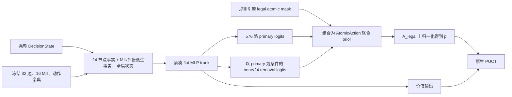

# Nine Men's Morris 严格 AlphaZero 训练方案设计

状态：**严格 AlphaZero 研究设计提案；非训练、评测或发布授权**

路线标识：**NMM-AZ**

定位：**以策略价值网络、原生 PUCT 和自我博弈为不可省略主干与受测对象；
Perfect DB 是不进入纯基线训练血统、在经校准支持域内提供绝对真值的测量
仪器，并可在独立实验中作为课程、约束和辅助教师**

最后更新：2026-07-30

## 1. 文档目的与权威边界

### 1.1 路线定位

本文定义一条面向 Nine Men's Morris（九子棋、Mill）的严格 AlphaZero
训练路线。这里的“严格”不是指逐行复刻围棋或国际象棋实现，而是指以下
算法闭环在正式基线中同时成立，且任何一项都不能被 Oracle 蒸馏、浅层
alpha-beta 或人工策略规则替代：

```text
策略价值网络 fθ(s) → 原生 PUCT → 自我博弈搜索策略 π
        ↑                              ↓
        └────── 用 (s, π, z) 更新 θ ────┘
```

其中：

- $f_\theta(s)=(p_\theta(s),v_\theta(s))$ 同时输出合法动作先验和当前行动方
  视角的价值；
- 每个自我博弈决策都由使用该网络的原生 PUCT 产生访问分布 $\pi$；
- $z\in\{-1,0,+1\}$ 来自权威规则引擎的真实终局，和棋在严格基线中为 0；
- 新网络继续产生后续自我博弈数据，形成策略改进闭环。

“严格”同时约束两个彼此独立的维度：

1. **算法闭环完整性**：网络、原生 PUCT、自我博弈和
   $(s,\pi,z)$ 更新都不能被外部教师替代；
2. **训练信息来源纯度**：`NMM-AZ-BASE` 的 target、起点选择和 checkpoint
   只来自已验收规则环境及本路线自身生成的信息，不读取 Perfect DB 标签、
   人类频率、Sanmill 动作或其他路线 checkpoint。

不能把这两个维度误解为必须逐项复刻 2017 年论文的所有工程形式。W/D/L
输出、自生成辅助目标、搜索值 bootstrap 或 Gumbel AlphaZero 等现代变体，
若只使用规则和自身搜索信息，仍可作为“信息纯”的 AlphaZero-family 消融；
但它们必须有独立配置和实验 ID，且不能反向改写本文首个原生 PUCT 基线。
`NMM-AZ-BASE` 保留为共同锚点，现代变体的收益必须相对它测量。

因此，下列系统即使很强，也不能单独称为本文的严格 AlphaZero 基线：

- Perfect DB 全候选标签蒸馏出的裸 student；
- student + 固定深度 minimax/alpha-beta；
- 使用人工价值函数 rollout 的普通 MCTS；
- 只训练 policy、没有 value 或没有搜索改进目标的模仿学习；
- 先完成 Oracle student，再把 PUCT/自我博弈作为可选末级升级的路线。

Perfect DB 的存在不会改变上述定义。它可以提高样本效率、发现理论错误、
构造残局课程、提供辅助标签或在运行时授权动作，但这些用途必须与
`NMM-AZ-BASE` 的纯自我博弈血统分开。Oracle 辅助版本应准确命名为
`NMM-AZ-ORACLE-*`，不能把 Oracle 蒸馏的收益归因于 AlphaZero 自我博弈。

本项目独有的科学机会不是再证明“小棋盘上的 AlphaZero 能下棋”，而是利用
NMM 的求解资产，在经验证支持域内绝对测量自我博弈 RL 的残差错误：距离
理论值还有多远、错误集中在哪里，以及表示、访问分布、信用分配和搜索各
贡献多少。这里
AlphaZero 仍是研究主干和受测对象；Perfect DB 是测量仪器，而不是纯基线的
动作生成器。

### 1.2 共享权威

本文不替代以下治理文件：

1. 仓库根目录的 `AGENTS.md`；
2. [Windows 训练交接](handoff/windows-training-2026-07-20.md)；
3. [本机训练数据布局](local-training-layout.md)；
4. [v5 Oracle 与规则规范](v5/oracle-and-rules-spec.md)中由仓库共享的规则、
   状态、动作和 Oracle 语义；
5. [v5 工程治理](v5/engineering-governance.md)的风险分类、实验 SoT 和
   语义版本规则。

仓库权威规则与独立测试高于 Sanmill、策略书、历史截图、旧数据库字段和
本文建议。Sanmill 是重要的差分参考与候选运行环境，不是绕过本仓库语义
验收的理由。

本文不得单独用于：

- 启动 smoke、长训练或恢复训练；
- 生成正式 Oracle 标签；
- 激活旧 checkpoint 或历史 SpecialistDB；
- 宣称“完美”“绝不输”“理论保持”或达到某个 Sanmill 等级；
- 修改共享规则、历史、Oracle 或 node-index schema。

实际运行必须另建冻结实验契约，通过训练就绪检查并获得明确启动授权。

### 1.3 与 v5 及既有路线的关系

`NMM-AZ` 与 v5 可以共享已验收的规则引擎、历史裁判、状态序列化、Sanmill
bridge、Oracle 查询器、verifier 和评测工具，但两条路线回答的问题不同：

| 路线 | 核心问题 |
| --- | --- |
| `NMM-AZ-BASE` | 网络 + 原生 PUCT + 纯自我博弈能学到多强，错误在哪里 |
| `NMM-AZ-ORACLE-*` | Perfect DB 介入后，相对纯 AlphaZero 的边际收益是什么 |
| v5 / Oracle-distill | 参考策略蒸馏、浅层搜索和紧凑运行时能否直接满足产品目标 |

字段等价的 v5 T0 可以作为强外部 control，也可以复用其基础设施；它不能
替代 `NMM-AZ-BASE` 的 PUCT 自我博弈实验。反过来，跑通 AlphaZero 也不证明
它比 v5 更适合产品。产品选择与研究问题在第 16 节明确分叉。

corrected-v4 作者补充说明，其引入 nets 与 Sentinel 所形成的 flawed
opponents，意图是让 Gen 2b 面对多样玩家，并在 Gen 3 中把人类偏好、人类
常见败着与更强的启发式玩家混合，使学习方利用“人真正会犯的错”，而不是
均匀随机败着。这个说明是有价值的**设计意图与实验假说**，不是 Gen 2b/
Gen 3 已经实现、训练完成或通过独立评测的证据；`v4-specialist-plan.md`
当前记录的 HumanDB、GapNet、Sentinel 和 heuristic 机制仍须按其实际代码、
标签 provenance、checkpoint 血统和冻结配置逐项验收。

在本文中，这个意图只进入第 17 节的 `NMM-AZ-TARGET-*` 外部对手联盟：
它不能进入 `NMM-AZ-BASE` 的输入特征、reward shaping、policy/value
target、起点抽样或 checkpoint。这样既保留严格 AlphaZero 基线，也能单独
检验“多样对手”“人类偏好”和“人类型败着”是否真的带来可归因增量。

## 2. 执行摘要

本路线的第一个完整研究交付物不是 Oracle student，也不是浅层搜索增益，
而是一个可复现的严格 AlphaZero 闭环：

1. 规则与历史充分的 NMM 环境；
2. 输出合法动作先验和价值的策略价值网络；
3. 使用网络 prior/value 的原生 PUCT；
4. 从标准起始局面开始的自我博弈；
5. 由搜索访问计数生成的 $\pi$；
6. 由真实终局生成的 $z$；
7. 使用 $(s,\pi,z)$ 更新网络并继续产生新对局；
8. exact resume、固定外部对手和独立评测证据。

推荐证据顺序为两条并行前置和一条合流后的证据链：

```text
NMM-AZ-E0  核心规则、历史、原子动作和 Sanmill 映射验收
    ↓
NMM-AZ-0   网络 + 原生 PUCT + replay + 训练闭环 smoke
    ↓
NMM-AZ-1   从随机初始化开始的标准起点纯自我博弈基线 ─────┐
                                                         ├─ 科学完成：
NMM-AZ-M0  comparator、覆盖和位置/完整历史偏差标定 ──────┘  理论残差 + H1
                                                              ↓
NMM-AZ-CTRL-0  同架构误差分解：全域/分层 Oracle 监督、
               AZ 访问分布 Oracle 监督、纯 AlphaZero
                                                              ↓
NMM-AZ-2   由 H1 和误差分解决定的规模、阶段与结构消融
    ├─ NMM-AZ-PHASE-*    分阶段采样或状态档案消融
    ├─ NMM-AZ-LONG-*     纯自我博弈长程转换与反向课程消融
    ├─ NMM-AZ-ORACLE-*   Perfect DB 课程、辅助标签和难例回灌
    └─ NMM-AZ-TARGET-*   理论安全约束下的非对称 AlphaZero
                                                              ↓
NMM-AZ-VERIFY-0  对冻结确定性策略做完整历史可达子图离线验证
```

PUCT 和自我博弈从 `NMM-AZ-0` 起就是主干，不是后置可选项。若未实现它们，
可以交付环境、Oracle student 或产品基线，但不能声称完成了本路线。

前置依赖分为两条，不能再混成一个总阻塞项：

- **核心 AlphaZero 前置**：规则 profile、完整历史状态、合法原子动作、
  settled successor、终局和重复/无进展语义必须验收；未通过时只能做
  disposable smoke。
- **Oracle 测量前置**：完整字段、视角保持的 ultra-strong comparator、
  支持域覆盖和位置级/完整历史偏差必须在理论降级评测或 Oracle 辅助训练前
  验收。它不阻塞只依赖规则终局 $z$ 的纯 AlphaZero 数据生成，却阻塞
  `NMM-AZ-1` 的科学完成、H1 检验、误差分解和任何理论可靠性结论。

因此 `NMM-AZ-E0` 与 `NMM-AZ-M0` 应并行推进。若 M0 延迟，AZ-0 smoke 和
纯 self-play actor 工程可以继续；不得把只有外部对局和 phase 覆盖的结果
称为已经回答“残余理论错误在哪里”。

严格基线不惩罚和棋。若把 draw 从 $z=0$ 改为负数，优化目标就不再等价于
AlphaZero 的真实终局回报，而且可能鼓励主动进入理论败势。和棋内诱错、
复杂度或目标对手胜率必须作为单独实验，在理论安全约束下比较。

Perfect DB 的优先角色是：

1. 校准后在声明支持域内作为绝对真值测量仪器，生成理论残差曲线与首错
   结构；
2. 构造表示/覆盖/强化学习误差分解的监督 control；
3. 离线理论评测与错误定位；
4. phase/残局课程和 hard-negative 来源；
5. 可选监督 warm start、辅助 loss 或 reanalysis；
6. 可选的理论安全动作 mask、陷阱/兑现环境；
7. 离线全称验证、运行时精确 fallback、紧凑表或证书的来源。

Perfect DB 不会自动成为“善于设陷阱的对手”。W/D/L 或距离字段只提供理论
约束与转换依据；若要针对当前 AlphaZero 制造安全陷阱，还需要冻结的对手
模型。主方法是在学习方 $A_{\mathrm{allow}}$ mask 下，以真实终局训练
非对称 AlphaZero；adaptive trap teacher 只保留为外部环境 control。两者
都属于 `NMM-AZ-TARGET-*`/`ORACLE-*`，不属于纯基线。

任何**改变训练数据、搜索、对手或运行时**的 Oracle 介入都必须与纯
`NMM-AZ-BASE` 做匹配预算对照，分别记账自我博弈计算、Oracle 查询、训练
更新和运行时成本。只读测量不改变 baseline，但其查询/枚举成本仍应单独
报告，不能混入训练算力。

本路线首个决定性假设是：

> **H1（兑现信号先死）**：自我博弈和棋率跨过预注册饱和阈值的时间，
> 早于 Oracle 理论降级率跨过预注册可靠阈值的时间。

`95%` 和 `1%` 可作为 pilot 前候选阈值，但必须在看正式曲线前冻结；不得把
它们写成已知 NMM 常数。H1 若成立，说明普通对称自我博弈在仍有理论错误时
已经失去足够决定性回报，后续 LONG、league 或 Oracle 约束不是“多训一点”
的同义词，而是需要独立验证的修复机制。

## 3. 研究问题、目标与非目标

### 3.1 主要研究问题

本路线依次回答：

1. 严格 AlphaZero 从随机初始化后的**绝对理论残差**有多大，集中在哪些
   phase、历史边界、唯一应手和长距离转换状态？
2. 对称自我博弈的决定性结果信号是否在残余理论错误消失前先枯竭，即 H1
   是否成立？
3. 在同一架构和评测域下，残差中多少可操作地归因于表示/优化上限、访问
   分布覆盖，以及自我博弈信用分配/有限搜索？
4. 严格 AlphaZero 是否能学会合法战术、阶段转换、封锁、flying 和长距离
   价值，并在固定计算下达到有意义的外部棋力？
5. 分阶段 replay、状态档案、网络结构或纯 self-generated 算法变体能否
   改善已定位缺口？
6. Perfect DB 课程、辅助监督、动作约束或难例回灌相对同计算纯自我博弈能
   增加多少样本效率和理论可靠性？
7. 能否对一个冻结、确定性的网络策略做完整历史可达子图验证，得到由证书
   支持的全称安全命题？
8. 理论安全动作内部，非对称 AlphaZero 能否学习针对指定对手的 ultra-strong
   诱错与实际兑现？
9. 在目标设备约束下，网络大小、PUCT 节点、延迟和棋力的折中是什么？

### 3.2 目标

- 建立完整、可恢复、可测试的原生 AlphaZero 闭环；
- 保持规则、历史、原子动作、视角和终局语义正确；
- 从随机初始化得到纯自我博弈基线和学习曲线；
- 从第一个 checkpoint 起密封保存独立测量 snapshot；M0 通过后用校准的
  Perfect DB 只读测量绝对理论误差，不把测量标签写回纯基线；
- 通过同架构监督 controls 分解表示、访问覆盖与 RL/search 残差；
- 检验 H1，并在信号枯竭时按预注册规则停止基线、另开修复实验，而不是
  在同一 run 中悄悄换目标；
- 覆盖 placing、moving、flying、capture 组合动作和阶段边界；
- 量化 PUCT 相对裸网络及固定外部引擎的增益；
- 在 Oracle 验收后量化自然访问分布上的理论降级率；
- 通过受控对照测量 phase curriculum、Oracle 和目标对手训练的独立贡献；
- 形成可以在 Sanmill 或兼容运行时中部署的紧凑网络 + PUCT 候选；
- 区分测得棋力、低理论错误率和可证明理论安全。

### 3.3 非目标

- 不把 NMM 当作缩小版围棋，也不预设棋盘小就容易完美；
- 不把自我博弈 Elo、训练 loss 或对旧 checkpoint 胜率当作理论可靠证据；
- 不用 Oracle student + alpha-beta 冒充严格 AlphaZero；
- 不把合法性、terminal 或 removal 规则交给网络猜；
- 不把 pending-removal 当作另一名玩家的独立回合；
- 不在严格基线中惩罚 draw；
- 不把人类“口诀”、节点地形或 mobility 常数写进 value/PUCT；
- 不预设 GNN、Transformer、共享 trunk 或 phase-specific head 必然更好；
- 不预设 Perfect DB 辅助一定优于增加自我博弈计算；
- 不因实现了 PUCT 就宣称完美；
- 不把单个 NMM 结果外推成跨棋种算法结论；
- 不让研究支线阻塞更简单、已满足需求的产品交付。

### 3.4 预期难点与可证伪预测

NMM 只有 24 个节点，合法分支和状态空间远小于围棋，因此严格 AlphaZero
很可能较快学会成 Mill、阻挡、开合 Mill、双威胁和基本封锁。这个判断只是
待测预测，不等于必然达到 Sanmill Level 9，更不等于接近完美。

从“会下”继续提升到“理论可靠”可能出现：

- **和棋饱和**：高水平对局大量 $z=0$，普通 outcome 无法区分简单安全
  draw、唯一应手 draw 和复杂诱错 draw；
- **兑现信号枯竭**：当 replay 中 $z$ 的经验方差、决定性对局数和
  PUCT 相对 prior 的改进量同时下降时，value 可能趋近常数、搜索策略趋近
  prior，残余理论错误却仍未消失；
- **阶段覆盖不均**：标准起点自我博弈可能让 placing/moving 样本淹没
  flying、4→3 和历史边界；
- **长距离信用分配**：罕见错误可能经过许多逻辑 ply 才变成终局失败；
- **长程转换自举**：AlphaZero 的终局 $z$ 本身不随距离折扣，但弱自我
  对手可能无法兑现早期理论败着，令本应为 L 的前缀实际收到 draw 标签；
- **搜索与网络共适应**：同一网络生成训练分布并评估叶节点，可能形成相互
  认可的盲区；
- **对称自我博弈的诱错缺口**：同类强搜索器不犯目标人群常见错误，复杂
  draw 线没有额外奖励；
- **目标/评测错配**：真实 W/D/L 目标只要求不降理论层级；对固定弱对手的
  match score 还要求在大量 draw 线中选出更容易诱错和兑现的路线，因此
  外部 match score 同时混入 ultra-strong 质量，不能作为纯理论安全代理；
- **最后一公里不成比例**：总体胜率或 Elo 可以快速上升，但少量理论败着
  需要很大的覆盖、评测和搜索成本才能消除。

相应的可证伪预测在正式实验契约中冻结为：

1. **P1（快速会下、残差集中）**：基础战术和固定弱对手败率会较快改善，
   但残差更可能富集于 flying、低子数残局、repetition/no-progress 边界和
   长距离状态；“≤6 子”只能作为待测 stratum，不能预写成结果。
2. **P2/H1（兑现信号先死）**：自我博弈 draw 饱和事件早于理论降级率达到
   可靠阈值；若不成立，继续扩大纯自我博弈比引入复杂支线更有依据。
3. **P3（覆盖/信用缺口大于表示缺口）**：相同小网络在全域或分层 Oracle
   监督下的理论动作质量显著高于纯 AlphaZero；若不成立，资源应优先投向
   表示容量和优化，而不是课程或 league。
4. **P4（ultra-strong 不自动涌现）**：在大量理论同层 draw 动作上，对称
   自我博弈不会稳定产生针对冻结弱对手的排序；若它自然出现，应由同层
   reference 保真度和未见对手 conversion 直接证伪本预测。
5. phase/archive、现代 self-generated 变体或 Oracle 辅助可能改善缺口，
   但其收益必须超过等计算的更多原生 PUCT 自我博弈。

P1–P4 是待证伪假设，不是立项理由的同义反复。尤其不得因 P2/P3“看起来
合理”而跳过纯基线、误差 control 或密封测量。

## 4. 博弈语义与训练样本单位

### 4.1 行动模式

NMM 不是四个完全独立、严格串联的 agent。正式状态应按当前行动方能力描述：

- `placing`：当前方仍有棋子未落下；
- `moving`：当前方已落完且盘面棋子数大于 3，只能沿规则边移动；
- `flying`：当前方盘面恰有 3 子，可移动到任意空点；
- `capture/removal`：主动作成 Mill 后必须完成的条件子步骤。

一方可以已经 flying，而另一方仍 moving。网络和搜索不得只使用一个双方
共享的粗 phase 标志。

### 4.2 逻辑 ply 与原子动作

一个训练和搜索用逻辑 ply 是当前玩家的一次完整决策：

```text
placement / movement / flying
+ 若形成 Mill，则完成合法 removal
```

Sanmill 协议可以用两个 token 表示主动作与 removal，但训练策略、PUCT 边和
访问计数应落在完整 `AtomicAction` 上：

```text
AtomicAction {
  primary_kind
  from_node?       # placement 时为空
  to_node
  capture_node?    # quiet 动作时为空
}
```

同一主动作若允许移除多个不同棋子，就是多个合法原子动作。规则引擎必须先
生成 settled successor；MCTS 不得在主动作与 removal 之间切换行动方或备份
价值。

### 4.3 完整 DecisionState

训练根状态至少包含：

```text
board_occupancy
side_to_move
in_hand_count_self / opponent
on_board_count_self / opponent
current_mode_self / opponent
rules_profile_id
repetition_state
no_progress_state
history_sufficient_state
claim_state
terminal_state / outcome_reason
node_index_schema_id
```

若合法性、终局或理论值依赖更多历史，必须显式加入或用可证明充分的摘要
表示。相同盘面但历史不同的状态不得错误合并。

仅保存当前 repetition/no-progress 计数或一个 board FEN，未必足以更新所有
后继状态的重复等价类。首选工程候选是携带“自冻结规则定义的最近一次历史
重置/不可逆动作以来”的版本化 position-key 序列、重复次数、no-progress
计数和 claim 状态，并用有界 ring buffer 实现。其长度上界和哪些动作会
重置历史，必须从最终规则 profile 推导；不能在规则尚未冻结时直接假设
placement、capture 或其他动作一定按某种方式重置。

这不是要求发明新的博弈理论，而是一个可关闭的状态表示与验收任务：

1. 先用保守完整相关历史作为 reference；
2. 证明候选摘要对每个合法 successor、重复/无进展裁决和 claim 等价；
3. 在阈值边界、capture/reset、循环和序列化往返上做差分/property test；
4. 证明后才让规则树、PUCT key 和 verifier 使用压缩摘要。

截至仓库提交 `65607ae` 的代码核查，Rust `Board` 只含双方 bitboard、累计
落子数和行动方，没有 repetition/no-progress/history 字段；Python
`GameEngine` 的特定振荡检测和 post-placement 计数也尚未成为共享权威规范
要求的通用历史裁判。因此“实现候选明确”不等于该缺口已经关闭。

规则树和 PUCT key 必须携带经证明充分的历史摘要，否则保守地携带完整相关
历史。网络可以实验压缩 history encoder，但若压缩未证明保持 Markov 性，
它只能作为近似 evaluator，不能支持全局理论保证。

网络输入可以规范化为当前行动方视角，但规则引擎、搜索备份、Oracle 查询和
评测必须记录视角转换。所有 $v,z,W/D/L$ 都要注明是当前行动方、根行动方
还是固定颜色视角。

## 5. 核心环境与规则验收

### 5.1 权威路径

正式训练前必须先冻结并验收：

- 标准规则 profile 及允许的变体；
- placing、moving、flying 和 removal 合法性；
- 成 Mill 后可移除棋子的例外规则；
- 棋子少于 3、无合法主动作、重复和无进展终局；
- 完整逻辑 ply 的 terminal/outcome reason；
- 状态序列化、反序列化和 replay；
- 每个 required component 的 fail-closed 行为。

外部 `NMM_Std/standards` 应作为标准语义对齐输入之一，其机器路径通过
`data/training_paths.local.json` 的专用键解析；最终权威仍是仓库冻结
profile 与独立测试。正式长训练不能采用“先按近似规则训练，后面再改”的
方案：规则、历史或 terminal 改动会改变合法动作、$z$、搜索树和
checkpoint 语义，通常需要新 schema、新实验 ID 和从头训练。

若采用外部 `NMM_Std/MIF` 工作草案及其 conformance corpus，还必须冻结
commit 或内容 hash。MFEN、MPK、MSTATE、MRS 及 stalemate、claim、delayed
removal、multiple-Mill 等 fixture 可用于 schema 对齐和差分测试，但该社区
草案不是自动高于仓库 profile 的规则权威。影响合法动作、历史或终局的差异
未关闭时正式训练保持 No-Go。

仓库当前简化 `GameEngine` 若尚未通过正式历史裁判验收，只能用于受限 smoke，
不能生成可保留的 $z$、理论标签或安全声明。

允许在规则验收前运行不保留 checkpoint 的 disposable smoke，用于验证张量
形状、设备吞吐或进程通信；不得把它升级为正式血统。

### 5.2 执行与测量两条 pacing item

必须把前置条件拆成：

| 前置项 | 阻塞范围 |
| --- | --- |
| `core_rules_acceptance_id`：规则、历史、原子动作、terminal、视角 | 所有正式 `NMM-AZ-*` 训练 |
| `oracle_comparator_acceptance_id`：完整字段、视角保持的 ultra-strong comparator | 所有正式 Oracle 查询、全候选标签和理论动作比较 |
| `oracle_instrument_calibration_id`：支持域完整性、缺表/unknown 行为、位置级与完整历史偏差 | `NMM-AZ-1` 科学完成、H1、CTRL-0、理论端点、Oracle 辅助训练与精确声明 |

这一区分防止两种错误：

- 在规则环境还不正确时盲目开始自我博弈；
- 因 comparator 尚未验收而错误阻塞完全不读取 Oracle 的纯 AlphaZero
  actor/smoke；
- 在没有校准测量仪器时，仅凭外部对局就声称已经测得 AlphaZero 距离理论
  真值的残差。

`core_rules_acceptance_id` 与 Oracle comparator/仪器标定都应列为项目级
并行 pacing item。前者控制能否正式生成训练数据；后者不阻塞纯闭环的工程
进度，却控制 `NMM-AZ-1` 能否完成其主要科学结论。设计文档在
`NMM-AZ-0` smoke 产生证据前进入功能冻结：除关闭上述验收、修正已发现语义
错误或补齐启动所需契约外，不再增加新网络分支、辅助头或采样花样。

Oracle 仪器标定至少包括：

- 冻结期望文件/sector 清单、内容 hash 和可查询支持域；
- 对每个声明支持的状态 fail closed；缺表、损坏、unexpected entry、
  perspective contradiction 和 `unknown` 都不得转成 draw/0/None 后继续；
- 在自然访问总体与历史边界 stress 总体上，测量位置级 $V^*_{\mathrm{pos}}$
  和完整历史规则裁判/证明结果的分歧率及其 strata；
- 分开报告 `A_pos`、`A_allow` 和无法完成历史证明的 `unknown`，不得用
  位置级安全集合代替完整规则安全集合；
- 使用独立 verifier 复核抽样与边界 case。

截至提交 `65607ae`，`EndgameSolvedDbHandle::open` 会静默跳过缺失的
`endgame_W_B.wdl` 并让相应 probe 返回 `None`。该行为可用于明确标注
best-effort 的探索，但不满足正式 Oracle 测量的 fail-closed 契约；M0 前
必须改为“期望清单完全匹配”，或显式加载一个版本化的部分支持域 manifest，
并让支持域外状态 abstain 且不进入端点分母。

### 5.3 必须通过的确定性测试

- 同一状态在独立实现中得到相同合法原子动作集合；
- 每个原子动作 replay 到相同 settled successor；
- pending-removal 不进入训练根；
- 当前行动方无合法动作时精确终止，不调用网络；
- repetition/no-progress 状态转移和终局一致；
- 双方 on-board/in-hand 计数、claim state、outcome reason 和 history hash
  一致；
- 视角交换两次返回原状态；
- 序列化往返不丢历史；
- Sanmill/NMM_LLM 映射可逆且动作集合一致；
- required component 缺失、unknown 或异常时停止，不返回中性值。

任何一项失败都阻塞正式训练。不能通过删除测试、跳过罕见规则或把异常变成
draw 获得绿色结果。

## 6. 节点编号、拓扑与对称性

### 6.1 语义节点与模型索引分离

Sanmill 的节点编号服务于其代码和协议，不必直接成为网络最合适的内存布局。
但“重新编号”本身不会提高棋力；它只有在改善动作编码、局部性、批处理或
实现可读性时才可能有工程收益。

必须分开：

- `semantic_node_id`：跨实现稳定的棋盘语义坐标；
- `sanmill_node_id`：Sanmill bridge 使用的编号；
- `model_node_index`：当前网络张量布局；
- `node_index_schema_id`：上述映射的版本身份。

映射必须覆盖：

- 单节点 placement/capture；
- movement/flying 的 `{from,to}`；
- 完整 `{from,to,capture}` 原子动作；
- board、history key、策略向量和 successor；
- 所有对称变换及其逆变换。

checkpoint、replay、搜索树、dataset 和 bridge 必须携带
`node_index_schema_id`。schema 改变时不得静默加载旧 checkpoint。

首版可采用便于审计的 3 ring × 8 position 语义布局，但必须从权威拓扑自动
验证它与 Sanmill/NMM_LLM 的映射；不能因为某份示例代码使用
`[0..7]/[8..15]/[16..23]` 就假定仓库编号相同。

当前已知至少存在三种双射顺序，正式 schema 必须通过语义坐标适配：

| 来源 | ring 顺序与每 ring 起点 |
| --- | --- |
| NMM_LLM `POSITIONS` | outer → middle → inner；每 ring 从左上角顺时针 |
| Sanmill Rust dense node | inner → middle → outer；每 ring 从上中点顺时针 |
| Malom bit order | outer → middle → inner；每 ring 从左中点顺时针 |

推荐候选 `ring-major-sector8-v1` 明确定义：

```text
ring   = [outer, middle, inner]
sector = [NW, N, NE, E, SE, S, SW, W]
index  = ring * 8 + sector
```

它便于复用一个 sector8 的 D4 置换，并让内外 ring 交换只作用于 ring 0/2。
这只是待共享规范冻结的模型协议，不得因碰巧与某个现有列表相同而隐式继承。
“交换 `[0:8]` 与 `[16:24]`”也只对该 schema 成立，不是跨实现算法。
正式映射记录至少包括：

```text
semantic_node_id
model_node_index
sanmill_dense_node
malom_bit_index
node_index_schema_id
forward_inverse_map_sha256
ring16_permutation_sha256
```

这里的 3×8 只定义序列化顺序，不定义神经网络邻域。下标相邻不等于规则
相邻，二维绘图坐标接近也不等于存在规则边。模型不得从 `i±1`、7×7 像素
距离或普通卷积核位置猜测拓扑；真实 adjacency 和 Mill incidence 必须作为
独立、版本化结构输入。

### 6.2 标准拓扑事实

标准棋盘应由权威表自动验证，而不是手抄：

- 24 个可落子节点；
- 32 条无向规则边：三个 ring 各 8 条，共 24 条，加相邻 ring 中点间 8 条；
- 16 条 Mill：三个 ring 各 4 条，共 12 条，加 4 条跨 ring Mill；
- 节点度数分布为 12 个度 2、8 个度 3、4 个度 4；
- 图直径/半径为 6/5；
- 每个节点恰好属于 2 条 Mill。

这些是客观拓扑事实，可以进入图结构、位置编码或确定性派生特征；“度 4
恒优”“角点恒差”是主观策略判断，不能进入固定评估权重。

仓库内的差分证据包括：

- [game/board.py](../game/board.py) 的节点、边和 Mill；
- [ai/malom_db.py](../ai/malom_db.py) 的 ring16 置换；
- [learned_ai/evaluation/oracle_corpus.py](../learned_ai/evaluation/oracle_corpus.py)
  的 ring16 canonicalization；
- [ai/board_symmetry.py](../ai/board_symmetry.py) 的通用 D4。

Sanmill 的 `topology.rs`、`opening_book_symmetry.rs` 和 perfect-db symmetry
实现可作独立差分证据，但正式报告必须冻结其 commit、工作树和文件 hash。
标准无对角线 profile 以外的规则变体必须重新计算边、Mill 和自同构，不能
因棋盘外观相同继续沿用 ring16。

### 6.3 ring16 自同构

标准 NMM 拓扑应验证 16 个自同构，包括 D4 几何对称与内外 ring 交换的组合。
不得只因图形看起来对称就直接扩充数据。每个变换都必须通过：

- 24 节点置换唯一且可逆；
- 群闭包与逆元；
- adjacency 和全部 Mill 保持；
- 合法原子动作映射；
- $T(g(s),g(a))=g(T(s,a))$；
- terminal、outcome、完整历史和 draw tracker 保持；
- 策略访问向量 $\pi$ 同步置换，价值 $z$ 不变。

严格 AlphaZero 可以像原始棋类实现一样使用规则保持的对称增强。首版在每个
训练样本上随机选择一个已验收变换，不应默认把 16 份全部物化进 replay。
`none`、D4、ring16 和推理 ensemble 的收益应单独消融。

颜色交换/行动方视角交换不是第 17 个棋盘自同构；它还必须转换行动方、双方
计数、reserve、mode、history 元数据和 value 符号。ring16 产生的是强相关
增强样本，不是 16 个独立统计观测。16-way 推理 ensemble 要支付 16 次
forward，即使 batch 降低 wall-clock，也必须与把同等计算交给更多 PUCT
节点的 control 比较。

若 full-history canonicalization 尚未证明安全，MCTS transposition key 不得
只按 ring16 规范化盘面。

### 6.4 图/超图拓扑契约

严格基线消费规则原生的图/超图事实，而不是 Chess 式稠密二维棋盘；这份
契约既可被 topology-explicit MLP 的 feature builder 使用，也可被
GNN/attention 直接使用：

$$
G=(V,E),\qquad |V|=24,\quad |E|=32
$$

$$
\mathcal{H}_{mill}=\{M_1,\ldots,M_{16}\},
\qquad |M_k|=3
$$

至少冻结以下张量及内容 hash：

| 对象 | 形状 | 含义 |
| --- | --- | --- |
| `edge_index` / $A_{\mathrm{edge}}$ | `2×64` 或 `24×24` | 32 条无向规则边的双向表示 |
| `mill_incidence` / $B_{\mathrm{mill}}$ | `24×16` | 节点是否属于某条 Mill 超边 |
| `graph_distance` / $D_{\mathrm{graph}}$ | `24×24` | 静态最短规则边距离 |
| `automorphism_perm` | `16×24` | ring16 节点置换 |
| `action_incidence` | 每合法动作的 `{from?,to,capture?}` | 策略动作与节点表示的关联 |

`A_edge` 描述普通 moving 的物理连线；`B_mill` 描述三节点成 Mill 关系。
二者不能互相替代：相邻路径不自动告诉网络哪三个节点构成一条 Mill，同属
Mill 也不意味着 flying 以外可以任意相互移动。

Flying 不应通过把 $A_{\mathrm{edge}}$ 永久改成 24 节点完全图来表示。规则
引擎在 flying 状态直接生成任意合法 `{from,to}`；网络通过全局状态通路和
动作条件评分表达远距离选择，静态棋盘图仍保持 32 条规则边。

上述对象作为 `environment_contract_hash` 的 topology 子 artifact。其
来源必须是同一权威拓扑定义或由它确定性生成，并与 Sanmill 映射、16 条
Mill 和 ring16 置换做交叉验证。模型是否采用 message passing 是架构选择；
拓扑内容是否正确不是架构选择。

## 7. 策略价值网络

### 7.1 严格基线接口

网络接口为：

$$
f_\theta(S)=\left(p_\theta(\cdot\mid S),v_\theta(S)\right)
$$

其中：

- $p_\theta$ 只在 $A_{\mathrm{legal}}(S)$ 上归一化；
- $v_\theta(S)\in[-1,1]$ 表示当前行动方最终结果的期望；
- 合法 mask 由规则引擎提供，不由网络预测；
- terminal 节点不调用网络。

首版以“拓扑显式 flat MLP + 固定主动作字典 + 条件 removal head”缩短到
首个可信证据的时间。它不是把 NMM 当作一维序列或 Chess 网格：节点顺序、
32 条规则边、16 条 Mill 超边和动作映射都由冻结拓扑契约定义，MLP 输入显式
包含由这些关系确定的节点/Mill/动作事实。



固定主动作字典为：

- 24 个 placement 目的地；
- $24\times23=552$ 个有序 `(from,to)` relocation pair；moving 的有向规则
  边和 flying 的全局 pair 都是其合法子集；
- 合计 576 个 primary ID，placement 与 relocation 类型不可混淆；
- removal 条件域为 `none` 加 24 个节点，最终只保留规则允许的组合。

对完整原子动作 $a=(m,c)$：

$$
P_\theta(a\mid S)
=
P_\theta(m\mid S)\,
P_\theta(c\mid S,m)
$$

quiet move 的条件 removal 只能为 `none`；成 Mill 的主动作按规则 mask 到
全部合法 capture。令
$\ell_\theta(S,a)=\log P_\theta(m\mid S)+\log P_\theta(c\mid S,m)$，
最终在 $A_{\mathrm{legal}}(S)$ 上重新归一化：

$$
p_\theta(a\mid S)
=
\frac{\exp \ell_\theta(S,a)}
{\sum_{b\in A_{\mathrm{legal}}(S)}\exp \ell_\theta(S,b)}
$$

约 576 个 primary 并不构成不可承受的“巨大永久非法空间”；真正风险是 mask
错误、条件 removal 被错误独立化，或为每个候选重复运行 trunk。首版必须用
一次 batched forward 产生全部合法原子 prior，并证明：

- fixed ID 与 `{type,from,to}` 一一映射；
- `none/capture` 条件概率恢复为完整 `{from,to,capture}` 联合概率；
- 非法项在 root noise、softmax、loss 和访问计数之前被 mask；
- 同一动作经 node-index/ring16 变换可逆；
- 策略头吞吐显著高于逐候选重复 trunk，且没有策略质量回归。

逐合法动作可变 $k$ scorer 保留为架构 control：它在候选数变化和原子动作
表达上更直接，但不能在没有实测前假设比固定字典更快。

### 7.2 输入事实与可消融派生特征

环境契约必须包含：

- 当前方/对方占位；
- 当前行动方；
- 双方 reserve 和盘面棋子数；
- 双方当前 mode；
- repetition/no-progress 与其他历史充分信息；
- 规则 profile；
- `A_edge`、`B_mill` 和动作 incidence 等真实拓扑关系。

flat MLP 首版不需要在每个样本中重复存储固定矩阵，但其 feature builder
必须由上述契约确定性地产生并 hash：

- 24 节点的己方/对方/空占位；
- 每节点按真实 adjacency 聚合的己/敌/空邻接计数；
- 每节点所属两条 Mill 的精确占位状态；
- 双方 reserve、盘面数、mode、行动方和经证明充分的历史字段；
- fixed primary/removal ID 对应的 from/to/capture incidence。

这叫“拓扑显式 MLP”，不是人工给节点价值打分。若删除这些关系事实，只把
24 个下标平铺给 MLP，应另命名为 topology-blind negative control。

确定性派生候选包括：

- 当前 Mill 成员和一步可成 Mill 点；
- phase-aware 合法主动作数；
- 节点相邻空位数；
- `blockade_win_in_one`；
- 节点度数、图距离和 same-Mill relation；
- 每条 Mill 的当前占位组合、可移动成员和一步合法闭合动作数；
- 每个动作触及的 from/to/capture Mill incidence；
- 由 $S$ 与 settled successor $T(S,a)$ 确定的单步规则差量。

这些特征可以帮助优化，但必须与仅使用原始充分状态的等参数 control 比较。
它们不能携带未来 Oracle 值，也不能被赋予人工固定分数。

状态级事实与动作条件事实必须分开建模。定义节点 $x$ 所属 Mill 集合：

$$
\mathcal{M}(x)=\{k:B_{\mathrm{mill}}[x,k]=1\}
$$

对合法原子动作 $a=(from?,to,capture?)$，可消融的规则差量
$r_{\mathrm{rule}}(S,a)$ 可以包括：

- from/to/capture 分别触及的 Mill token，并保留三种角色；
- 每条 Mill 在动作前后的精确三节点占位或状态 bit；
- 新闭合、被打开或因 capture 被破坏的 Mill 集合；
- settled successor 中双方 phase-aware 主动作数和可移动棋子 mask；
- successor 是否为规则终局及其 `outcome_reason`。

这些量只能由已验收规则引擎确定性生成。“feeder”“spring”“dead
placement”“主动性”等尚未形成无歧义机器定义的策略名不能直接进入 schema。
每动作 successor 特征还会消耗规则 CPU；比较时必须把这部分计入
matched-total-work，不能用减少 PUCT 节点换来的表面网络增益冒充免费提升。

完整历史的规则充分性与网络的近似历史编码也必须分开。规则树始终携带完整
或已证明充分的历史；网络可在 global token 中消融最近 $K$ 个 settled
atomic action token：

$$
H_K=\{(\mathrm{side},\mathrm{type},from?,to,capture?)_{t-i}\}_{i=1}^{K}
$$

首轮候选可预注册 $K\in\{0,4,8\}$，同时保留精确 repetition/no-progress
摘要。短历史用于帮助识别开合 Mill、等待、追赶和局部循环，不得以 opening
名称或作者策略标签替代。

“气”只作直观比喻，正式 schema 区分：

$$
\operatorname{adjacent\_empty}(S,x)
=
|\{y:(x,y)\in E,\ y\text{ 为空}\}|
$$

$$
\operatorname{primary\_move\_count}(S,p)
=
|A_{\mathrm{primary}}(S,p)|
$$

$$
\operatorname{atomic\_action\_count}(S,p)
=
|A_{\mathrm{legal}}(S,p)|
$$

`adjacent_empty` 是节点局部事实；`primary_move_count` 按 placing、moving、
flying 的当前规则统计主动作；`atomic_action_count` 还会因同一成 Mill
主动作存在多个 removal 而膨胀。三者不能混称“总气数”，也不能跨 mode
直接比较。

一步封锁胜使用规则可验证定义：

$$
\operatorname{blockade\_win\_in\_one}(S)
=
\mathbb{1}\left[
\exists a\in A_{\mathrm{legal}}(S):
T(S,a)\text{ 因对手无合法主动作而由当前方获胜}
\right]
$$

无合法主动作若在冻结 profile 下是 terminal，规则引擎必须直接返回 loss；
不能用“总气数 ≤ 2”等近似阈值交给 value 网络。Flying 方的合法目的地不受
局部 adjacency 限制，节点 `adjacent_empty` 不能替代其合法动作数。

### 7.3 拓扑显式 flat MLP 基线与架构顺序

严格首版不使用 Chess 式 7×7/8×8 普通 Conv2D，也不把展开后的 24 个下标
误认为具有自然一维局部性。但“棋盘是图”不推出“首个可执行基线必须是
GNN”。在 24 个固定节点上，一个消费完整客观拓扑事实的 flat MLP 具有足够
表达能力、吞吐容易测量、实现面小，适合作为到首个证据时间最短的基线。

基线状态表示为：

$$
h_\theta(S)
=
\operatorname{MLP}_\theta\left(
\operatorname{flatten}
[X_{\mathrm{node}},X_{\mathrm{mill}},g_{\mathrm{history/mode}}]
\right)
$$

其中：

- $X_{\mathrm{node}}$ 含 24 节点占位、真实邻接聚合和静态度数/关系事实；
- $X_{\mathrm{mill}}$ 含 16 条三节点 Mill 的精确占位状态，不含人工好坏分；
- $g_{\mathrm{history/mode}}$ 含 side、reserve、mode 和历史充分字段；
- policy 使用第 7.1 节的固定 primary 字典与条件 removal head；
- value 从共享 trunk 输出。

flat MLP 会对冻结模型节点索引敏感，这不是隐藏事实。`NMM-AZ-E0` 必须先
选择可审计的 `model_node_index`，冻结 Sanmill/Malom/模型双向置换，并从
训练开始随机使用已验收 ring16 变换。评测报告等变误差与各 orbit 表现。
不能凭视觉坐标重编号，也不能声称对称增强使模型在数学上天然等变。

策略材料中的多数困难案例比较的不是静态局面口诀，而是“这一个合法动作
改变了哪些 Mill、机动性和强制应手”。因此在严格 smoke 后，先比较动作后果
表示，再决定是否扩大 trunk：

1. fixed primary + conditional removal 基线；
2. 增加 role-aware from/to/capture-to-Mill incidence；
3. 再增加单步 successor 规则差量；
4. 再比较短历史编码和 mode-conditioned FiLM；
5. topology-explicit MLP 与逐候选 atomic scorer 做等计算比较；
6. 最后才扩大 trunk 或增加辅助 loss。

GNN/超图和 attention 是首要架构消融，而不是被排除：

1. 24-node adjacency-only GNN；
2. 24 node + 16 Mill hyperedge 的关系消息传递；
3. 24-token graph attention，以 $D_{\mathrm{graph}}$、adjacency 和
   same-Mill 作为 relation bias，同时保留 global token；
4. flat MLP 的 topology-explicit 与 topology-blind 对照；
5. 7×7 masked ResNet，仅作为兼容/负向对照。

图/超图候选的抽象 block 仍为：

$$
h_i'
=
\Phi_\theta\left(
h_i,\;
\operatorname{Agg}_{j:A_{ij}=1}\phi_E(h_i,h_j),\;
\operatorname{Agg}_{k:B_{ik}=1}\phi_M(h_i,u_k),\;
g
\right)
$$

其中 $u_k$ 是 Mill 超边表示，$g$ 是全局状态表示。网络不接收“中点应
加分”等人工权重；边和 Mill 只告诉它客观关系。

标准图直径为 6，每条 Mill 两端的最短图距离为 2。若误差分解显示表示是
主要瓶颈，message-passing 深度可预注册 `{2,4,6}`：2 层足以聚合单条
Mill 的局部组合，6 层在图论上覆盖全图；这不证明 6 层最好，仍需监控
过平滑、残差、global token 和吞吐。Graph attention 的距离 bucket 可覆盖
`0..6`，并把 same-Mill 作为独立 relation，而不是预设其正负价值。

因此正式基线的硬约束是“消费真实 24 节点/32 边/16 Mill 拓扑且不照搬
Chess 二维局部性”，不是“必须使用某个图网络家族”。这消除了第 3.3 节
不预设 GNN 与旧版首版强制 GNN 之间的矛盾。

### 7.4 Phase conditioning

按复杂度递增：

1. 完整状态中的 mode 字段；
2. mode embedding；
3. FiLM 或小型 phase adapter；
4. shared trunk + 小型 phase-specific policy head；
5. 完全独立 agent，仅作诊断对照。

placing 的价值取决于后续 moving/flying，完全独立 agent 会割裂信用传播。
多 head 也不能改变最终策略必须落在统一合法原子动作集合上的要求。

### 7.5 价值头

`NMM-AZ-0` 最小 smoke 可以使用单标量 $v$ 回归真实 $z$。在进入昂贵的
`NMM-AZ-1` 前，必须用小规模、多 seed、等计算 pilot 比较：

1. 2017-style scalar-only control；
2. 由同一真实终局产生 one-hot target 的 W/D/L 三分类头。

两者都只使用 self-generated outcome，均不改变信息血统。W/D/L 头给 PUCT
的标量仍为：

$$
v(S)=p(W\mid S)-p(L\mid S)
$$

W/D/L 头可能在高和棋总体中保留稀有 W/L 尾部的独立梯度和更好的校准，
因此可由预注册 selection 指标选为长跑主配置；scalar-only 必须保留为历史
形式 control。二者不能混为同一 experiment ID。

W/D/L 分类并不会凭空创造决定性样本：若 replay 已几乎全部为 draw，三类头
同样会发生 signal starvation。它是表示/优化选择，不是 H1 的解决方案。

可选辅助头包括 phase-aware mobility、历史 slack、blockade、DTW/DTL 或
不确定性。每个辅助标签必须定义来源、单位、mask 和版本，并证明没有泄漏
Oracle final 数据。

### 7.6 策略材料只生成假说

外部 `NMM_Strategy/en.md` 的机器路径和内容 hash 应通过本地路径契约冻结。
它可以提示模型可能需要表达的关系，例如：

| 策略材料中的现象 | 可证伪的网络/数据假说 |
| --- | --- |
| open/dual/entwined/separate Mill、feeder | dynamic Mill token、same-Mill relation 或 role-aware action-to-Mill incidence 是否有增益 |
| spring、herding、blockade | 更深消息传播、global token 或 mobility aux 是否有增益 |
| flying、跨 ring 调动 | 全局 action scorer/attention 是否优于纯局部传播 |
| placement 末端、4→3 | mode embedding、phase replay 或 transition strata |
| dead placement、capture、牺牲/弃 Mill、选择 removal | successor 差量动作头与完整 atomic scorer 是否有增益 |
| 唯一应手、zugzwang、等待、循环 | 短历史 encoder、长距离首错和 defensive precision |

正确流程是“提出假说 → 规则 replay → 可选 Oracle 重标 → 独立消融”。禁止：

- 把书中推荐动作直接当 $\pi$；
- 把“cardinal 更强”“角点更差”等判断写成固定权重；
- 把作者转述的 Perfect DB 结论当成独立 Oracle 证据；
- 让同一棋局、题目或策略家族跨越 train/final 泄漏组件。

这些材料支持“当前拓扑显式基线需要表达动作后果”的判断，不支持改回二维
Chess 编码，也不支持在取得基线证据前预设 GNN、更大 trunk 或更多辅助头
一定更强。

### 7.7 条件动作分解基线与 joint scorer 对照

首版固定动作头使用：

$$
P(a\mid S)=P(m\mid S)P(c\mid S,m)
$$

其中 $m$ 是 placement/movement/flying 主动作，$c$ 是该主动作形成
Mill 后的 removal；quiet move 使用专门的 `none`。最终送入 PUCT 的 prior
仍必须恢复成每个完整 `{from,to,capture}` 原子动作的联合概率。

不得把两个彼此无条件的 softmax 直接相乘，也不得把 removal 变成对方回合。
实现应对所有合法 primary 批量产生条件 removal logits，不能为每个候选
重复 trunk forward。

逐合法完整原子动作 joint scorer 保留为质量 control。它可能更直接表达
from/to/capture 三者相互作用，但也可能增加 MCTS 热路径开销。二者必须在
相同参数级别、搜索节点、网络 forward、规则 CPU 和 wall-clock 下比较策略
质量、校准和吞吐，不能只比较网络 FLOPs。

## 8. 原生 PUCT

### 8.1 PUCT 是主干，不是升级项

从 `NMM-AZ-0` 开始，所有正式自我博弈策略目标都由原生 PUCT 产生。搜索器
必须直接调用本路线的策略价值网络，而不是：

- 用 Sanmill 内置静态评估代替 $v_\theta$；
- 用 alpha-beta 主变化代替访问分布 $\pi$；
- 用随机 rollout 终局平均代替网络叶值；
- 仅在部署时增加 MCTS，而训练数据由其他教师生成。

浅层 alpha-beta、Oracle reference 和 Sanmill 固定节点引擎只作为外部
control。

### 8.2 选择公式

对搜索状态 $S$ 和合法原子动作 $a$：

$$
a^*
=
\arg\max_a
\left[
Q(S,a)
+
c_{\mathrm{puct}}
P(S,a)
\frac{\sqrt{\sum_b N(S,b)}}{1+N(S,a)}
\right]
$$

必须冻结并记录：

- $Q,N,P$ 的定义与初始化；
- **FPU（first-play urgency）**：未访问边使用父值、固定值还是
  parent-value reduction，以及 reduction 的公式和参数；
- 当前行动方视角和 backup 符号；
- root prior 噪声；
- terminal 值；
- expand/evaluate/backup 顺序；
- 并行搜索的 virtual loss 或等价机制；
- tie-break 与 RNG；
- 节点、时间、内存和 batch 边界。

### 8.3 叶节点与备份

- terminal：由规则引擎返回 $-1,0,+1$，不调用网络；
- 非 terminal 新叶：调用 $f_\theta$，以合法 prior 扩展并返回当前行动方
  视角 $v$；
- 经过一个完整原子动作后行动方切换，向父层备份时翻转价值符号；
- removal 已包含在原子动作中，不发生额外符号翻转；
- repetition/no-progress 必须从完整历史判定。

应使用手工可证明小树和 property test 验证：

- 一步必胜被选中；
- 一步必败被回避；
- draw、颜色交换和视角翻转正确；
- quiet 与 mill+capture successor 的 backup 一致；
- 空合法动作直接判负；
- batch 与逐节点推理在容差内一致。

### 8.4 Root 探索与决策温度

自我博弈根节点使用：

$$
P'(S,\cdot)
=(1-\varepsilon)P(S,\cdot)+\varepsilon\eta,
\qquad
\eta\sim\operatorname{Dir}(\alpha)
$$

首个 baseline 冻结一套可解释的 $\varepsilon,\alpha_0,\tau$ 和温度切换
规则。由于 placing、moving、flying 与多 removal 状态的合法原子动作数差异
很大，默认保持 Dirichlet **总浓度**近似稳定，而不是给每个合法动作使用同一
固定 $\alpha$：

$$
\alpha(S)
=
\operatorname{clip}\left(
\frac{\alpha_0}{|A_{\mathrm{legal}}(S)|},
\alpha_{\min},
\alpha_{\max}
\right)
$$

于是 $\eta\sim\operatorname{Dir}(\alpha(S)\mathbf{1})$。$\alpha_0$、
上下界和是否按 atomic/primary 分支数计算都必须在 pilot 后、正式结果前
冻结。固定 per-action $\alpha$ 只作诊断 control；不能把已知会随分支数改变
总浓度的配置冒充中性默认值。

训练目标为：

$$
\pi(a\mid S)
=
\frac{N(S,a)^{1/\tau}}
{\sum_b N(S,b)^{1/\tau}}
$$

评测时默认关闭 root noise，并使用冻结的低温或 argmax 规则。自我博弈和
评测参数必须分开版本化。

标准起点基线仍从空棋盘开始，但开局多样化必须从第一局就由 root noise 和
冻结的高温 opening window 提供，并报告前若干 ply 的 ring16 orbit 覆盖。
若另加“随机若干开局步”，这些步也必须由本路线当前 PUCT 合法生成并完整
记录 $\pi$；任意随机落子或外部 opening book 不属于同一基线。复用自身
prefix 作为起点是独立 self-generated archive 消融，不能无标识混入。

### 8.5 Transposition 与树复用

首版可以不跨根复用树，以降低历史合并风险。若启用 transposition 或跨步
树复用，key 必须包含完整 Markov 状态、行动方、规则 profile、draw tracker
和 schema。不得只用盘面占位。

PUCT 是树统计；把多个父节点合并成 DAG 时，访问计数和 prior 的共享语义
必须另行定义和测试。未证明前宁可使用较少优化，也不能错误共享历史不同的
状态。

### 8.6 原生热路径与叶节点批处理

正式吞吐结构应为：

1. native 规则状态与 PUCT 树；
2. 收集等待网络评估的叶节点；
3. 一次 GPU/加速器 batch forward；
4. native backup；
5. 周期性持久化可恢复的 self-play 样本。

Sanmill 进程协议适合差分验证、基准和受控对局，不应在每个树节点同步启动
Python↔Sanmill IPC。若规则树暂时无法原生化，`NMM-AZ-0` 必须先量化 IPC
的 p95/p99、batch 利用率和节点/秒，并把不可扩展吞吐作为 No-Go，而不是靠
缩小 PUCT 到失去代表性的预算掩盖问题。

### 8.7 只使用自生成信息的现代搜索变体

原生 PUCT 是首个共同锚点，不能在 smoke 前被别的搜索器替代。基线关闭后，
可把下列方法作为信息来源仍为纯 self-generated 的独立消融：

- Gumbel AlphaZero / sequential halving 根选择；
- playout-cap randomization；
- 只使用自身搜索统计的 policy-target pruning；
- $z$ 与冻结根 $Q$ 的 bootstrap 混合；
- reanalyse 旧 replay 时由当前网络重新产生 $\pi$。

这些方法可能在低 simulation budget 下更有效，但它们改变搜索或 target
算子，不得继续沿用同一个 `mcts_config_id` 或把收益称为“原生 PUCT 多训练
了一点”。每个变体必须保留同 parent、matched-node、matched-network-
forward、matched-total-work 和 matched-latency 的原生 PUCT control。

Gumbel AlphaZero 的理论策略改进条件建立在其特定采样/顺序减半算法上，
不能只加入 Gumbel noise 就借用该结论。搜索值 bootstrap 也必须报告偏差、
校准和 H1 时间线，防止搜索与网络共同确认错误。

## 9. 严格自我博弈闭环

### 9.1 基线数据生成

`NMM-AZ-BASE` 从随机初始化网络开始，每局从标准初始状态启动。每个逻辑
ply：

1. 在当前状态运行固定预算 PUCT；
2. 保存状态 $S_t$ 和根访问分布 $\pi_t$；
3. 按冻结温度从 $\pi_t$ 选完整原子动作；
4. 用规则引擎执行到 settled successor；
5. 直到权威 terminal，得到结果 $z$；
6. 为每个历史状态写入相应行动方视角的 $z_t$。

核心训练记录：

```text
run_id
game_id
ply_index
state_schema_id
rules_profile_id
node_index_schema_id
network_checkpoint_id
mcts_config_id
state
legal_atomic_actions
visit_counts
policy_target_pi
side_to_move
terminal_result_z
outcome_reason
source=standard_start_self_play
symmetry_id
```

严格基线不得混入：

- Oracle policy/value 标签；
- 人类棋谱频率；
- Sanmill 选择动作；
- 状态档案起点；
- 手工 phase 权重；
- draw 负奖励；
- 旧 v5/corrected-v4 checkpoint。

这些都可以成为后续有名字的实验臂，但不能污染纯基线。

### 9.2 迭代与 checkpoint 协议

每个训练周期至少记录：

- 产生数据所用网络；
- actor 数、每局搜索预算和实际节点；
- 新增对局/状态、结果和长度分布；
- replay window 与抽样策略；
- optimizer step；
- 新 checkpoint；
- 固定外部评测结果；
- 是否继续、扩算或停止。

可选择“持续使用最新网络”或“候选通过 arena 后晋级”为生成者，但首个
实验必须预注册一种协议。若使用 arena，晋级不能只看候选对父网络的自我
对局胜率，还要通过外部 anchor、规则和稳定性门禁。若不使用 arena，也要
保存可回退 checkpoint 和防止灾难退化的监控。

### 9.3 Resign、截断与长局

严格首版关闭 resign；错误的早认输会把网络偏差写回 $z$。只有在独立
评测上证明阈值的误认输率低于冻结上限后，才可启用并持续审计。

最大对局长度不能通过随意判 draw 解决。必须使用规则 profile 的重复/
无进展规则；若工程上还需要硬截断，该样本应标为 `truncated_unknown`，
从 value loss 排除或按预注册方法处理，不能伪装成真实 draw。

### 9.4 自我博弈稳定性

至少监控：

- W/D/L、terminal reason 和对局长度；
- replay window 内 $\operatorname{Var}(z)$、决定性对局数/比例及其按
  generation checkpoint 的有效样本量；
- 各 mode 的状态比例与动作分支数；
- root policy entropy、最大访问占比和 value 分布；
- prior→visit 的 KL/排序改变量，以及新增 PUCT 预算是否仍改变动作；
- 重复状态、循环和截断率；
- 网络推理延迟、PUCT 节点/秒和 batch 利用率；
- checkpoint 间策略 KL、value drift 和外部评测；
- 非有限 loss/gradient、actor 崩溃和数据缺口。

高和棋率本身不是棋力失败，但可能是**学习信号先于理论误差死亡**的机制。
为检验 H1，定义冻结平滑窗口上的两个首次越界时间：

$$
t_{\mathrm{draw}}(q)
=
\inf\{t:\widehat{\Pr}_t(z=0)\ge q\}
$$

$$
t_{\mathrm{theory}}(r)
=
\inf\{t:
\widehat{\operatorname{theory\_downgrade}}_t\le r\}
$$

主检验为 $t_{\mathrm{draw}}(q)<t_{\mathrm{theory}}(r)$。$q=0.95$、
$r=0.01$ 是候选起点，不是已知常数；窗口、持续周期、CI、未越界的删失处理
和多个 seed 的聚合都必须预注册。训练期 trigger 使用冻结的
`H1-monitor` selection set；一次性 final 只做确认，不能被 trigger 反复
查看。

同时冻结 `signal_starvation` 触发器，至少联合考虑：

- rolling $\operatorname{Var}(z)$ 与有效决定性样本数；
- W/L value tail 的质量和校准；
- prior→visit 改进量；
- Oracle 理论降级率仍高于目标；
- 更大 PUCT 预算是否仍能修复错误。

触发器不能在同一 run 中自动换 loss、混入 Oracle 或改变对手而继续沿用
`NMM-AZ-BASE` 血统。正确行为是保存并停止/继续到预注册上限，然后从同一
parent 另开 `LONG`、league、W/D/L、Gumbel 或 Oracle 实验。不能为了制造
更多胜负样本直接把 draw 改成 loss。

### 9.5 早期理论败着与长程转换自举

若完整 comparator 证明状态 $S$ 本可保持 D，而早期动作 $a$ 的 settled
successor 已使当前方进入 L，则该动作在落下时就已发生理论降级。它不因
表面劣势要到 40 回合或 80 个逻辑 ply 后才显现而变成“接近 draw”。在
settled successor 正常切换行动方的 profile 下，可写作：

$$
Q^*(S,a)=-V^*(T(S,a))
$$

正式实现仍必须使用已验收的视角转换和 comparator，不能仅凭这个简式处理
特殊终局或历史规则。

标准 AlphaZero 把真实终局结果按各状态行动方视角回填给整盘历史，不使用
随 ply 衰减的折扣：

$$
z_t\in\{-1,0,+1\}
$$

因此长距离本身不会把第 6 回合的 loss 梯度缩小成 $-1/80$。真正的困难是
**兑现缺口**：早期网络的自我博弈对手不知道后续强制胜法，理论 L 前缀可能
被实际下成 draw，令该状态收到 $z=0$，同时有限预算 PUCT 也无法直接展开
几十个分支 ply 纠正 prior/value。这是策略、价值和搜索互相等待的自举问题。

纯 AlphaZero 路线先保留标准起点 `NMM-AZ-BASE`，再以独立
`NMM-AZ-LONG-*` 消融比较：

1. 对实际决胜自我博弈的全部前缀保留未折扣真实 $z$，并按同一对局聚类；
2. 对距离实际终局较远的前缀做分层 prioritized replay，但不改变其 target；
3. 从自身合法决胜档案中由近终局向更早前缀移动起点，继续用当前 PUCT 产生
   $\pi$ 并下到真实终局，形成反向课程；
4. 使用冻结历史 checkpoint 或残局转换 checkpoint 的 league，提高胜势
   实际兑现率；
5. 对早期根使用更高预算 PUCT reanalysis，并与把同计算用于更多普通自我
   博弈的 control 比较。

距离 bucket 应由实际对局长度/Oracle 距离分布预注册，`8/16/32/64` 或
`40/80` 只能是 pilot 候选，不是规则事实。若档案或优先级只由本路线实际
终局和 ply 距离产生，仍可属于纯 `LONG` 分支；一旦使用 Perfect DB 找出
理论首错、选择 losing conversion line 或决定起点难度，就必须改记为
`NMM-AZ-ORACLE-*`。

上述方法提高学习概率，不提供全局证明。有限网络和有限 PUCT 即使在样本中
修复了长程败着，也只能报告独立 Oracle final test 上测得的理论降级率。

## 10. Replay、阶段覆盖与课程

### 10.1 自我博弈 replay 是主数据源

严格基线 replay 只包含由当前路线 PUCT 自我博弈产生的 $(S,\pi,z)$。
建议按完整对局组成泄漏和恢复单位，记录生成 checkpoint、抽样概率和
symmetry。

replay window 太短会遗忘早期策略，太长会让旧弱策略主导。窗口大小、最新
数据比例和每个状态复用次数必须在实验前冻结，并报告有效样本量。

### 10.2 Phase 分布先测量后干预

必须报告：

- placing / moving / flying 的自然访问率；
- 当前方/对手 mode 组合；
- placement 最后一步前后；
- 4→3 flying 转换；
- quiet / mill+capture；
- `|A_legal|`、phase-aware `primary_move_count=0/1/2/3+`；
- 当前 Mill 数、一步可成 Mill、可重开 Mill 和一步双威胁；
- capture 时存在非 Mill 棋子与“对方全部棋子均在 Mill”的规则例外；
- 唯一合法动作、唯一保持最佳理论层级动作；
- `blockade_win_in_one`、子数多但机动性低；
- 7v4、6v4、4v4、4v3、3v3 等 piece-count matchup，但不预设理论值；
- history slack、接近 repetition/no-progress 阈值；
- 连续精确防守长度和决定性转换距离分位数；
- 网络置信度、搜索/网络分歧和可用时的 Oracle 分歧；
- source、规则、生成 checkpoint 和逻辑 ply 长度。

placing→moving 在完整对局中未必稀有，flying、唯一应手和历史边界才可能
稀有。不得在没有统计前凭直觉固定 phase 权重。

### 10.3 `NMM-AZ-PHASE-*` 实验

如果 `NMM-AZ-1` 证明稀有 phase 学习不足，可比较：

1. 纯自然 replay control；
2. phase-balanced replay；
3. 稀有 transition 过采样；
4. 从版本化状态档案启动的 PUCT 自我博弈；
5. hard-state prioritized replay。

这些仍可使用相同 AlphaZero loss，但改变了训练或访问分布，因此必须使用
独立 experiment ID。状态档案起点必须：

- 是合法、完整历史状态；
- `removal_pending=false`，且可从完整合法历史重放；
- 记录来源和抽样概率；
- 保持在其预先分配的数据 split，不跨 final-test 泄漏组件；
- 由同一 PUCT/网络继续产生 $\pi,z$；
- 与等量标准起点自我博弈做 matched-compute 对照。

不得把任意拼装、只满足棋子计数的盘面描述成自然可达状态。

所有非自然采样必须记录或可恢复 sampling probability，并比较未加权课程与
预注册 importance weighting/clipping。无论训练如何平衡，产品端点仍按
固定自然总体权重计算；重复 moving cycle 也不得仅因样本数量大而淹没其他
mode 的梯度。

若档案状态来自 Perfect DB 分歧、策略书或人类棋局，来源只决定采样，不得
直接决定 $z$ 或 policy target。

### 10.4 Hard-state 回灌

允许从以下来源发现候选难例：

- 纯 AlphaZero 首错；
- 固定 Sanmill 或浅搜分歧；
- Oracle 理论降级；
- 可重放人类对局；
- `NMM_Strategy/en.md` 的策略家族和题目；
- phase/历史/对称 metamorphic 测试。

进入 AlphaZero replay 后，仍应由当前网络的 PUCT 重新搜索产生 $\pi$，
由真实终局产生 $z$，除非明确属于 `NMM-AZ-ORACLE-*` 监督臂。

长程难例必须区分三种位置，不能笼统都叫“首错”：

- `realized_decisive_prefix`：只依据本局最终胜负和 ply 距离定位，不能
  从中声称哪一步是首个理论错误；
- `first_theory_downgrade`：逐动作 Oracle 证明的首次 W→D、W→L 或 D→L；
- `conversion_prefix`：理论降级后、直到规则终局之间的胜势兑现状态。

一个早期错误之后可能产生几十个同源必败状态。replay 应以完整对局和首次
理论降级 cluster 去重/限额，优先保留错误前状态、错误动作、当时全部安全
替代动作及分距离转换前缀，避免后续大量 L 状态淹没真正决策点。

反向课程应先证明近端状态能由当前 runtime 实际兑现，再逐步移向更早前缀；
若移动到某距离后实际 conversion rate 塌陷，应记录该边界，不得用 Oracle
终值伪装成当前 PUCT 已经学会兑现。

### 10.5 去重、泄漏组件与密封评测

纯标准起点自我博弈 replay 可以按在线训练协议滚动使用；但所有用于架构、
课程、Oracle、策略材料、确认性评测和 final test 的状态集，必须先按泄漏
组件分组再切分。至少识别：

- 完全相同的状态和历史；
- 同一完整对局；
- 同一 ring16 orbit，使用颜色交换增强时连同颜色 orbit；
- 同一父局面及相邻变例；
- 同一 opening/strategy/puzzle family；
- 同一人类玩家或 session；
- 同一 Oracle 枚举 cluster。

同一组件只能进入一个 split。至少保留：

- train/replay；
- selection/validation；
- 一次性 confirmation；
- 独立自然访问 final test；
- 独立稀有 strata stress test。

confirmation 和两类 final test 不得选择网络架构、PUCT 参数、phase 权重、
Oracle 课程或阈值。ring16 增强样本仍属于同一组件，不能按 16 个独立样本
计算置信区间或有效样本量。

## 11. 损失函数与优化

### 11.1 严格基线损失

对自我博弈样本 $(S,\pi,z)$：

$$
\mathcal{L}_{AZ}
=
(z-v_\theta(S))^2
-\sum_{a\in A_{\mathrm{legal}}(S)}
\pi(a\mid S)\log p_\theta(a\mid S)
$$

其中：

- $z=+1$：该状态行动方最终获胜；
- $z=0$：真实和棋；
- $z=-1$：该状态行动方最终失败；
- $\pi$：当前网络经 PUCT 改进后的访问分布；
- policy loss 只在合法完整原子动作上计算。

不得把 Oracle 最佳动作、Sanmill 动作或人类动作静默替换为 $\pi$。

若第 7.5 节 pilot 选择 W/D/L 头，value 项改为真实终局 one-hot 的交叉熵：

$$
\mathcal{L}_{\mathrm{WDL}}
=
-\sum_{o\in\{W,D,L\}}y_o\log p_\theta(o\mid S)
-\sum_{a\in A_{\mathrm{legal}}(S)}
\pi(a\mid S)\log p_\theta(a\mid S)
$$

这仍然只使用自我博弈真实终局，不引入 Oracle。scalar 与 W/D/L 配置分别
记录，不允许在同一曲线上无标识切换。

若 optimizer 使用 Adam-family，weight decay 默认按 AdamW/SGDW 式与
gradient loss 解耦，由 optimizer 配置单独冻结；不再把
$\lambda\|\theta\|_2^2$ 写进目标函数后又称其为 weight decay。若选择 SGD
或显式 L2 regularization，必须准确命名并单独记录。

### 11.2 Draw 处理

严格基线的 draw 必须为 0。以下做法不属于严格基线：

- 把所有 draw 标成负数；
- 按对局长度惩罚 draw；
- 奖励复杂度、分支数或对手机动性下降；
- 对安全 draw 和危险 draw 使用人工分数。

如果目标是提高对非完美对手的胜率，应使用第 17 节的约束排序：

$$
\max_a U_{\mathrm{target}}(S,a)
\quad
\text{s.t.}\quad
V^*(S,a)\ge V^*(S)
$$

而不是让核心 value 误报真实结果。

可以单独建立 `NMM-AZ-DRAW-ABLATION-*`，比较小幅 draw shaping，但必须：

- 保留 $z$ 事实标签并另存 shaped target；
- 与 `z=0` control 使用相同计算；
- 用 Oracle 检查是否增加 D→L；
- 不把结果称为严格 AlphaZero；
- 不允许 shaped value 进入理论安全声明。

### 11.3 自生成与 Oracle 辅助 loss

第 7.5 节的 W/D/L 若被选为主 value head，属于核心 outcome loss，不在
下面求和中重复计入。mobility、blockade、history slack、未来若干步自身
policy 等由规则或本路线轨迹生成的量，可以作为 self-generated 辅助头。
distance、theory tier 或 defensive precision 若来自 Perfect DB，则只能
进入 `NMM-AZ-ORACLE-*`。总损失写成：

$$
\mathcal{L}
=
\mathcal{L}_{AZ}
+\sum_k \beta_k\mathcal{L}_{aux,k}
$$

每个 $\beta_k$ 必须预注册，并与等参数、等训练计算的无辅助 control
比较。每个 head 分别报告 loss、gradient norm、有效样本数及其与
policy/value 主任务的梯度干扰。辅助头不能改变合法动作、terminal 或核心
$z$。

### 11.4 优化与稳定性

实验契约必须冻结：

- optimizer、学习率、scheduler、weight decay；
- batch size、gradient accumulation、mixed precision；
- replay 抽样和样本复用次数；
- gradient clipping；
- 网络初始化和全部 RNG；
- checkpoint 间隔；
- 非有限 loss/gradient 的 fail-closed 行为。

训练 loss 下降不是晋级证据。必须同时观察搜索后策略、外部对局、阶段覆盖
和可用时的 Oracle 理论指标。

## 12. Perfect DB / Oracle 的正确角色

### 12.1 Oracle 不是训练环境组成，却是支持域内的绝对测量仪器

纯 `NMM-AZ-BASE` 只需要：

- 完整 Markov 状态；
- 合法原子动作与状态转移；
- terminal 和真实 $z$；
- 策略价值网络、PUCT 和自我博弈。

因此，ultra-strong comparator 尚未验收时，可以在核心规则验收后训练纯
AlphaZero；但此时不能生成正式 Oracle 标签、计算理论降级率或声称接近
Perfect DB，也不能把 `NMM-AZ-1` 关闭为“已测得残余错误结构”的科学
里程碑。

Oracle 对纯基线是只读仪器：它可以从第一个 checkpoint 起测量每动作理论
关系，但查询结果不得进入 baseline 的起点抽样、PUCT、replay target、
optimizer 或晋级决策。只有进入明确的 `NMM-AZ-ORACLE-*`/`TARGET-*`
实验时，Oracle 才改变训练过程。

### 12.2 Oracle 的七类用途

| 用途 | 是否改变严格基线血统 | 需要的验收 |
| --- | --- | --- |
| 绝对理论残差曲线、H1、首错与 strata 诊断 | 否，只读测量 | comparator + 仪器标定 + 独立 verifier |
| 同架构全域/访问分布监督 control 与误差分解 | 不改变 baseline；control 自身不是纯 AZ | 全候选标签、总体和 matched-training 契约 |
| 状态发现、课程或档案采样 | 是，形成 `NMM-AZ-PHASE-*` 或 `NMM-AZ-ORACLE-*` 实验 | 状态合法性；若按理论值筛选还需 comparator |
| policy/value 辅助监督或 warm start | 是，形成 `NMM-AZ-ORACLE-*` | 全候选字段、视角、tie-group 和 split 验收 |
| `A_allow` mask 下的非对称 AlphaZero/兑现训练 | 是，形成 `NMM-AZ-TARGET-*` | 完整历史 allow set、对手模型、mask 与 conversion 契约 |
| 冻结策略的离线可达子图验证 | 不改变被验证 checkpoint；产生独立证书 | 完整历史 verifier、确定性策略语义和闭包证明 |
| 运行时 exact fallback/授权 | 改变运行时保证类别 | 精确组件、支持域和失效语义验收 |

Oracle 知道真值，不代表网络会自然学会；网络学会也不代表运行时拥有证明。
蒸馏后的近似网络只能报告测得错误率。

### 12.3 全候选标签红线

任何正式 Oracle policy 教师都必须为每个状态保存全部合法原子动作，而不是
只保存最终最佳一步或近似 `top-k`：

```text
state_id
history_id
side_to_move
legal_atomic_actions
settled_successor_ids
oracle_value_before
oracle_fields_after_each_action
theory_tier_groups
within_tier_reference_groups
distance_metric_id
distance_fields_after_each_action
unknown/equivalence flags
source_provenance
sampling_probability
```

若预算不足，应减少状态数、优化批处理或停止实验，不能静默丢掉非 top-k
候选。否则无法测量理论降级、唯一应手、tie-group 或 hard negative。

### 12.4 理论层级与同层参考

对状态 $S$，定义全部合法动作 $A_{\mathrm{legal}}(S)$。在完整历史规则
下，理论安全集合为：

$$
A_{\mathrm{allow}}(S)
=
\{a\in A_{\mathrm{legal}}(S):
V^*(S,a)=V^*(S)\}
$$

其中 W > D > L。任何同层实战参考只能在 $A_{\mathrm{allow}}$ 内排序：

$$
\text{先最大化 }V^*
\;\rightarrow\;
\text{再比较经验证的 ultra-strong/reference 字段}
\;\rightarrow\;
\text{最后才比较目标对手效用}
$$

位置级 `A_pos` 与完整历史 `A_allow` 必须区分。循环、重复或无进展可能让
相同盘面具有不同允许集合。

同层 comparator 的解释也必须按理论层级冻结：

- W：先保持完整历史下的 winning liveness，再比较可验证的转换字段；
- D：先保持 draw viability，再比较 history slack、cycle/claim risk 和
  已验收的 ultra-strong 字段；
- L：先满足声明的 bounded-survival 下界，再比较救和/反胜机会，最后才可
  比纯延迟。

“多活若干步”不能自动解释成更强；任何距离字段都要注明 DTW/DTL/逻辑 ply
等准确语义。

### 12.5 Comparator 可分辨性

comparator 正确不等于对所有 draw 都能提供细粒度顺序。正式使用前应生成
版本化 `reference_discriminability_profile_id`，报告：

- 在自然总体和关键 strata 中，可区分同层动作的状态占比；
- 每状态 tie-group 数量、最佳组大小和占合法动作比例；
- 严格可比较 pair、unknown、equivalence 和 abstain 比例；
- 可学习的同层排序 headroom。

支持率低时，同层排序门禁应为 `unsupported/inconclusive`，不能因几乎没有
可区分状态而轻松通过；支持充足但网络 miss 高，才指向数据、容量、优化或
表示问题。

### 12.6 Oracle 辅助实验臂

在纯基线冻结后，可比较：

1. `ORACLE-EVAL`：只用 Oracle 评测，不改变训练；
2. `ORACLE-WARM`：先全候选监督 warm start，再进入同一 PUCT 自我博弈；
3. `ORACLE-AUX`：保留 $(\pi,z)$ 主 loss，增加 Oracle W/D/L 或 tie-group
   辅助 loss；
4. `ORACLE-HARD`：用 Oracle 找首错/唯一应手状态，再由当前 PUCT reanalyse
   或继续自我博弈；
5. `ORACLE-REANALYSE`：对旧 replay 使用当前更强网络重新搜索 $\pi$，
   Oracle 只用于挑选或检查；
6. `ORACLE-DIRECT`：Oracle policy/value 直接作为监督对照，不称 AlphaZero
   基线。

每个实验必须与相同 parent 的纯自我博弈 control 比较，并至少匹配/报告：

- wall-clock 和训练更新；
- 网络 forward 与 PUCT 节点；
- 新状态数与 replay 复用；
- Oracle 原始/成功查询、cache hit 和候选动作数；
- CPU/GPU 时间、内存和存储。

若 Oracle 臂只因更多标签或更多计算更强，结论必须限制为该资源差异。

### 12.7 Oracle 辅助策略目标

在 `NMM-AZ-ORACLE-*` 中，辅助 target 可依证据逐步采用：

1. 最佳 tie-group 的 multi-label classification；
2. tie-group 内中性均匀分布；
3. 完整 comparator 产生的温度分布；
4. 证据足够可分辨时的 pairwise/listwise ranking；
5. 仅在独立 target 分支中使用有支持域的对手条件策略。

“统计上尚未发现差异”不等于理论等价；应使用预注册 equivalence band 或
保留 unknown。上述 target 只能进入明确的辅助 loss/独立 checkpoint，不能
静默替换严格 AlphaZero 的 PUCT 访问目标 $\pi$。

### 12.8 长距离 W/D/L 与距离辅助目标

Oracle 辅助必须把“理论层级”和“兑现距离”作为两个不同字段。若状态本为 D，
动作 $a$ 使当前方进入 L，即使数据库给出的胜负兑现距离很长，policy
安全目标仍应立即把它归入理论败着：

$$
\operatorname{tier}(S,a)=L,\qquad
\operatorname{distance}(S,a)=d
$$

禁止把它标成：

$$
V(S,a)=-\frac{1}{d}
$$

后一种写法会让远期必败在标量上看起来接近 draw，破坏 W > D > L 的硬层级。
正确顺序始终是：

$$
\text{先保持 W/D/L}
\;\rightarrow\;
\text{再在同层比较经验证的距离/转换字段}
$$

距离辅助头只在字段语义和支持域已验收时启用，并明确：

- 是 DTW、DTL、DTM、逻辑 ply、原子子步骤还是其他量；
- 谁在同层中取最小/最大，以及循环如何处理；
- W、D、L 哪些 tier 有定义，unknown 如何 mask；
- 是否受 repetition/no-progress profile 影响；
- 距离 bucket、截断和归一化如何由实际分布决定。

`ORACLE-LONG` 数据应按 early-ply、phase、理论降级类型、距离分位数、唯一
安全应手和 conversion 结果分层。训练可比较：

1. 只使用严格 $(\pi,z)$ 的纯 control；
2. Oracle W/D/L value 辅助；
3. 最佳安全 group 的 policy 辅助；
4. W/D/L 优先、距离只作次级辅助的联合版本；
5. 相同 Oracle 查询量用于 IID 状态，而非专挑长程难例的匹配对照。

Oracle 标签能告诉网络“这里已经 L”，但不证明当前 runtime 能把对手的 L
稳定兑现成实际胜局。因此理论分层准确率和实际 conversion rate 必须分别
报告。

### 12.9 绝对泛化曲线与三臂误差分解

在同一个冻结评测域 $\mathcal{D}$ 上定义：

$$
E(\theta;\mathcal{D})
=
\Pr_{S\sim\mathcal{D}}
\left[
\arg\max_{a\in A_{\mathrm{legal}}(S)}
p_\theta(a\mid S)
\notin A_{\mathrm{allow}}(S)
\right]
$$

若 runtime 是 PUCT，则另报用确定性 runtime 动作替换 policy argmax 的
版本。`A_allow` 只有在完整历史语义得到支持时才可使用；否则准确命名为
`A_pos` error。

`NMM-AZ-CTRL-0` 使用同一架构、参数量、optimizer 家族和评测域构造三臂：

| 臂 | 训练信息 | 主要解释 |
| --- | --- | --- |
| `SUP-FULL` | 可枚举全支持域或预注册分层总体的全候选 Oracle 标签 | 该架构与优化在充分真值数据下的可达到误差 |
| `SUP-VISIT` | 纯 AZ 实际访问状态上的全候选 Oracle 标签 | 加入访问分布覆盖限制后的误差 |
| `AZ` | 原生 PUCT 自我博弈 $(S,\pi,z)$ | 再加入 outcome 信用分配、搜索和共适应后的总误差 |

用同一端点报告：

$$
E_{\mathrm{full}},\qquad
\Delta_{\mathrm{coverage}}
=
E_{\mathrm{visit}}-E_{\mathrm{full}},\qquad
\Delta_{\mathrm{rl/search}}
=
E_{\mathrm{AZ}}-E_{\mathrm{visit}}
$$

这些是**操作性分解**，不是自动成立的因果恒等式。三臂训练分布、标签噪声、
优化难度和预算不同会产生交互；signed gap 可以为负，不能强行截为 0。
必须做 matched-architecture、多个 seed、学习曲线和预算敏感性，解释范围
限于冻结域。

只有真正枚举了声明支持域的全部状态、全部合法动作和完整历史等价类，才可
称“全域精确曲线”。若只能做分层均匀或自然总体抽样，仍需第 15 节的抽样
权重、聚类和置信区间，不得因数据库很大就把样本估计改称全域真值。

### 12.10 冻结神经策略的离线全称验证

NMM 的已解结构允许提出一个比“低测得错误率”更强的独立目标：

> 对冻结、确定性策略 $\pi_{\mathrm{det}}$，从声明初始状态和完整历史规则
> 出发，对任意合法对手动作，策略永不进入规则失败终局。

`NMM-AZ-VERIFY-0` 不训练网络，而是验证一个已冻结 artifact：

1. 冻结裸网络 argmax 或确定性 PUCT runtime、浮点/量化语义、tie-break、
   legal mask、硬件/软件实现和 fallback；
2. AI 节点只展开 $\pi_{\mathrm{det}}(S)$ 选择的一个动作，对手节点量化
   展开全部合法原子动作；
3. node key 含完整 Markov 历史、规则 profile 和 claim 状态；
4. 对可达 AND/OR 子图做递归 viability/吸引域分析，处理 SCC、重复和
   no-progress；
5. 输出 root、策略 hash、覆盖节点/边、闭包、rank/不变量和独立 verifier
   可复核的证书。

位置级 Perfect DB 不能单独证明完整历史命题，网络置信度也不能填补未展开
分支。若子图未闭合、资源超限、策略非确定或存在 `unknown`，只能报告
`bounded_survival`/`positional_exact` 或明确的 `inconclusive`。只有完整
闭包证书通过独立验证，才进入 `theory_preserving_verified` 类别。

## 13. Sanmill 接入设计

### 13.1 接入原则

通过版本化接口接入外部 Sanmill source tree 是可行方案；机器路径通过
`data/training_paths.local.json` 解析。Sanmill 在本路线中是：

- 候选权威等价环境；
- 差分规则实现；
- 固定节点外部对手；
- 最终部署/bridge 目标。

它不能自动成为仓库规则权威，也不能把其内部节点编号、搜索评价或 action
token 直接当作网络语义。

正式实验需冻结：

- Sanmill source commit 和工作树状态；
- 编译器、binary hash 和构建选项；
- 规则 profile；
- state/action 协议版本；
- `node_index_schema_id` 映射；
- 每个逻辑 ply 的主动作/removal 组合规则；
- terminal/outcome reason；
- 搜索节点、线程和随机性定义。

### 13.2 环境 API

AlphaZero 环境至少提供：

```text
reset(rules_profile, seed) -> DecisionState
legal_atomic_actions(state) -> list[AtomicAction]
step_atomic(state, action) -> settled DecisionState
terminal_value(state, perspective) -> {-1, 0, +1} | nonterminal
serialize_full_state(state) -> bytes/json
deserialize_full_state(payload) -> DecisionState
transform(state, action, symmetry_id)
```

训练热路径应支持批量状态编码和低开销 successor。若每个 MCTS 节点都通过
高延迟进程协议调用 Sanmill，吞吐可能不可接受；可以实现本仓库原生规则树，
但必须通过与冻结 Sanmill bridge 和独立 verifier 的差分测试。

### 13.3 节点编号与网络无关性测试

对声称 permutation-equivariant 的 GNN/attention 实现，应做同步重编号
metamorphic test：

1. 置换状态、邻接和动作；
2. 前向网络；
3. 将策略映回语义动作；
4. 比较原输出。

若模型使用有意学习的绝对位置 embedding，则至少在两个经过验证的 schema
上独立训练，量化其棋力、校准和收敛差异。不能只凭编号视觉整齐判断“更适合
强化学习”。

### 13.4 Sanmill 等级评测

“Sanmill Level 9”是产品配置，不是稳定学术单位。只有冻结：

- source/binary；
- 规则；
- 节点/时间/线程；
- opening seed 与颜色；
- 对局数和置信区间；
- bridge 开销；

才能报告与该版本 Level 9 的直接对局结果。达到 Level 9 不代表理论可靠，
未达到也不能单独定位是网络、PUCT 还是规则接口问题。
该结果是次级外部 anchor/产品证据，不是 H1、误差分解或 AZ-1 科学完成的
门禁；在纯基线和 M0 曲线之前不预注册任何“必须达到 Level 9”的资源承诺。

## 14. 里程碑与受控实验

### 14.1 `NMM-AZ-E0`：核心环境验收

目标：关闭第 5 节的核心 AlphaZero 前置条件。

交付物：

- 冻结规则 profile 和标准一致性报告；
- 完整 `DecisionState` 与历史充分性证明/测试；
- `AtomicAction`、settled successor 和 replay 测试；
- Sanmill/NMM_LLM 差分结果；
- 一个内容寻址的 `environment_contract_hash`，覆盖 node index、跨实现
  映射、`A_edge`、`B_mill`、距离矩阵、ring16、状态/动作序列化和规则；
- terminal、视角和 property-test 报告；
- 性能基线：合法动作、successor、terminal 的 p50/p95/p99。

Go 条件：

- 所有必需语义测试通过；
- 缺失组件 fail closed；
- disposable smoke 不混入正式血统；
- 环境吞吐足以运行预注册的 `NMM-AZ-0` 小预算。

E0 本身不需要 ultra-strong comparator 完成。

#### 并行 `NMM-AZ-M0`：Oracle 测量仪器验收

M0 与 E0 并行，不阻塞 AZ-0 smoke，但阻塞 AZ-1 的科学完成。交付物：

- 完整字段、视角保持 comparator 与独立 verifier；
- 期望 DB/sector 清单、内容 hash、支持域和 fail-closed probe；
- comparator 可分辨性 profile；
- 自然总体和历史边界 stress 总体上的
  `positional_value_vs_full_history_disagreement`；
- `A_pos`、`A_allow`、unknown/abstain 的分离报告；
- H1 与 CTRL-0 所需的密封测量集、功效/枚举计划。

若完整历史 reference 暂时无法闭合，M0 可以验收一个准确命名的
`positional_measurement_only` 仪器，但它不能生成
`natural_theory_downgrade_rate` 或 `A_allow` 结论。

### 14.2 `NMM-AZ-0`：严格闭环 smoke

目标：证明网络、原生 PUCT、自我博弈、replay、训练和恢复真正闭合。

最小 smoke 应：

- 从随机初始化网络开始；
- 使用第 7.3 节拓扑显式 flat MLP、固定 primary 字典和条件 removal head，
  而不是二维棋盘卷积；
- 从标准初始局面生成完整对局；
- 每步使用原生 PUCT；
- 保存 $(S,\pi,z)$；
- 完成若干 optimizer update；
- 新 checkpoint 能继续生成数据；
- 固定 seed 下 exact resume 重现关键计数和 hash；
- 在手工小树上通过 PUCT/backup 测试。

这不是棋力晋级。允许非常小的网络和节点预算，但禁止用 Oracle、Sanmill
动作、alpha-beta 或旧 checkpoint 替代闭环组件。

Stop 条件：

- 规则、视角、backup 或终局错误；
- 策略目标不是访问分布；
- replay 的 $z$ 视角不一致；
- 非有限 loss/gradient；
- resume 后数据或 RNG 血统不可解释；
- 输出目录与既有训练冲突。

### 14.3 `NMM-AZ-1`：纯自我博弈基线

目标：测量严格 AlphaZero 从随机网络学习 NMM 的真实曲线。

必须冻结：

- 单一网络架构和参数量；
- `environment_contract_hash`、网络实际消费的 topology feature 和
  action-head schema；
- 第 7.5 节 pilot 选定的 scalar 或 W/D/L value，并保留另一配置的历史
  control；
- 标准起点；
- replay window；
- PUCT 节点、FPU、按分支数缩放的 root noise、温度和 batch；
- actor/learner 资源；
- 最大 wall-clock/计算；
- checkpoint 评测日程；
- fixed external anchors。

主要科学证据：

- 从第一个 checkpoint 起的理论降级、首次理论错误和 strata 曲线；
- H1 的 $t_{\mathrm{draw}}$ 与 $t_{\mathrm{theory}}$ 次序、删失和 seed
  稳定性；
- signal-starvation 指标与更大 PUCT 预算的修复能力；
- 纯训练血统与只读 Oracle 测量之间无数据回流的审计。

外部与工程证据：

- 对随机、启发式和冻结 Sanmill 配置的配对对局；
- 棋力随自我博弈计算的学习曲线；
- 各 mode 访问率和表现；
- PUCT 相对同一 checkpoint 裸网络的增益；
- 多 seed 稳定性；
- 训练/推理吞吐和 exact resume；
- CPU 规则树、GPU batch、网络 forward、规则 successor 和 wall-clock 的
  实测包络；不把未经 pilot 的 GPU 小时估计写成预算事实。

AZ-1 的**工程完成**不要求 comparator：闭环稳定超过随机和预注册弱基线，
并产生可分析 scaling 曲线即可。AZ-1 的**科学完成**要求 M0，且必须给出
绝对理论残差、H1 和支持域边界；否则只能标记
`engineering_complete_measurement_pending`。

固定外部对手 match score 不是理论安全端点。若理论降级已低但外部胜率仍
低，可能是同层 ultra-strong/兑现质量不足，而不是严格 W/D/L 目标失败。

#### `NMM-AZ-CTRL-0`：同架构误差分解

在 AZ-1 已产生冻结访问分布 shard、M0 已通过后，按第 12.9 节运行
`SUP-FULL`、`SUP-VISIT` 和 `AZ` 三臂。它必须在大规模架构扩张前回答：

- P3 是否成立；
- 当前主导项更像表示/优化、覆盖，还是 RL/search；
- 全域枚举是否可行，若不可行，使用哪一冻结分层总体；
- 结论对训练预算、seed 和 policy-vs-runtime 端点是否稳健。

`ORACLE-DIRECT` 在这里是关键科学 control，但仍不属于 AlphaZero baseline。

### 14.4 `NMM-AZ-2`：规模、阶段与结构消融

只有 `NMM-AZ-1` 已形成稳定基线，且 H1/CTRL-0 已给出方向后才进入。按
单变量实验比较：

- 网络宽度/深度；
- topology-explicit flat MLP、GNN 或 attention；
- fixed conditional head、joint atomic scorer 与 role-aware
  action-to-Mill incidence；
- 无 successor 差量 vs 单步规则差量动作头；
- 无短历史 vs 最近 $K$ 步 action history encoder；
- mode embedding、FiLM 或 phase head；
- 自然 replay vs phase-balanced replay；
- 标准起点 vs 状态档案；
- 自然 replay vs `NMM-AZ-LONG-*` 决胜前缀/反向课程；
- D4/ring16 增强；
- 标量 value vs W/D/L outcome head；
- PUCT 节点、batch 和探索参数。
- 原生 PUCT vs Gumbel AlphaZero/其他 self-generated 搜索变体。

每个比较使用相同 parent 或 from-scratch 契约、相同最大训练计算和冻结
selection/final。不得一次改变架构、数据、搜索和 loss 后把收益归因于
“更像 AlphaZero”。

`NMM-AZ-2` 的目标是得到最强的纯自我博弈候选与已定位缺口，不是等待
Oracle student 或浅层搜索。

优先级由证据决定：

- H1 成立且 `SUP-VISIT` 明显优于 AZ：先做 LONG/league/targeted
  visitation，不先扩 trunk；
- `SUP-FULL` 也差，即 P3 不成立：先改容量、表示和优化；
- H1 不成立且纯 AZ 仍随计算稳定改善：优先继续 scaling；
- 只有低 simulation budget 明显限制搜索改进时，才优先 Gumbel/搜索变体。

### 14.5 `NMM-AZ-ORACLE-0`：Oracle 辅助的边际价值

进入条件：

- 纯 `NMM-AZ-1` baseline、H1 与 CTRL-0 结论已冻结；不要求先完成所有
  AZ-2 架构消融；
- ultra-strong comparator 和 verifier 已验收；
- 全候选标签 pilot 证明查询、存储和失败率可接受；
- 预注册要解决的 baseline 缺口；
- 预注册最小实用增量和最大额外成本。

至少保留：

1. 相同 parent 的纯自我博弈 control；
2. 一个预注册 Oracle 辅助臂；
3. 查询量/计算匹配的替代 control，例如把相同计算用于更多纯自我博弈或
   更深 PUCT。

若比较多种 Oracle 用法，应顺序开展，不进行一次性大赛。正式标签仍坚持
全候选，不允许 `top-k` 退化。

若基线缺口包含“早期动作理论上已 L，但自我博弈要很久才显现或未能兑现”，
首个 Oracle 实验应明确选择 `ORACLE-LONG`，分别测量：

- 首次理论降级识别率；
- 安全替代动作召回；
- 按距离分位数的 value/policy 校准；
- 教师或当前 runtime 的实际 conversion rate；
- 相对 `NMM-AZ-LONG-*` 纯反向课程的样本效率增量。

### 14.6 `NMM-AZ-RUNTIME-0`：运行时折中

在冻结网络上比较不同 PUCT 预算、batch、树复用和可选精确组件。产品主要
口径通常为 matched-latency；同时报告：

- matched-total-work；
- matched-node；
- 峰值内存；
- 模型大小；
- 能耗（若产品相关）；
- 自然理论降级和外部 match score。

`search_compute_ledger_id` 至少记录规则/successor CPU 工作、transposition、
网络样本和 batch、GPU 时间、CPU process time/cycles、线程、内存和硬件
身份。网络 FLOPs 或搜索节点数都不能单独冒充总计算。

### 14.7 `NMM-AZ-TARGET-*`：目标对手实验

只在核心 AlphaZero 和理论评测都稳定后开展。其 checkpoint、数据、loss、
对手模型和声明与 `NMM-AZ-BASE/ORACLE` 隔离，详见第 17 节。

主实验 ID 使用 `NMM-AZ-TARGET-MASKED-*`，在学习方回合把已验收的
`A_allow` 作为硬 action mask，并至少保留：

1. 相同 parent 的对称 AlphaZero 自我博弈 control；
2. 只按普通 Perfect DB 最优/转换策略行动、但不针对学生设陷阱的 Oracle
   opponent control；
3. 针对冻结目标对手、在 allow set 内最大化真实终局 $z$ 的 masked
   non-symmetric AlphaZero；
4. 理论安全且使用冻结学生模型选线的
   `safe_trap_setter + exact_converter` 外部环境 control；
5. matched Oracle 查询量、训练更新、网络 forward、规则 successor 工作与
   wall-clock 账本。

为检验 corrected-v4 作者所述 Gen 2b/Gen 3 意图，另设同一 parent、同一
allow mask 和匹配总计算的 opponent-league 消融，不把多项改变一次合并：

1. `TARGET-HEUR`：只使用冻结强启发式/固定搜索预算锚点；
2. `TARGET-VARIED`：在锚点之外加入冻结历史 checkpoint 和多样非人类
   玩家，测量“只增加对手多样性”的增量；
3. `TARGET-HUMAN-PREF`：再加入由训练 split 估计的人类条件动作分布，测量
   人类偏好本身的增量；
4. `TARGET-HUMAN-BLUNDER`：再加入经 Oracle 分层和独立校准的人类型败着
   模型，测量“错误类型而非随机错误”的增量；
5. `TARGET-RANDOM-BLUNDER-CTRL`：匹配总体错误率和理论降级严重度、但随机
   选择错误动作的负对照，用来判断收益究竟来自错误数量还是人类错误结构。

这里的“强启发式”是冻结 best-effort anchor，不因名称而获得 perfect
资格。若要称为 perfect/Oracle opponent，必须通过相应 comparator、历史和
支持域验收。联盟优先按整盘抽取并冻结一个 opponent identity；若在单盘内
混合动作源，必须逐 ply 记录实际 source 和概率，不能把它伪装成单一固定
策略。

`Trap_1` 只作诊断/分层，不作 reward。该实验分别回答长程防守、主动设陷阱
和实际兑现；主动能力必须交换角色并在未见目标对手上评测。若把外部教师
动作蒸馏为 policy target，另开 `ORACLE-DISTILL`，不得把收益归因于 masked
AlphaZero 的终局学习。

### 14.8 最小实用增量门禁

统计显著不等于值得投产。所有 `PHASE`、`ORACLE`、搜索配置和 target 支线
必须在看结果前冻结：

- 主要实用效应 $\delta_{\min}$，例如自然理论降级率的绝对下降、固定
  外部总体 match score 提升或目标设备吞吐提高；
- 关键安全指标的非劣界；
- 最大额外延迟、总工作量、内存和工程复杂度；
- 目标置信区间和功效；
- 达不到效应或成本上限时的停止决定。

推荐使用联合 Go：

$$
\Delta U\ge\delta_{\min},
\qquad
\Delta C\le C_{\max},
\qquad
\Delta R\text{ 满足安全非劣界}
$$

低于 $\delta_{\min}$ 时，即使 $p$ 值显著，也应结论为“可检测但不值得
投产”。阈值必须由产品或研究预算给出，不能看到结果后调整。

### 14.9 `NMM-AZ-VERIFY-0`：冻结策略离线验证

进入条件：

- 候选网络/runtime、完整历史规则与 deterministic tie-break 已冻结；
- 第 12.10 节 verifier 与独立 checker 已通过小图测试；
- Oracle/证明支持域、资源上限和 `unknown` 语义已冻结；
- 目标命题明确为标准起点、起点集合、非败、必胜或其他性质之一。

先对裸网络 argmax 做最小 feasibility，再决定是否验证固定预算 PUCT
runtime。Go 只依据证书闭包和独立复核，不依据网络置信度或抽样零错误。
若资源上限内不能闭合，这是合法的 `inconclusive`，不得把局部位置值升级为
全称理论安全。

## 15. 评测体系

### 15.1 五层评测

| 层级 | 回答的问题 |
| --- | --- |
| 环境正确性 | 规则、动作、历史、终局和映射是否正确 |
| 真值仪器校准 | Oracle 覆盖、视角、缺表与位置/完整历史偏差是否可控 |
| AlphaZero 学习 | 网络 + PUCT 是否从自我博弈持续变强 |
| 外部棋力 | 对冻结 Sanmill/搜索器/旧模型表现如何 |
| 理论可靠性 | 是否把理论 W/D/L 降级，在哪些 strata 首错 |

任何一层都不能由另一层替代。规则测试通过不证明棋力；自我博弈胜率提高不
证明外部泛化；对 Sanmill 胜率高不证明理论安全；未经校准的位置级 Oracle
也不证明完整历史理论值。

### 15.2 固定外部总体

为了避免候选定义自己的评测分布，应在训练前冻结
`natural_population_spec_id`：

- 规则、起点集合和权重；
- 生成状态的冻结策略混合；
- 至少一个与所有候选无 checkpoint/训练血统的
  `external_anchor_policy_id`；
- anchor 的最低混合权重、搜索预算和 binary 身份；
- 对局/ply 抽样、颜色、seed、聚类单位和 final hash；
- 1–2 个预注册 sensitivity spec。

每个 sensitivity spec 在结果前分类为 `release_critical` 或
`diagnostic_only`。release-critical 变体发生安全越界或主要结论方向反转，
候选 No-Go；不能事后降格。

候选自身实际到达状态另报
`runtime_reached_*`，不能替代固定外生总体。

### 15.3 AlphaZero 特有诊断

至少报告：

- raw network 与同 checkpoint PUCT 的动作差异和 match score；
- root visit entropy、prior/visit KL、value/搜索结果偏差；
- rolling $\operatorname{Var}(z)$、决定性结果有效样本数和
  `signal_starvation` 事件；
- H1 的 $t_{\mathrm{draw}}(q)$、$t_{\mathrm{theory}}(r)$ 及 seed/删失；
- 标量 value 的 MSE、分桶可靠性；使用 W/D/L 变体时的 log loss、Brier
  score 和 ECE；
- 不同节点预算的增益曲线；
- 搜索后效果是否随预算单调改善；若不单调，定位 batch、探索或 value 误差；
- 自我博弈 checkpoint 间策略/value 漂移；
- PUCT 首次修复或制造理论错误的深度；
- 理论 L 前缀被实际下成 W/D/L 的 `realized_conversion_matrix`；
- 从首次理论降级到规则终局的距离与当前 runtime 实际兑现率；
- 反向课程能稳定兑现的最早前缀边界；
- replay 年龄、生成 checkpoint 和当前网络之间的 off-policy 程度；
- `policy_equivariance_error`：变换前策略与逆映射后策略的 L1/KL；
- `value_invariance_error`：同一 ring16 orbit 的最大 value gap；
- phase、动作数和历史复杂度分层。

这些指标用于解释闭环是否工作，不替代外部和理论端点。

### 15.4 理论降级率

在 comparator 与 `oracle_instrument_calibration_id` 验收后，主要理论
产品端点为：

$$
\operatorname{natural\_theory\_downgrade\_rate}
=
\Pr_{S\sim\mathcal{D}_{natural}}
\left[
V^*(S,a_{\mathrm{runtime}})<V^*(S)
\right]
$$

W > D > L，动作值统一到状态行动方视角。必须报告：

- D→L、W→D 和 W→L；
- `first_theory_downgrade`；
- 首次降级发生的 opening ply 与到理论/实际终局的距离；
- `natural_allow_violation_rate` 与 `A_allow` 选择率；
- 唯一保持最佳层级动作召回；
- W 状态的实际 conversion；
- 理论 W/L 与真实对局 W/D/L 的 conversion gap；
- 位置级价值与完整历史规则价值的分歧；
- Oracle 支持域覆盖率、unknown/abstain、缺表和分母排除原因；
- `P(certW)` 或准确命名的较弱证据，不能把网络置信度冒充证书；
- placing/moving/flying、4→3、历史边界和长距离转换；
- 状态数、独立对局数、事件数、抽样权重和聚类置信区间；
- runtime policy、网络、PUCT 和 final-test hash。

不能用训练重采样集、self-play Elo 或只与 Perfect DB 对局替代逐动作
Oracle 检查。

若只有位置级 comparator，应改报
`natural_positional_tier_downgrade_rate`，不得沿用完整历史端点名。

除自然总体外，按第 12.9 节报告全域或分层理论动作曲线。只有确实完整枚举
支持域时使用 `exhaustive_*` 前缀；抽样版本继续报告权重与 CI。最终冻结
策略若进入 `VERIFY-0`，抽样零错误仍不能替代全称可达子图证书。

### 15.5 同层参考保真度

在 comparator 可区分状态集 $\mathcal{S}_{dist}$ 上，定义最佳 reference
group $G_1(S)$：

$$
\operatorname{reference\_best\_group\_miss\_rate}
=
\Pr\left[
a_{\mathrm{runtime}}\notin G_1(S)
\mid S\in\mathcal{S}_{dist}
\right]
$$

该指标分别在总体和 D tier 报告，并绑定第 12.5 节的可分辨性 profile。
它只衡量 ultra-strong/reference 同层保真度，不等于对人类的陷阱效用。

### 15.6 稀有 strata 与统计功效

确认性评测必须预注册：

- estimand、最小实用效应/非劣界和目标 CI；
- planning 事件率、聚类设计效应和有效样本量；
- 最大样本、sequential look 和 futility；
- 多重性与无/少事件处理；
- 每个关键 strata 的 `underpowered_disposition`。

允许的处置：

- `critical_stop`：产品必须覆盖，功效不足不晋级；
- `scope_restriction`：只有 runtime 能识别并拒答/切换精确 fallback，或产品
  明确排除该支持域时允许；
- `sequential_expand`：按预注册步长扩样，到最大值后执行预先指定的停止或
  缩小范围。

自然可达且无法拒答的 flying、phase transition 和历史边界不能在看到
inconclusive 后临时改称“范围外”。

### 15.7 搜索预算公平性

比较 PUCT 配置、alpha-beta、Sanmill 或 Oracle 辅助 runtime 时，同时报告：

1. matched-latency：目标设备产品主口径；
2. matched-total-work：CPU/GPU/规则/内存资源账本；
3. matched-node：搜索行为诊断。

三者方向不一致时，结论必须限制到对应硬件和预算，不能选择最有利口径。

### 15.8 正式对局协议

正式 match evaluation 至少：

- 交换颜色并配对起点；
- 冻结 seed、线程、节点/时间上限和硬件；
- 同时使用标准初始局面与预注册 stress starts；
- stress starts 覆盖 blockade、phase transition、flying、唯一应手及经规则
  replay 的 strategy-inspired 状态；
- 比较多个冻结 Sanmill 预算或版本化外部对手；
- 冻结固定-N 样本量，或只使用按第 15.9 节预验证并在首盘前冻结的序贯
  停止合同；
- 分别报告 win/draw/loss、match score、对局长度和各 mode 表现；
- 报告置信区间，不从单局或只对旧 parent 的胜率下结论。

对局起点若来自 Oracle、策略材料或历史失败，必须遵守第 10.5 节的泄漏组件
和密封规则。达到某个 Sanmill Level 仍只表示该冻结配置下的直接对局结果。

### 15.9 配对 pentanomial GSPRT 停止合同

GSPRT 是候选引擎相对冻结基线的**统计停止器**，不是下棋组件，也不替代
正确性、理论安全、延迟或资源 gate。`nmm.paired-evaluation.v1` 的固定-N
合同继续作为默认和历史可比基线。只有高吞吐候选/基线 A/B 在代表性模拟及
参考向量验收后，才可选择一个独立版本化的
`nmm.paired-pentanomial-gsprt.v1` 合同；不能在看到结果后把固定-N 实验改成
序贯实验。

每个统计更新单位必须是从同一完整历史起点或前缀开始、严格交换颜色的完整
对局对。按候选方视角，一对对局的 9 种有序结果归入：

$$
\left[
n_{LL},
n_{LD}+n_{DL},
n_{LW}+n_{DD}+n_{WL},
n_{DW}+n_{WD},
n_{WW}
\right].
$$

因此中间桶**有意合并**双和与一胜一负；pentanomial 的价值是把换色对作为
一个 trial 并保留 pair 内相关性，不是把 `DD` 与 `LW/WL` 分开。只有完整
pair 才能更新统计量，未完成 pair 不得进入任何 look。

启用序贯停止前，必须同时满足以下抽样与顺序合同：

- 在首盘前冻结目标总体、起点抽样框、source/stratum 权重、seed、canonical
  pair 顺序、look 间隔和最大 pair 数；起点不得按候选或中途结果挑选；
- 起点来自冻结分布且能提供新的抽样单位；重复完全相同的确定性
  start/policy pair 不能伪装成新增样本；
- 并行运行只在 canonical 已完成 pair 或 batch frontier 前进时更新，不能按
  单局实际完成顺序更新，以免对局长度形成信息性排序；
- 只有有限个、确定性、逐起点审阅的 corpus 继续跑完其固定-N 合同；若要对
  它使用 GSPRT，必须先定义可重复抽样的目标总体并重新做功效模拟；
- “尖锐开局”可以提高筛选阶段的信息量，但它定义的是独立 screening
  estimand；自然总体、release-critical strata 和 stress strata 必须分别
  报告并保留各自 gate；
- 单次序贯检验对 optional stopping 的控制不解决多候选扫描偏差。实验族、
  multiplicity/selection 规则和至少一次未参与筛选的新鲜确认必须预注册。

每个合同在任何对局开始前至少冻结：

- `rule_id`、`elo_model`、`elo0`、`elo1`、$\alpha$、$\beta$、`min_pairs`、
  `max_pairs`、`batch_pairs` 和最大样本处置；
- 上述 pentanomial 桶顺序、零频桶 regularization、受约束多项式 MLE
  求解器及 fail-closed 条件；
- static/dynamic overshoot 规则、canonical pair/order hash、source/stratum
  权重和并行 frontier 语义；
- 代码/数值依赖身份、独立实现 hash、参考 fishtest snapshot 和验收向量。

若 gate 的效应声明为 `+X logistic Elo`，首版应冻结
`elo_model=logistic`。Fishtest 同时支持 normalized Elo；它只能作为另一个
明确版本化且重新模拟的合同，不能与 logistic 阈值混用。NMM 的
`elo0/elo1`、最大样本和 batch 大小必须由本项目高和率、pair 相关性和目标
最小实用效应决定，不能照搬 Stockfish 的数值。

对数似然比的名义边界为：

$$
\mathrm{LLR}_{lower}=\log\frac{\beta}{1-\alpha},
\qquad
\mathrm{LLR}_{upper}=\log\frac{1-\beta}{\alpha}.
$$

若选择 dynamic overshoot，每个 look 还必须记录当时的有效边界和 overshoot
状态，因为它们依赖完整路径。状态只能是：

- `h1_pass`：越过上界，证据支持预注册的较高 Elo 假设；
- `h0_fail_target`：越过下界，证据支持较低假设/未达到 `+X` gate；
- `continue`：边界之间且尚可继续；
- `inconclusive_max`：到最大 pair 数仍未越界；
- `invalid_infrastructure`：pair、顺序、数据或数值合同失效。

`h0_fail_target` 不是“候选更弱”的同义词，`inconclusive_max` 也不是“相等”。
例如 `elo0=0, elo1=+X` 只检验是否达到正向门槛；声称候选更弱需要另一个
预注册的负向/镜像检验，声称等效则需要预验证的等效或三决策设计。

原始逐局 JSONL 保持不可变，append-only look ledger 在每次更新记录 pair
frontier、五桶累计数、LLR、名义/有效边界、overshoot 状态和决定。独立
recomputer 必须按精确 canonical 顺序重放每个 look。正式报告同时给出
W/D/L、pentanomial 向量、Elo/效应估计及置信区间、LLR/边界、停止与最大
pair 数、各 source/stratum 样本；GSPRT 决定不能替代效应量和 CI。

启用 gate 至少覆盖全部 9 种有序 pair 映射、零频桶、MLE 概率和约束、
求解失败/非有限值 fail closed、乱序/重复/缺失/部分 pair、resume/replay
以及错过 look。交叉验证必须逐 look 而非只比最终累计值，并至少复现：

- pentanomial `[10789, 19328, 33806, 19402, 10543]`、logistic
  `elo0=-3`、`elo1=1` 时，LLR 为 `2.131067811785019`；
- pentanomial `[39, 2226, 31451, 2412, 40]`、logistic `elo0=0.2`、
  `elo1=0.9` 时，LLR 为 `2.1625425800483598`。

最后还必须在 H0、中点和 H1，以及代表性高和率、pair 相关性、strata 混合和
batch 大小下做 Monte Carlo，验证 Type I/II error、最大样本处置和期望样本
量。Fishtest 只作为公式和数值交叉验证参考；本仓库不得依赖机器本地参考
目录，也不得在未完成许可证审查前复制或内嵌其源码。

## 16. 产品路线与研究路线分叉

### 16.1 研究完成条件

严格 AlphaZero 研究的最低完整交付为：

- `NMM-AZ-E0` 环境验收；
- `NMM-AZ-M0` 真值仪器验收或准确命名的位置级受限结论；
- `NMM-AZ-0` 闭环 smoke；
- `NMM-AZ-1` 随机初始化纯自我博弈基线；
- H1、绝对理论残差和 phase/历史首错结构；
- `NMM-AZ-CTRL-0` 的操作性误差分解；
- 外部棋力、计算和恢复证据。

即使结果弱或 PUCT 不如其他搜索器，只要实验受控并得到明确否定结论，仍是
有效研究产出。不能因为结果不强而把 Oracle student 追认成严格基线。
若 M0 尚未完成，只能交付 AlphaZero 工程基线，不能声称完成了本路线最有
区分度的“已解博弈绝对测量”科学目标。

### 16.2 产品可以更早选择其他路线

如果产品目标只是目标设备上的强、紧凑 NMM 引擎，可以在任一时点选择：

- v5 Oracle-distilled student + 浅层搜索；
- `NMM-AZ` 网络 + PUCT；
- Oracle-assisted AlphaZero；
- 网络候选排序 + exact pack/prover；
- Sanmill 现有搜索。

产品不必等待 `NMM-AZ-ORACLE-*` 或 `NMM-AZ-TARGET-*`。研究也不能因为
产品选择 v5 就改变“严格 AlphaZero”定义。二者分别记录成本、声明和
checkpoint 血统。

### 16.3 PUCT/自我博弈不占其他产品关键路径

在本文路线内部，PUCT 和自我博弈是主干；在整个项目产品组合中，它们是
可并行、可预算停止的研究选项。这两个层级不能混淆：

- “产品不必采用 AlphaZero”是组织选择；
- “AlphaZero 文档可以不实现 PUCT/自我博弈”是定义错误。

### 16.4 运行时保证类别

| 类别 | 运行时组成 | 允许声明 |
| --- | --- | --- |
| `ordinary_best_effort` | 网络 + PUCT/有界搜索 | 测得棋力和风险 |
| `positional_exact` | 网络/搜索 + 精确位置 pack | 当前动作的位置级关系 |
| `bounded_survival` | 网络/搜索 + 有限界 prover | 声明 horizon 内性质 |
| `theory_preserving_verified` | 冻结确定性策略 + 完整历史可达子图递归证书 | 证书支持域与绑定策略内的全局性质 |
| `oracle_service` | 完整 Oracle service | Oracle 支持范围内性质 |

网络、PUCT 和自我博弈本身都不授权“绝不输”。网络置信度不能替代精确授权。

## 17. 理论安全下的目标对手诱错

### 17.1 主形式：安全动作 mask 下的非对称 AlphaZero

对称自我博弈优化的是对同类搜索器的结果，不会自动学会针对人类或某个浅层
引擎的认知陷阱。Perfect DB 中多个 draw 动作也可能同值。

固定目标对手策略 $\pi_{\mathrm{opp}}$ 后，对手成为环境的一部分；学习方
面对一个定义明确的 MDP/随机博弈。主实验不需要手工 trap bonus，而是把
学习方动作域从 $A_{\mathrm{legal}}$ 约束到完整历史规则下的
$A_{\mathrm{allow}}$：

$$
\pi_{\theta}^{\mathrm{safe}}(a\mid S)
\propto
\pi_\theta(a\mid S)\,
\mathbb{1}[a\in A_{\mathrm{allow}}(S)]
$$

在学习方节点，PUCT 只扩展 allow set；在对手节点，按冻结
$\pi_{\mathrm{opp}}$ 或其明确搜索器形成 chance/opponent transition；$z$
仍来自真实规则终局，policy target 仍来自学习方 PUCT 访问分布。于是：

$$
\max_{\pi_\theta}
\mathbb{E}_{\pi_\theta,\pi_{\mathrm{opp}}}[z]
\quad
\text{s.t.}\quad
a_t\in A_{\mathrm{allow}}(S_t)
\text{ on learner turns}
$$

这仍保留“网络 → PUCT → 对局 → $(S,\pi,z)$ 更新”的 AlphaZero 形状，但
Oracle action mask 与非对称对手改变了训练信息和环境，因此属于
`NMM-AZ-TARGET-MASKED-*`，不属于纯 `NMM-AZ-BASE`。

若只有位置级 `A_pos`，实验必须命名为 positional constraint，不能声称完整
历史理论安全。L tier 也不存在普通意义的“非败安全集合”；必须使用第 12.4
节冻结的 bounded-survival/rescue 契约，或把该 tier 排除在支持域外。

### 17.2 对手模型

必须冻结：

- 对手版本、搜索预算和随机性；
- 训练/评测对局；
- 支持域和 OOD；
- 错误定义；
- 首次暴露和重复暴露；
- 与候选无泄漏的 final test。

与一个“陷阱 AI”大量对战只会学习该版本的弱点，不能证明通用陷阱能力。
与普通 Perfect DB 最优策略对战可以训练防守和理论安全，但固定的最短/
默认最优着不等于善于设陷阱，也不能单独提供“当前 AlphaZero 或人类会被
哪条 draw 线诱导”的信号。主实验应把 Oracle 理论约束与冻结目标对手
模型组合成 masked 非对称环境，而不是把教师动作伪造成学生搜索 target。

HumanPolicy 不应默认强制 ring16 或颜色等变：UI 朝向、执子颜色、设备布局
和视觉习惯可能是真实人类信号。对称增强只能作为消融，并保留独立、未增强
的人类分布 final test。

#### 人类偏好、人类败着与利用能力必须分开

HumanDB 的动作频率首先定义的是条件偏好分布，而不是败着概率。令
$c$ 表示棋力分组、用时、phase、执子颜色、UI 朝向或数据源等可用条件，
训练 split 上估计：

$$
p_{\mathrm{H}}(a\mid S,c)
=
P(\text{human chooses }a\mid S,c)
$$

再由已验收 comparator 从行动者视角为每个合法动作赋予理论层级
$\tau(S,a)\in\{0,1,2\}$，分别表示 L、D、W，并定义相对最佳合法动作的
层级损失：

$$
\Delta_{\mathrm{tier}}(S,a)
=
\max_{b\in A_{\mathrm{legal}}(S)}\tau(S,b)-\tau(S,a)
$$

于是一个状态上的经验人类理论败着质量可以写成：

$$
B_{\mathrm{H}}(S,c)
=
\sum_{a\in A_{\mathrm{legal}}(S)}
p_{\mathrm{H}}(a\mid S,c)\,
\mathbb{1}\!\left[\Delta_{\mathrm{tier}}(S,a)>0\right]
$$

其中还应分别报告 W→D、W→L、D→L、同层 comparator rank 损失和距离
字段，而不能只压成一个标量。常见动作可能理论安全，罕见动作也可能是唯一
好着；因此“HumanDB 最常走的一步”“最大 human frequency”或
`human_norm` 都只是 preference signal。`gap_norm` 即使被命名为
opponent blunder probability，也只有在标签来源、视角、校准和未见人类
数据上通过验收后，才能成为 HumanBlunder 模型。

最后还要区分第三个量：学习方是否能够**诱发并兑现**这些错误。人类败着
概率高不等于当前网络能把它引出来，更不等于错误发生后能赢。正式报告至少
同时给出：

- `opponent_first_theory_downgrade_rate`；
- `learner_first_theory_downgrade_rate`；
- `conditional_conversion_rate`，即对手先降级后的实际兑现率；
- 未见人类 final split、未见 opponent checkpoint 和外部引擎上的结果；
- 相对匹配错误率的随机败着 control 的增量。

任何声称“人类型败着”的模型都必须在玩家或完整对局级切分，不能让同一玩家
或同一对局前缀跨 train/final 泄漏。样本量允许时应按棋力、phase 和用时
校准；样本不足时标记 unsupported，不把全局频率冒充条件人类模型。

### 17.3 候选指标

在 $A_{\mathrm{allow}}$ 内可研究：

- 对手保持理论层级动作占比；
- 是否唯一应手；
- 连续精确防守长度；
- 对手浅搜与深搜/Oracle 的分歧；
- 错误后到理论转换的逻辑 ply；
- 错误后本 runtime 的实际转换率；
- 真实目标人群/引擎的经验错误概率。

这些指标只是候选 feature/label，不能未经验证写成固定 trap bonus。

40、80 或其他 ply 阈值必须由实际距离分布和目标对手数据确定。放宽距离只
允许寻找“对手错误后远期失败”的安全陷阱，不能允许 AI 自己先失去理论层级。

### 17.4 Trap score 降为诊断，终局效用才是目标

旧的一步分数：

$$
\operatorname{Trap}_1(S,a)
=
1-
\sum_{b\in A_{\mathrm{allow}}^{\mathrm{opp}}(T(S,a))}
\pi_{\mathrm{opp}}(b\mid T(S,a))
$$

只测量对手下一步分给安全应手的概率质量，不能代表多步陷阱、实际 conversion
或最终效用。它可以用于：

- 描述训练总体难度；
- 对候选起点分层；
- 作为不进入 value target 的可选搜索引导消融；
- 与实际首次理论降级概率、最终胜率做校准。

它不得成为固定 reward、value target 或安全证明。主训练直接最大化真实
终局 $z$，安全由动作 mask 构造。

`safe_trap_setter` 和 `exact_converter` 仍可保留为两个外部 control：

1. 普通 Oracle optimal/conversion opponent；
2. 针对冻结学习方模型、只在 allow set 内选线并在取得 W 后精确兑现的
   adaptive opponent。

二者用于比较“普通最优对手”和“对手条件访问分布”的差异，不再承担给学生
产生 policy target 的职责。长程陷阱仍必须满足：设陷阱方在对手犯错前未
降低自身理论层级、首次降级可定位、远期结果可实际兑现。自己先走入 L 再赌
对手犯错仍是赌博，不是陷阱。

### 17.5 非对称对局的数据与 loss 边界

每盘 masked 非对称对局至少记录：

```text
experiment_id
learner_checkpoint_id
learner_mcts_config_id
opponent_model_id
oracle_comparator_id
allow_set_artifact_id
constraint_class_per_ply
state_and_history_id
all_legal_actions_and_oracle_tiers
learner_root_pi
opponent_action_and_probability
opponent_source_class
opponent_mixture_weight
human_condition_bucket
human_preference_probability
human_blunder_class_and_severity
optional_trap1_diagnostic
first_theory_downgrade
safe_alternatives_at_first_downgrade
distance_metric_and_conversion_distance
actual_terminal_z_and_outcome_reason
oracle_query_and_compute_ledger
```

学习方回合由其 PUCT 生成 $\pi$，形成正常
$(S,\pi_{\mathrm{learner}},z)$ 样本，但 policy softmax 和 root noise 都
只能作用于该状态的 allow set。对手回合来自冻结 $\pi_{\mathrm{opp}}$ 或
外部 searcher，不是学习方 PUCT 访问分布：

- 对手回合默认 mask 掉 learner policy loss；
- 若对手回合状态进入 value loss，必须含 `actor_role/opponent_model_id`，
  记录 mixed-policy 来源，并与只训练 learner-turn value 的 control 比较；
- 若希望网络模仿 adaptive opponent 选线，使用单独命名的 Oracle policy
  distillation/ranking loss；
- 首次理论降级前状态、错误动作、全部安全替代动作和转换前缀作为同一
  cluster 保存，不能拆散泄漏。

allow mask 是环境约束，不是 $\pi$ 标签。若把 safe group 另作辅助
classification target，必须建立独立 `ORACLE-AUX` 臂，不能把蒸馏收益
归因于 masked AlphaZero 的终局学习。

corrected-v4 的 nets、Sentinel、HumanDB、GapNet 或 heuristic 可以决定
某个冻结外部对手如何行动，但在 `NMM-AZ-TARGET-*` 主实验中：

- 它们的分数不能作为 learner 的输入 feature；
- 不能进入 learner 的 reward shaping 或 value target；
- 它们选择的对手动作不能进入 learner policy loss；
- learner 仍只从自身 PUCT 的 root visit target 和真实终局 $z$ 更新。

若要测试把这些信号直接提供给 learner 是否有帮助，必须另建非纯
feature/reward ablation，不能把结果归因于“与人类型对手对战”。这一区分
避免把“学会利用对手行为”与“直接读取旧系统的手工评价信号”混为一谈。

若部署时移除 Oracle mask，只留下网络 + PUCT，理论安全不再由构造保证；
必须重新测量 allow-violation 和 conversion。只有把经验证的 mask/证书保留
到运行时，才能继承对应精确声明。

### 17.6 课程、联盟与能力方向

陷阱课程按数据库和实际对局的距离分位数由短到长，不预设 40/80 ply 为事实：

```text
短距离可兑现败着
    ↓
唯一应手与中程封锁
    ↓
placing→moving 跨阶段陷阱
    ↓
长距离早期理论降级
```

推荐 opponent league 至少包含：

- 标准对称 AlphaZero 自我博弈；
- 冻结历史 checkpoint；
- 冻结的多样非人类玩家；
- HumanPreference opponent；
- 经 Oracle 分层和 held-out 校准的 HumanBlunder opponent；
- 匹配错误率/严重度的 RandomBlunder control；
- 冻结强启发式/固定搜索预算 anchor；
- 普通 Oracle 最优/转换对手 control；
- 自适应 `safe_trap_setter + exact_converter`；
- 冻结 Sanmill 外部 anchor。

每个目标训练 block 冻结一个 $\pi_{\mathrm{opp}}$；完成后才可更新 opponent
league。若双方同时在线变化，该过程不再是固定 MDP，必须另记为 population
self-play，不能与冻结对手结果混算。

联盟权重、按整盘还是逐动作混合、玩家技能桶和错误率必须在看候选结果前
冻结。强锚点用于防止只适应某一弱对手，但不能替代理论评测；HumanPreference
用于重现人类常见选择，HumanBlunder 用于重现其中有理论代价的选择，二者
不能共用一个含义不清的 `human score`。只提高对训练 opponent mixture 的
胜率而在未见人类/引擎上退化，应判为 opponent overfitting，而不是学会了
通用诱错。

只让 AlphaZero 长期对抗一个设陷阱对手，主要训练的是识别、防守和不放任
长程陷阱；它不会因此自动学会主动设陷阱。若目标还包括制造并兑现陷阱，
应让学习方在自身 allow set 内对冻结弱对手优化真实 $z$，并交换颜色/角色，
或建立独立 teacher-policy distillation control。主动能力必须在未见
opponent checkpoint、人类 final test 或外部引擎混合上验证。

该训练可在部署时蒸馏为“网络 + 原生 PUCT”，不要求在线访问完整 Perfect
DB；但脱离 allow mask/精确组件后仍只能报告测得理论降级和实际 conversion，
不能声称全局理论保证。若 mask 保留在 runtime，它的查询、延迟、支持域和
fail-closed 成本必须进入产品账本。

## 18. 训练运维与可复现性

### 18.1 实验 SoT

元数据不实现为十余套彼此独立的“schema ID 注册系统”。正式实验只要求两个
内容寻址的顶层对象：

1. `environment_contract_hash`：规则 profile、完整历史、状态/原子动作
   序列化、node index 与跨实现映射、32 边、16 Mill、ring16、terminal 和
   Oracle 视角接口的不可变内容；
2. `run_manifest`：引用环境 hash，并冻结本次网络、搜索、数据、优化、
   计算、评测、输出和 parent lineage。

原有 `node_index_schema_id`、`graph_topology_schema_id`、
`mcts_config_id`、`opponent_model_id` 等名称可以保留为 manifest 内的可读
字段或子 artifact hash，不要求先建设一套不存在的通用元数据平台。

每个正式 `run_manifest` 至少冻结：

- `route_id=nmm-az`、实验族、run ID 和父 checkpoint；
- Git commit、工作树状态和代码 hash；
- Windows、Python、PyTorch、CUDA、GPU/driver 和编译器身份；
- `environment_contract_hash` 与 `core_rules_acceptance_id`；
- 只读 Oracle 测量或训练使用 Oracle 时的 comparator、instrument
  calibration 和支持域 hash；
- Sanmill source/binary/rules/protocol 身份；
- 网络实际消费的 topology feature、fixed action dictionary、conditional
  removal、可选 rule-delta/history-$K$ hash；
- 网络结构、参数量和初始化；
- PUCT、FPU、branch-scaled root noise、温度、batch 和并行参数；
- self-play 起点、actor、replay、抽样与最大预算；
- optimizer、loss、RNG 和 exact-resume；
- 数据、checkpoint、replay 和报告输出根；
- 评测总体、外部 anchor、效应阈值和停止条件；
- 若启用第 15.9 节，版本化统计合同、Elo 模型/假设、pentanomial schema、
  canonical pair/order hash、look/overshoot/最大样本规则、实验族
  multiplicity 和已验收代码/参考身份；
- H1 阈值/窗口、signal-starvation trigger 和 CTRL-0 三臂合同；
- Oracle/phase/long/target 支线的额外查询与匹配计算账本；
- 使用 masked target 环境时的 allow-set artifact、opponent model、
  learner/opponent role、转换策略和首次理论降级 schema；
- VERIFY-0 使用的 deterministic policy、浮点/量化、tie-break 和 certificate
  artifact。

### 18.2 血统隔离

建议命名：

```text
nmm-az-base-*
nmm-az-phase-*
nmm-az-long-*
nmm-az-oracle-*
nmm-az-oracle-trap-league-*
nmm-az-draw-ablation-*
nmm-az-target-masked-*
nmm-az-target-*
nmm-az-verify-*
```

`NMM-AZ-BASE` 不 warm-start corrected-v4、v5、SpecialistDB、HumanDB 或
Oracle student。共享代码不改变血统，混入训练样本/checkpoint 才改变。

历史 SpecialistDB 保持只读和原 provenance。HumanDB 的人类频率和结果只能
在证据支持域进入 target 分支；未版本化历史 Malom 字段不是标签。

### 18.3 输出与恢复

机器路径只写入 `data/training_paths.local.json`。正式运行前解析并验证：

- dataset/replay root；
- checkpoint root；
- report/log root；
- 临时目录；
- 不与 v5、corrected-v4、历史 run 或 SpecialistDB 冲突。

exact resume 至少恢复：

- network/optimizer/scheduler；
- replay cursor/window；
- actor/learner step；
- 所有 RNG；
- 当前 self-play 生成 checkpoint；
- 适用时的搜索/档案状态；
- 适用时的 opponent-league schedule、constraint class、learner/opponent
  role、对手模型和 Oracle 查询/cache cursor；
- 已完成数据 shard 和内容 hash。

### 18.4 失败语义

以下情况立即停止而不回退默认值：

- 规则、历史、视角、合法动作或 terminal 不一致；
- checkpoint/data lineage 不完整；
- required component 缺失；
- 非有限 loss/gradient；
- actor 产生非法动作或不可 replay 状态；
- $z$ 视角或 PUCT backup 错误；
- exact resume 不能重现；
- 输出目录冲突；
- Oracle unknown 被中性化；
- Oracle 期望文件/sector 缺失却继续测量；
- masked learner 选择 allow set 外动作，或 opponent/Oracle 动作被伪记为
  learner PUCT policy target；
- final test 泄漏；
- 计算或存储超过冻结上限；
- 关键安全指标或 release-critical sensitivity 越界。

长训练前必须使用仓库的训练就绪检查。本设计不冻结或授权任何 launch
command。

## 19. 可复用资产与当前缺口

### 19.1 可复用基础设施

- 提交 `65607ae` 已核实的 PyO3 Rust `native/nmm_core`：
  bitboard、24 节点 adjacency、16 Mills、带 `capture` 的完整 `Move`、
  settled copy-make、D4、Zobrist/TT、原生 alpha-beta、fullgame/endgame
  mmap probe；
- sector-corrected Malom 解码及 provenance 测试；
- 原子 move-plus-removal 查询语义；
- phase-covered corpus 工具；
- Sanmill strict logical-turn、`statejson` 和固定节点 bridge；
- v5 规则、历史、Oracle、verifier 和评测契约；
- `nmm.paired-evaluation.v1` 的逐局结果、pair identity、不可变 JSONL 和
  独立重算经验，可用于重建 pentanomial 累计值，但不等于 GSPRT 已验收；
- 逐合法动作可变 $k$ 策略评分实现；
- 训练/评测 manifest、隔离输出和 exact-resume 经验；
- corrected-v4、v5 和历史模型作为冻结外部 control；
- corrected-v4 作者所述 Gen 2b/Gen 3 flawed-opponent、human-preference
  和 human-blunder mixture 作为 `NMM-AZ-TARGET-*` 的待验证 opponent-
  league 假说；
- `NMM_Strategy/en.md` 作为可证伪假说与难例来源。

复用这些资产不允许继承错误标签、旧 checkpoint 语义或绕过独立验收。
作者意图不能替代实现验收；`v4-specialist-plan.md` 中的 `human_norm`、
HumanDB most-played opponent、`gap_norm`、Sentinel 和 heuristic 只能在
核实实际代码、配置、数据 split、标签 provenance 与冻结 checkpoint 后，
才可成为正式 opponent artifact。
现有 `ai/mcts.py` 是 UCT + heuristic/value-net 叶值实现，不是本文要求的
原生 neural PUCT；Rust alpha-beta/TT 也不能直接计作 PUCT 已完成。当前
native primitives 显著缩小了环境热路径工作面，但不得用“已完成百分比”
替代 actor 吞吐和闭环 smoke 证据。

### 19.2 当前核心缺口

- 正式规则 profile 与 `NMM_Std/standards` 的最终 conformance 尚需冻结；
- 第 4.3 节的有界相关历史候选尚未实现和证明，正式历史裁判仍未验收；
- 简化 `GameEngine` 尚不能作为正式历史裁判；
- `NMM_Std/MIF` 工作草案版本与 conformance corpus hash 尚未冻结；
- Sanmill/NMM_LLM 的完整逻辑动作、terminal 和历史差分仍需形成核心
  acceptance artifact；
- 正式 Sanmill source commit、工作树和 topology/symmetry 文件 hash 尚未
  冻结；
- `environment_contract_hash` 尚未冻结；其中 node index/跨实现映射、精确
  adjacency、Mill incidence、图距离和 action incidence 尚未形成同一可执行
  契约；
- ring16 尚未成为覆盖 DecisionState、动作、successor 和历史的统一测试；
- 通用 `ai/board_symmetry.py` 的 D4 与 Malom/Oracle ring16 置换来源尚未
  统一；
- full-history ring16 canonical transposition 的安全性尚未证明；
- 当前仓库尚无本文定义的原生神经 PUCT；
- 自我博弈 actor、replay 和 learner 的完整闭环尚未形成验收证据；
- topology-explicit flat MLP、固定 primary/conditional removal head、
  value pilot、FPU、branch-scaled noise 和计算包络尚未预注册；
- exact-resume 尚未针对自我博弈闭环验证；
- 固定外部 anchor 和自然访问评测总体尚未冻结；
- 仓库尚无经参考向量和高和率 Monte Carlo 验收的 pentanomial MLE/GSPRT、
  append-only look ledger、canonical-order recomputer 或版本化序贯停止
  合同。

### 19.3 当前 Oracle 支线缺口

- 完整字段、视角保持的 ultra-strong comparator 尚未验收；
- `EndgameSolvedDbHandle` 的缺表静默跳过行为不满足正式测量 fail closed；
- 位置级 Oracle 与完整历史规则值的自然总体偏差尚未标定；
- `A_pos`、`A_allow` 和 unknown 的支持域覆盖尚未形成 M0 artifact；
- comparator 可分辨性 profile 尚未生成；
- 全候选标签的吞吐、存储和失败率 pilot 尚未执行；
- natural theory downgrade final test 与功效计划尚未冻结；
- Oracle warm/aux/hard 各实验的匹配预算合同尚未定义；
- `SUP-FULL`、`SUP-VISIT`、`AZ` 三臂误差分解合同尚未定义；
- 冻结 deterministic policy 的完整历史可达子图 verifier/certificate 尚未
  实现；
- 长距离字段的 DTW/DTL/DTM/逻辑 ply 语义和支持域尚未验收；
- masked target AlphaZero 的 allow-set、chance/opponent node、冻结对手
  模型和首次理论降级记录尚未形成版本化环境契约；
- 非对称对局中的 learner policy loss mask、mixed-policy value 数据和可选
  opponent-policy distillation 尚未形成独立数据 schema。
- Gen 2b/Gen 3 的作者说明尚未对应到冻结 experiment ID、opponent
  checkpoint、联盟权重和可复现实验配置；
- HumanPreference 与 HumanBlunder 尚未拆成独立、按玩家/对局切分且有
  held-out 校准的模型；现有 GapNet artifact 仍因标签 provenance 待审而
  禁用；
- 人类型败着与匹配错误率/严重度的 RandomBlunder control 尚未建立；
- 强启发式 anchor 尚无冻结版本、节点/时间预算和“best-effort 而非
  perfect”的正式身份。

这些缺口不能阻塞纯 `NMM-AZ-0` 或 AZ-1 数据生成，但会阻塞 AZ-1 科学
完成、H1、CTRL-0、所有 Oracle 标签/理论门禁和精确声明。

### 19.4 设计冻结

在 `NMM-AZ-E0` 和 `NMM-AZ-0` 关闭前：

- 不新增网络家族；
- 不新增辅助 loss；
- 不新增 phase/Oracle/target 支线；
- 不继续扩写以尚无证据支撑的门禁；
- 不再扩大本文；把 AZ-0 可执行配置单独压缩成短实验契约；
- 资源优先用于核心规则验收、M0 仪器标定、原生 PUCT、闭环 smoke 和恢复
  测试。

只有新证据显示现有设计无法表达或验证必要行为时，才修改设计并记录原因。
这不是停止工作，而是防止 blocked 路线持续积累纸面复杂度。

## 20. 待回答的实证问题

不再把所有想法平铺成同优先级清单。先回答能够否定后续大块工作的 P0，
只有证据触发后才进入 P1/P2。

### 20.1 P0：关闭前置与决定研究方向

1. `NMM_Std/standards`、仓库规则与冻结 Sanmill 在完整历史规则下还有哪些
   可观察差异？
2. 第 4.3 节有界相关历史候选是否对每个 successor、重复、无进展和 claim
   与保守完整历史等价？
3. 原生环境每秒能生成多少 legal action、successor 和 terminal，CPU 规则
   树与 GPU batch 哪个才是实测瓶颈？
4. `environment_contract_hash` 的模型索引、跨实现映射、32 边、16 Mill
   和 ring16 是否全部可逆并通过完整历史 metamorphic test？
5. Oracle 的期望 sector/文件覆盖、unknown 与 fail-closed 是否通过 M0？
6. 位置级 $V^*_{\mathrm{pos}}/A_{\mathrm{pos}}$ 与完整历史
   $V^*/A_{\mathrm{allow}}$ 的分歧率多大，集中在哪些 strata？
7. 原生 PUCT 的视角、FPU、removal、repetition backup 和 branch-scaled
   root noise 是否通过全部小树/统计测试？
8. topology-explicit flat MLP + fixed primary/conditional removal 是否在
   一次 batched forward 中产生正确 prior，并满足 smoke 吞吐？
9. scalar 与 W/D/L outcome head 在等计算 pilot 中哪个更稳定、校准更好，
   是否都出现 signal starvation？
10. P2/H1 是否成立：draw 饱和是否早于理论降级率达到目标？
11. P3 是否成立：`SUP-FULL`、`SUP-VISIT`、`AZ` 的操作性 gap 分别多大？
12. 冻结裸网络策略的完整历史可达子图验证能否在预注册资源内闭合？

### 20.2 P1：由 H1 与误差分解触发

1. 棋力和理论残差随 self-play games、network forwards、PUCT nodes 与
   wall-clock 的 scaling 曲线是什么？
2. 原生 PUCT 相对同 checkpoint 裸网络增加多少棋力、减少多少理论错误？
3. placing、moving、flying、4→3、唯一应手和历史边界的访问率/首错率如何？
4. 多少早期理论 L 前缀被实际下成 draw，兑现缺口随 checkpoint 和搜索预算
   如何变化？
5. phase-balanced replay、self-generated archive 与 LONG 反向课程分别
   是否优于等计算自然 replay？
6. 若表示是瓶颈，flat MLP、GNN、Mill hypergraph 和 attention 在等参数/
   total-work 下哪个更好？
7. fixed conditional head 与 joint atomic scorer，以及 action-to-Mill、
   successor delta、最近 $K$ 步历史的独立增量是什么？
8. 原生 PUCT 与 Gumbel AlphaZero、playout-cap randomization 或纯
   self-generated bootstrap 在匹配预算下谁更好？
9. ring16 增强/ensemble 是否优于把相同网络计算用于更多 PUCT 节点？
10. Oracle W/D/L safe group、距离辅助和 hard-state 回灌相对等查询/计算
    control 的独立增量是什么？
11. 全候选标签的 p95/p99 查询、压缩字节/状态与 comparator 可分辨 headroom
    是否支持对应实验？
12. strategy-inspired blockade、sacrifice、reopenable-Mill、zugzwang
    strata 是否真的富集纯 AlphaZero 的首错？

### 20.3 P2：目标对手、验证与产品

1. masked 非对称 AlphaZero 是否在不违反 $A_{\mathrm{allow}}$ 的条件下提高
   对冻结目标对手的实际 conversion？
2. `TARGET-HEUR → TARGET-VARIED → TARGET-HUMAN-PREF →
   TARGET-HUMAN-BLUNDER` 的逐项增量是什么；相对匹配错误率与严重度的
   RandomBlunder control，收益是否真的来自人类错误结构？
3. HumanPreference 与 HumanBlunder 在棋力、phase、用时、颜色和 UI
   朝向条件下是否可校准，并能否泛化到未见玩家/完整对局 final split？
4. 普通 Oracle optimal opponent 与
   `safe_trap_setter + exact_converter` 环境对长程防守的增量是否不同？
5. 交换角色/population league 能否在未见对手上学会主动、理论安全的
   ultra-strong 行为，而不只是防陷阱？
6. Perfect DB、指定引擎和真实人类的错误分布差异多大，HumanPolicy 的
   orientation/color 信号是否真实？
7. draw shaping 是否提高目标胜率却增加 D→L 或校准错误？
8. matched-latency、matched-total-work 和 matched-node 的搜索结论是否
   一致？
9. 网络 + PUCT、v5 student + 浅搜和 exact-assisted runtime 在产品成本下
   谁更合适；Sanmill Level 9 的冻结直接对局结果是什么？
10. 哪些结论只适用于标准 NMM，哪些值得在其他规则变体或已解博弈复制？

## 21. 相关研究

- Ralph Gasser，
  [Solving Nine Men's Morris](https://www.cambridge.org/core/books/abs/games-of-no-chance/solving-nine-mens-morris/855C0BC5C53321E41B6E7991F919B70D)：
  用大规模残局数据库和搜索证明标准起始局面为和棋。
- Thomas Lincke，
  [Perfect Play using Nine Men's Morris as an Example](https://muehlespieler.de/download/diplomarbeit_nine_mens_morris.pdf)：
  区分安全 trap 与主动理论让步，并讨论对手错误概率。
- Gábor E. Gévay、Gábor Danner，
  [Calculating Ultra-Strong and Extended Solutions for Nine Men's Morris](https://arxiv.org/abs/1408.0032)：
  用多值逆向分析区分 draw 内路线并提高对非完美对手胜率。
- David Silver 等，
  [Mastering Chess and Shogi by Self-Play with a General Reinforcement Learning Algorithm](https://arxiv.org/abs/1712.01815)：
  AlphaZero 的策略价值网络、PUCT、自我博弈和 $(s,\pi,z)$ 训练闭环。
- David Silver 等，
  [Mastering the Game of Go without Human Knowledge](https://www.nature.com/articles/nature24270)：
  展示从随机初始化、搜索改进策略和自我博弈结果学习的 AlphaGo Zero
  方法。
- Ivo Danihelka 等，
  [Policy Improvement by Planning with Gumbel](https://openreview.net/forum?id=bERaNdoegnO)：
  提出 Gumbel AlphaZero 与 sequential halving，在有限模拟下研究可证明的
  策略改进；本文只把它作为原生 PUCT 之后的 self-generated 消融。
- David J. Wu，
  [Accelerating Self-Play Learning in Go](https://arxiv.org/abs/1902.10565)：
  提出 playout-cap randomization、policy target pruning 和多种辅助目标；
  为第 8.7 节提供候选，而不是授权一次混入全部技巧。
- Ilya Loshchilov、Frank Hutter，
  [Decoupled Weight Decay Regularization](https://arxiv.org/abs/1711.05101)：
  区分 adaptive optimizer 中的 L2 penalty 与 decoupled weight decay，
  支持第 11.1 节准确记录 AdamW 式优化。
- Thomas Anthony、Zheng Tian、David Barber，
  [Thinking Fast and Slow with Deep Learning and Tree Search](https://arxiv.org/abs/1705.08439)：
  Expert Iteration 的搜索教师与学生框架；有助于区分它和严格 AlphaZero
  闭环。
- Alexandre Trudeau、Michael Bowling，
  [Targeted Search Control in AlphaZero](https://arxiv.org/abs/2302.12359)：
  从状态档案启动轨迹以改善深层覆盖和样本效率。
- Sergio Andaloro，
  [Monte Carlo Tree Search applied to Nine Men's Morris](https://www.politesi.polimi.it/handle/10589/126365)：
  表明普通 rollout MCTS 在 NMM 上并不天然强。
- Wesley Loewer，
  [The Effects of Rule Variations on Perfect Play Databases for Nine Men's Morris](https://www.researchgate.net/publication/305413042_The_Effects_of_Rule_Variations_on_Perfect_Play_Databases_for_Nine_Men%27s_Morris)：
  展示细微规则变化会改变大量中间局面标签。
- Cameron Cheung，
  [Techniques for Solving and Visualizing Large Games](https://www2.eecs.berkeley.edu/Pubs/TechRpts/2023/EECS-2023-186.html)：
  讨论 NMM 的多部分动作、求解/存储优化和包括内外层交换在内的 16 种棋盘
  对称。
- Jiuqi Wang、Martin Müller、Jonathan Schaeffer，
  [Deep Dive on Checkers Endgame Data](https://webdocs.cs.ualberta.ca/~mmueller/ps/2023/2023_Jiuqi_COG.pdf)：
  展示 tablebase 蒸馏 W/D/L 和浅层搜索增强的价值；在本文中作为 Oracle
  辅助/对照依据，而非替代严格 AlphaZero。
- Richard Sutton，
  [The Bitter Lesson](https://www.incompleteideas.net/IncIdeas/BitterLesson.html)：
  支持可扩展学习与搜索；这不意味着忽略规则、Markov 状态或可验证拓扑。
- Michel Van den Bergh，
  [GSPRT approximation](https://www.cantate.be/Fishtest/GSPRT_approximation.pdf)
  与
  [Normalized Elo](https://www.cantate.be/Fishtest/normalized_elo_practical.pdf)：
  给出配对 pentanomial 序贯检验及 Elo 标度的推导和近似；本文要求用 NMM
  分布重新验证，而非直接继承 chess 参数。
- [official-stockfish/fishtest 统计参考实现（固定 snapshot）](https://github.com/official-stockfish/fishtest/tree/7b62ef48a1914fd203ac8c827b3fd70cd894dc04/server/fishtest/stats)：
  用于受约束多项式 MLE、LLR、边界和 dynamic overshoot 的逐 look 数值
  交叉验证，不作为本仓库运行时依赖。
- [Sanmill source code](https://github.com/calcitem/Sanmill)：
  用作规则、拓扑、动作、对称性和固定节点引擎的差分参考。

## 22. 最终设计结论

本路线的主结论应在文档开头和项目决策中保持不变：

> **AlphaZero 是训练主干和受测对象；校准后的 Perfect DB 是不进入纯基线
> 血统、在声明支持域内提供绝对真值的测量仪器，并可在独立实验中提供课程、
> 动作约束和辅助监督；
> Sanmill 提供规则/运行时接口与外部对手；v5 和浅层搜索是对照或产品替代
> 路线。**

严格路线为：

```text
冻结规则与完整历史
    ↓
策略价值网络 fθ(s)=(p,v)
    ↓
原生 PUCT 产生 π
    ↓
标准起点自我博弈产生 z
    ↓
用 (s,π,z) 更新网络
    └───────────────循环───────────────┘
```

以下是不可退让的定义边界：

- PUCT 从第一个正式 smoke 起就是核心，不是后置升级；
- 自我博弈从严格基线开始就是主要数据源，不是 Oracle student 之后的可选
  补丁；
- 严格基线从随机网络和标准起点开始，不读取 Oracle、人类或旧 checkpoint；
- draw 的事实回报为 0；
- 规则、历史、合法原子动作和 terminal 在正式训练前验收；
- ultra-strong comparator/仪器标定不阻塞纯 AlphaZero actor 和 smoke，
  但阻塞 AZ-1 科学完成、H1、误差分解和理论声明；
- Sanmill 节点编号与模型索引显式映射，不凭直觉改编号；
- 3×8 只作序列化；首版使用 topology-explicit flat MLP，显式消费 24
  节点、32 边、16 Mill 和全局历史事实，不照搬 Chess 的 7×7/8×8 普通
  二维卷积；GNN/超图是由误差证据触发的架构消融；
- 首版 policy 使用 576 primary fixed dictionary、合法 mask 和条件
  removal head；joint atomic scorer 作为等计算 control；
- 策略书优先提示动作后果表示问题；严格 smoke 后先消融 role-aware
  action-to-Mill incidence、单步 successor 规则差量和短历史，再考虑盲目
  扩大 trunk；
- flying 通过合法原子动作和全局表示处理，不篡改静态 32 边棋盘图；
- removal 属于当前玩家的完整原子动作；
- 终局 $z$ 不随长距离折扣；早期理论 L 难学的核心是弱对手未兑现和有限
  搜索形成的自举缺口，而不是把 L 除以距离；
- phase 覆盖先测量，课程、档案和过采样使用独立实验；
- 纯长程反向课程与 Oracle 选线/标签严格分开记为 `LONG` 和 `ORACLE`；
- Perfect DB 介入必须相对纯基线做匹配预算对照；
- 全候选 Oracle 标签不能退化为只学最佳一步或 `top-k`；
- W/D/L 理论层级永远优先于 DTW/DTL/DTM 等距离辅助字段；
- 理论降级率、外部 anchor 和稀有 strata 约束不能被自我博弈 Elo 替代；
- H1“兑现信号先死”与 `SUP-FULL/SUP-VISIT/AZ` 误差分解优先于大规模
  架构扩张；
- Gumbel AlphaZero、bootstrap、playout-cap randomization 等只使用自身
  信息的现代方法可作消融，但不能抹掉原生 PUCT 锚点；
- 网络 + PUCT 没有精确组件时不声称完美；
- 目标对手诱错采用 $A_{\mathrm{allow}}$ mask 下的非对称 AlphaZero，以
  真实终局 $z$ 为目标；一步 trap score 只作诊断；
- corrected-v4 作者所述 Gen 2b/Gen 3 意图被吸收为 target 支线的可证伪
  opponent-league 假说：多样对手、人类偏好、人类型败着和强启发式锚点
  必须逐项消融，并与匹配错误率/严重度的随机败着对照；作者意图不等于
  实现或效果证据；
- HumanPreference 只表示人类会怎样选择，HumanBlunder 还必须结合理论
  层级损失并在未见人类数据上校准；Sentinel、GapNet、HumanDB 和 heuristic
  只能控制冻结外部对手，不能进入 target 主实验的 learner feature、reward
  或 policy target；
- opponent/Oracle 动作不能伪造成 learner PUCT 的 $\pi$；主动设陷阱能力
  需要交换角色、冻结对手并在未见对手上验证；
- 冻结确定性神经策略可进入完整历史可达子图离线验证；只有递归闭包证书
  通过独立 verifier 才能声称 `theory_preserving_verified`；
- 产品可以选择 v5、浅搜或 exact-assisted runtime，但这不改写 AlphaZero
  研究定义；
- 在 `NMM-AZ-E0/0` 产生证据前冻结设计扩张，把资源集中到环境、M0 仪器
  标定、原生 PUCT、自我博弈闭环和恢复测试。

因此，第一项工程目标是：

> **跑通并验证 Sanmill 原生规则等价环境上的策略价值网络 + 原生 PUCT +
> 标准起点自我博弈闭环。**

第一项科学目标是：

> **利用校准后的 Perfect DB，在声明支持域内绝对测量严格 AlphaZero 从
> 随机初始化后的残差错误结构，检验兑现信号是否先于理论误差枯竭，并区分
> 表示、访问覆盖与 RL/search 缺口。**

只有同时得到纯基线与独立真值测量，Oracle 课程、全候选蒸馏、状态档案、
和棋内排序和 masked target 训练的增量才可归因。否则得到的只是另一个强
NMM 引擎，无法回答“严格 AlphaZero 距离理论真值还有什么结构性残差、为何
存在，以及能否被离线验证”。
